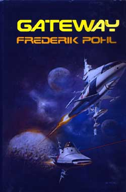

<!-- translated by Yandex Translate -->

# Путь к блогам будущего

Фредерик Пол

## О характере персонажей

**Вопрос:** “В вашем романе Врата([Gateway](https://web.archive.org/web/20160416122436/http://www.amazon.com/gp/product/0345475836?ie=UTF8&tag=7159-20&linkCode=as2&camp=1789&creative=390957&creativeASIN=0345475836)) насколько персонаж Робинетт Броудхед автобиографичен, а насколько терапевтичен?”

** О: ** Ну, в каком-то смысле каждый персонаж в каждой истории, которую я когда-либо писал, автобиографичен.  То есть, каждый персонаж - это, по сути, то, о чем, как мне кажется, я бы заботился, что делал и чего желал, если бы был этим существом, с его внешностью и историей.

Мне нетрудно это сделать, когда персонаж - человек, как Робинетт.  Я знаю, в каком мире он живет, что его воспитывала мать (автобиографическая?  может быть), какие у него надежды на будущее (не очень большие, пока ему не выпадет шанс попасть в Врата(Gateway) и так далее, и я вполне могу представить, какими были бы мои чувства, если бы все это относилось ко мне.

Когда персонаж не является человеком, а иногда даже не органичен, как Ван-То в Мире На Краю Времен([The World at the End of Time](https://web.archive.org/web/20160416122436/http://www.amazon.com/gp/product/0345371976/ref=as_li_ss_tl?ie=UTF8&camp=1789&creative=390957&creativeASIN=0345371976&linkCode=as2&tag=twtfb-20)), это сложнее.  Ван То - это энергетический шар, живущий в ядре звезды.  Но все же у него есть чувства — такие как стремление к самосохранению, возможно, ревность, вероятно, тщеславие, вероятно, любопытство и так далее - достаточные, чтобы сделать его персонажем, а не реквизитом.

(Этим отличием все мы, писатели НФ, обязаны [Стэнли Джи. Вейнбаум](https://web.archive.org/web/20160416122436/http://library.temple.edu/collections/scrc/stanley-g-weinbaum-papers-and).  Почти каждое инопланетное существо в каждом научно-фантастическом рассказе, написанном до создания по имени Твил в его “[Марсианской одиссее](https://web.archive.org/web/20160416122436/http://www.amazon.com/gp/product/1434477185/ref=as_li_ss_tl?ie=UTF8&camp=1789&creative=390957&creativeASIN=1434477185&linkCode=as2&tag=twtfb-20)” в 1934 году, начиная с "Вторжения марсиан[" Герберта Уэллса](https://web.archive.org/web/20160416122436/http://manybooks.net/titles/wellshgetext92warw12.html) и далее, было реквизитом.  Только Твил Вайнбаума был персонажем.)

По крайней мере, я думаю, что примерно таким я был бы, если бы оказался шаром лучистой энергии вместо человеческого существа.

### 2 Комментария

- [Билл Хиггинс - жокей на бревне](https://web.archive.org/web/20160416122436/http://beamjockey.livejournal.com/) говорит:
Поскольку в этом блоге сейчас много голосов, было бы неплохо добавить подпись автора к записям Фреда.  
Я вижу “автор Элизабет Энн Халл”, выделенное жирным шрифтом черным цветом прямо под заголовком записей профессора.  Я бы посоветовал сделать это для Фреда, для команды блога и др., чтобы помочь читателям различать голоса.
[**12 февраля 2014, 15:07**](/fred-pohl/2014-02-04-on-the-character-of-characters/)
- [команда блога](https://web.archive.org/web/20160416122436/http://thewaythefutureblogs.com/) говорит:
Ну, идея в том, что это по-прежнему блог Фреда, так что все, что не опубликовано, принадлежит ему. Есть много его вещей, которые можно опубликовать, например, “Яркие высказывания”, где подпись не совсем уместна. Возможно, мы можем просто разместить заметку на этот счет.
[**17 февраля 2014, 19:42 вечера**](/fred-pohl/2014-02-04-on-the-character-of-characters/)

[WordPress](https://web.archive.org/web/20160416122436/http://wordpress.org/)
[TWTFB2](https://web.archive.org/web/20160416122436/http://dicksmithsoftware.com/)