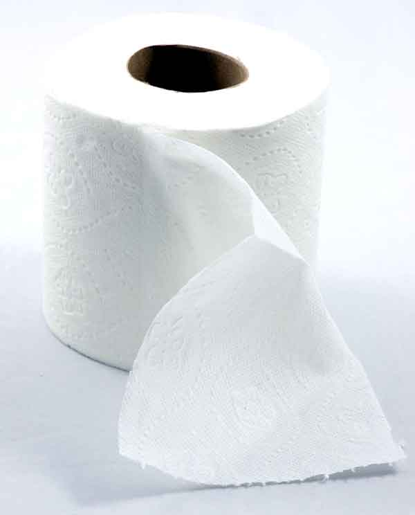

<!-- translated by Yandex Translate -->

# Путь к блогам будущего

Фредерик Пол

## Бумага или пластик?  (то есть Новые деревья или древние?)

** Автор: Элизабет Энн Халл**



[Статья](https://web.archive.org/web/20160416124623/http://theweek.com/article/index/250984/no-print-isnt-dead), которую я прочитал некоторое время назад в [The Week](https://web.archive.org/web/20160416124623/http://theweek.com/) (моя любимая печатная замена теперь доступному только онлайн [World Press Review](https://web.archive.org/web/20160416124623/http://www.worldpress.org/)), убеждает меня в том, что “Нет, бумага не умерла”.

Поскольку я завален бумагами в различных формах — поздравительными открытками (как полученными, так и еще не отправленными), фотографиями, завещаниями, старыми и новыми контрактами, новым паспортом, официально заверенными нотариусом документами, старой корреспонденцией, даже нежелательной почтой, и да, книгами, журналами и газетами, — я просмотрел факты, упомянутые в длинном эссе, вызывают более чем небольшой интерес. Теория гласит, что, читая печатные издания, мы учимся более основательно, чем на электронных носителях.  Я хотел бы в это верить, но не уверен, что верю.  Дополнительные исследования, пожалуйста.

Подходим к вопросу об устаревании бумаги с другой стороны: большинство розничных магазинов больше не предлагают большого выбора способов защиты наших продуктов питания и других покупок по дороге домой. Высококлассные универмаги, похоже, отдают предпочтение бумажным пакетам с ручками, бутики tony иногда используют легкие хлопчатобумажные пакеты, универмаги со скидками используют в основном пластик; Costco предлагает по желанию перепрофилированные картонные коробки со срезанными крышками; за пределами Калифорнии большинство продуктовых магазинов предлагают только тонкий пластик, в то время как Trader Joe предоставляет бумагу для тех, кто не берите с собой их собственные сумки.

Но мы очень мало задумываемся о * реальных* затратах на старые источники углерода (нефть, уголь, природный газ и газ, получаемый путем гидроразрыва пласта) по сравнению с новыми, возобновляемыми источниками углерода (деревья, растения, меха и шкуры животных и т.д.), а также о непреднамеренных последствиях нашего выбора.  Нам еще предстоит провести хорошую реалистичную оценку общей стоимости производства энергии и [пластмасс](https://web.archive.org/web/20160416124623/http://www.wisegeek.org/how-is-plastic-made.htm) за счет потребления ископаемого топлива, на формирование которого ушло много тысячелетий.

Я не сомневаюсь в потенциальных и непосредственных выгодах для планеты от сохранения сокращающихся лесов земного шара, но также могут существовать [устойчивые способы](https://web.archive.org/web/20160416124623/http://www.twosides.us/Paper-Production-Supports-Sustainable-Forestry) выращивания деревьев и другого сырья, такого как хлопок, конопля и т.д., из которых получается довольно хорошая бумага.  Земля, безусловно, производит [новую нефть](https://web.archive.org/web/20160416124623/http://www.adventuresinenergy.org/What-are-Oil-and-Natural-Gas/How-Are-Oil-Natural-Gas-Formed.html); проблема в том, что с точки зрения человечества на это уходит так много времени.

Еще одним фактором, влияющим на экологичность, могут быть продукты нефтехимии, используемые при создании электронных устройств. Я знаю, что предпочитаю писать на компьютере, а не на бумаге.  Гораздо легче пересматривать.  Но ничто не помогает мне так хорошо, как бумага для составления ежедневного списка дел.  Легче сортировать и расставлять приоритеты, и пусть моя дочь добавляет по мере того, как она придумывает подходящие материалы. И конечно, нам все еще нужны женские гигиенические принадлежности и американская [туалетная бумага](https://web.archive.org/web/20160416124623/http://www.deseretnews.com/article/865595211/On-a-different-roll-Living-without-toilet-paper-luxury.html?pg=all)!

Так что я совершенно убежден, что бумага еще не умерла - пока.

### Один комментарий

- пиджкамп говорит:
Я знаю, что лично у меня гораздо большая склонность к беглому просмотру электронного текста, чем к чтению текста на бумаге. Не совсем уверен, почему это так и насколько большой тренировочный эффект это дает.
[** 23 февраля 2014 года, 1:19 утра**](/posts/2014-02-20-paper-or-plastic-i-e-new-trees-or-ancient-ones/)

[WordPress](https://web.archive.org/web/20160416124623/http://wordpress.org/)
[TWTFB2](https://web.archive.org/web/20160416124623/http://dicksmithsoftware.com/)