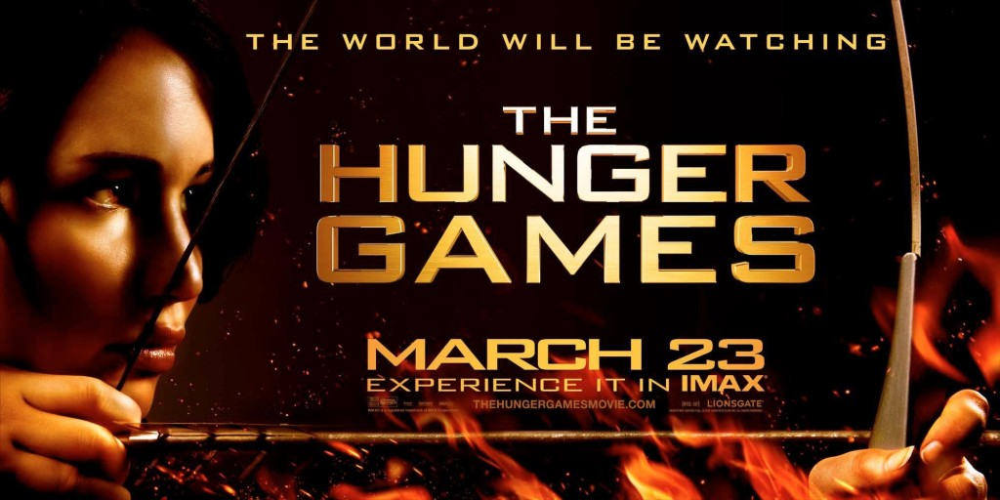

# The Way the Future Blogs

Frederik Pohl

## Divide and Conquer

**By Elizabeth Anne Hull**



By Elizabeth Anne Hull

Let’s you and him fight!  One of the most effective strategies in battle is to pit factions of opposition against each other. Politicians do it so that opponents stop bothering the people in power, or the people who want power. They view government — whether local, state, national or  international — as “playing the game” of politics.

When I saw the first of the [Hunger Games](https://web.archive.org/web/20160416142612/http://www.amazon.com/gp/product/B0084IG7KC/ref=as_li_ss_tl?ie=UTF8&camp=1789&creative=390957&creativeASIN=B0084IG7KC&linkCode=as2&tag=twtfb-20) films, I was surprised that I actually enjoyed watching such a violent idea come to life through the wizardry of Hollywood.  I wrote my doctoral dissertation on neo-Freudian transactional analysis to understand drama (“[A Transactional Analysis of the Plays of Edward Albee](https://web.archive.org/web/20160416142612/http://books.google.com/books/about/A_Transactional_Analysis_of_the_Plays_of.html?id=1YtEOAAACAAJ),” Loyola University of Chicago, 1975), and I think games can sometimes be dangerous even if they aren’t immediately lethal.

Regarding a sporting event as a game can make fans blind to the suffering of others.  I have been watching the [debate](https://web.archive.org/web/20160416142612/http://www.nature.com/neuro/journal/v12/n12/full/nn1209-1475.html) over football players and their [higher risk](https://web.archive.org/web/20160416142612/http://www.usnews.com/news/articles/2012/09/05/playing-in-nfl-triples-risk-of-alzheimers-parkinsons-diseases) of dementia at a young age, Alzheimer’s and Parkinson’s disease.

Playing games in personal relationships can prevent you from enjoying the tension release of intimacy and trust.

I’m not sure whether I feel less comfortable with those who view human life as gamesmanship in a zero-sum game (if one wins, another must lose), or with those who view the abstract qualities of life as battles, declaring war on poverty, drugs, or terrorism.

Ordinarily, games can be fun, but they can get to be tedious when they are unrelieved by work.  And sometimes wars must be fought, especially if others pick the fight.

### 2 Comments

- [Dan Gollub](https://web.archive.org/web/20160416142612/http://www,dreampattern.com/) says:
When a country launches an attack against either a foreign country or its own populace, its television programs should have to show the suffering caused. Such programs might lead the residents of the country to protest and rebel against that use of force.
[**March 2, 2014, 6:09 pm**](/posts/2014-03-02-divide-and-conquer/)
- [Stefan Jones](https://web.archive.org/web/20160416142612/http://www.flickr.com/photos/stefan_e_jones/) says:
I am a lifelong gamer, but the kind of games I enjoy tend to be of the “sandbox” variety, and role playing games of the Dungeons & Dragons sort. When I play a game like *Civilization* I go for the research / industrialization / diplomacy / cultural domination victory. War by soft power.
I have never gotten into spectator sports, or competitive game shows, or the like. Boosterism and sneering at the other side’s fans . . . it is all very alien to me. Alien and kind of dismaying.
I enjoyed *Hunger Games* the movie, but I found the scenario really upsetting. I’m not sure if I’ll see the second film . . . although, it does promise to show cracks developing in “Capital’s” tyranny.
[**March 2, 2014, 10:19 pm**](/posts/2014-03-02-divide-and-conquer/)

[WordPress](https://web.archive.org/web/20160416142612/http://wordpress.org/)
[TWTFB2](https://web.archive.org/web/20160416142612/http://dicksmithsoftware.com/)