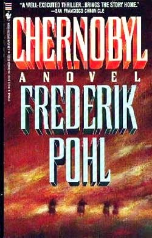

# The Way the Future Blogs

Frederik Pohl

## Peddling Books Through the Harmonic Convergence

In 1987, I spent some weeks pushing my (then) new book, [Chernobyl](https://web.archive.org/web/20160416141935/http://www.amazon.com/gp/product/B00FO6F2Q2/ref=as_li_ss_tl?ie=UTF8&camp=1789&creative=390957&creativeASIN=B00FO6F2Q2&linkCode=as2&tag=twtfb-20). It was an unusual tour mdash; only six states, but a total of four countries mdash; and even more hectic than most of its kind, partly because some of it took place in and around the famous [Harmonic Convergence](https://web.archive.org/web/20160416141935/http://www.ccel.us/newage.ch11.html) that year.

I’ve said from time to time that the main difference between science fiction, which is supposed to depict things which might actually happen, and reality, which is the sum of the things that do happen, is that reality is a lot less plausible than the author of even the trashiest imaginable science-fiction story would ever dare. I always like it when something I’ve said turns out to be true, so let’s take a look at that implausibility, the 16th of August of ’87, when six hundred thousand people are said to have saved the world by humming in unison.

Let’s start a little way back.

A decade or so before that, a more than ordinarily fuzzy-brained motion-picture producer got hold of a 1974 book called [The Jupiter Effect](https://web.archive.org/web/20160416141935/http://www.amazon.com/gp/product/0394715748/ref=as_li_ss_tl?ie=UTF8&camp=1789&creative=390957&creativeASIN=0394715748&linkCode=as2&tag=twtfb-20).  It went to his head. He decided that he wanted to make it as a feature film. Then, thinking creatively, he realized the book didn’t have any actual story in it that could be filmed, so he decided that he wanted a novel written from which the film could be adapted.

Then, for my sins, they came after me to write the novel.

The thesis of the “[Jupiter Effect](https://web.archive.org/web/20160416141935/http://drtimball.com/2011/profit-in-spreading-fear/)” was that on a date in the early summer of 1979, all the major planets would be in the same general direction from the Sun. The book said that this could really ruin your day, because the combined gravitational attraction of all those lopsided planets would disturb the core of the Sun. That would somehow accelerate its rate of nuclear fusion and so increase the Sun’s radiation. Then all hell would break loose on the Earth. Among other things, friction between the heated atmosphere and all those mountain tops in the Rockies and Cascades would trigger earthquakes.

As a result, the book said, Southern California would fall into the sea.

(I hope you’re paying enough attention to understand that I’m not describing the plot of a science-fiction story. This was supposed to be real. This interesting prediction didn’t come from somebody’s chance encounter with an alien saucerer from the planet Clarion, but from the work of a couple of — otherwise — pretty reliable [physicists](https://web.archive.org/web/20160416141935/http://www.americanscientist.org/bookshelf/pub/john-gribbin).)

So I went and took my meeting, as they say, with the prospective producers and publishers. They explained all this scientific stuff to me, and I knew at once what I had to do. (I have my standards, after all.) I said, “No way, José.”

I said the whole thing was preposterous and definitely was not going to happen; and besides, if they wanted to film that book, the way to do it was to buy the film rights from the authors of the book, and then hire a script writer get to work on a scenario and, above all, leave me alone.

I thought that would end it.

As a matter of fact, I didn’t really understand how this particularly nutty idea had got even that far. Still, I was wholly confident that at some point someone in the producing organization would come to his senses. When this happened they would surely realize, a) that they couldn’t possibly get a film written, cast, produced, cut and released in time for the alleged drowning of Los Angeles and, b) it was a lousy idea anyway. I thought that if I just said no that might end the matter right then. Or, anyway, if it didn’t, at least I’d be out of it.

In the second part of that I was wrong. They kept coming at me.

My principles make me turn down a lot of goofy ideas. The trouble is, though, that people who really want me to do something can usually find a way of getting me to — no, not to do the thing I am morally opposed to, exactly — but to do something that’s enough like it to land me in a project I don’t really want to get into.

That’s what happened here. They coaxed, and they kept increasing the money offer, and they threw in a few little outside fringe benefits I could hardly resist (among others, they promised to give my son, who had just got his degree in film, an actual job in film production to put on his resume), and after this had gone on for a month or so they wore me down to the point where I said, “Well, hell, I don’t believe in the Jupiter Effect, and I can’t write a book that treats it as though it were going to happen, but I guess, maybe, if that would satisfy you, I could write a book about what would happen in the real world if a lot of people believed it was going to occur.”

Exclamations of amazed delight from all; contracts drawn up instantly; the ball was in my court.

So I went home and wrote the book. It is called [Syzygy](https://web.archive.org/web/20160416141935/http://www.amazon.com/gp/product/0553205277/ref=as_li_ss_tl?ie=UTF8&camp=1789&creative=390957&creativeASIN=0553205277&linkCode=as2&tag=twtfb-20) and, although I did my best on it, and even think some parts of it are pretty good, I wish I hadn’t written it. The good parts would have been even better in another novel, and the bad parts are intrinsic to the dumb basic idea.

In the event, my skepticism turned out to be justified on two counts: I didn’t believe Southern California would slide into the sea that weekend, and it didn’t; I didn’t believe the movie would ever be made, and it wasn’t. And, although the book sold a fair number of copies, it has given me very little joy.

What struck me about Harmonic Convergence was that it was a kind of Jupiter Effect replay.

On August 16th, 1987, all the planets lined up again. It wasn’t quite the same configuration, but it’s a fairly interesting- looking one. (It was even said to be “unique”, but, of course, every alignment of the planets is unique.) This time it wasn’t just a few nutty film executives who took it seriously. It made the nightly network news and every newspaper in the land, because it was said to be “decisive.”

The swamis had a theoretical basis for all this hoopla. They said that the ancient Mayan calendar, and a few other doubtful primitive sources, all predicted that this “harmonic convergence” would occur at sunrise on August 16th of 1987.

However, the swamis warned, it wasn’t necessarily going to be wonderful for the human race. It could go either way. If it went bad, there would be earthquakes in Detroit and hellish street crime all over. If it went well, everything would go our way at last. All nuclear fuel would slump into inert lead. Peace and brotherhood would descend upon us, and we would start a new age of enlightenment in which we would all wear white tunics and eat yogurt.

It was up to us to choose which of these possible outcomes really happened, they said, and the way to make it go right was for everybody to get together in “power points” around the world, where they would hold hands, meditate and say, “ooooom.”

I really thought I could stay out of this one, but the Harmonic Convergence converged while I was in the middle of the book tour for Chernobyl.

*To be continued. . . .*

*An earlier version of this article appeared in Science Fiction Chronicle in 1988.*

**Related posts:**

- Peddling Books Through the Harmonic Convergence,  [**Part 2**](/posts/2014-03-31-through-the-harmonic-convergence-part-2/), [**Part 3**](/posts/2014-04-10-through-the-harmonic-convergence-part-3/)

### 3 Comments

- [Stefan Jones](https://web.archive.org/web/20160416141935/http://www.flickr.com/photos/stefan_e_jones/) says:
I was just starting to become a skeptic when *The Jupiter Effect* came out. In fact, it might have been one of the straws that broke the camel’s back. 
I look forward to reading about the making of *Chernobyl*. I read it once, back when it came out, and still recall some parts vividly.
[**March 13, 2014, 9:57 pm**](/posts/2014-03-13-peddling-books-through-the-harmonic-convergence/)
- Ace Lightning says:
When the Harmonic Convergence was being endlessly promoted, the repetition of the phrase eventually caused me to hear it as “Harmonica Virgins”. I told this to some friends of mine, and one said “Band name!” I realized that a band called the Harmonica Virgins would be something like this: An all-female hard-rock (or even heavy metal) band, dressed in the sluttiest, skimpiest, kinkiest outfits they can get away with. As they take the stage, the venue’s announcer screams, “Ladies and gentlemen… THE HARMONICA VIRGINS!”. The lead singer of the band steps up to the mike and waits for the applause to die down a little, then says, “And none of us play the harmonica, either. Hit it, girls!”
[**March 14, 2014, 5:34 am**](/posts/2014-03-13-peddling-books-through-the-harmonic-convergence/)
- [JJ Brannon](https://web.archive.org/web/20160416141935/http://www.youtube.com/watch?v=xPgZeOsG8sk) says:
It’s always fascinating to re-ride through events, but seen from Fred’s insightful and self-deprecatingly amused perspective.
JJB
[**March 14, 2014, 7:19 pm**](/posts/2014-03-13-peddling-books-through-the-harmonic-convergence/)

[WordPress](https://web.archive.org/web/20160416141935/http://wordpress.org/)
[TWTFB2](https://web.archive.org/web/20160416141935/http://dicksmithsoftware.com/)