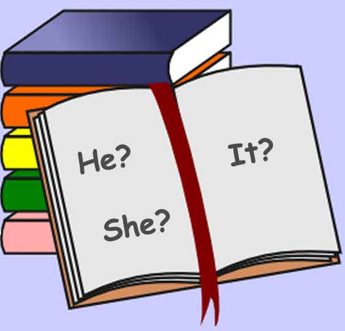

<!-- translated by Yandex Translate -->

# Путь к блогам будущего

Фредерик Пол

## Будущее местоимений

** Автор: Элизабет Энн Халл**



Согласно [AAUW](https://web.archive.org/web/20160416142116/http://www.aauw.org/who-we-are/outlookmag/), с 1990-х годов актуальной темой в области феминистских / гендерных исследований на уровне колледжей является использование гендерно-специфичных местоимений при обсуждении неизвестных лиц.  (Не все феминистки читают НФ, поэтому они могут не понимать, что [родной язык ](https://web.archive.org/web/20160416142116/http://www.sfwa.org/members/elgin/)[Сюзетт Хейден Элгин](https://web.archive.org/web/20160416142116/http://www.amazon.com/gp/product/1558612467/ref=as_li_tl?ie=UTF8&camp=1789&creative=390957&creativeASIN=1558612467&linkCode=as2&tag=twtfb-20&linkId=O3XLQGJ7DIEFULYU) в предыдущем десятилетии рассматривал ситуацию с точки зрения лингвиста.)

[Согласование местоимения с предшествующим](https://web.archive.org/web/20160416142116/http://leo.stcloudstate.edu/grammar/pronante.html) - это запутанная грамматическая проблема, с которой я сталкивался с тех пор, как начал преподавать композицию на первом курсе [Чикагского университета Лойолы](https://web.archive.org/web/20160416142116/http://%20www.luc.edu/) в конце 1960-х годов.

Поскольку Лойола является иезуитским университетом, вы, возможно, хорошо понимаете консервативный акцент на грамматике при оценке письменных работ и выставлении оценок.  Фактически, рекомендации по выставлению оценок, данные нам ассистентами преподавателя, предусматривали, что работа со слишком большим количеством ошибок в грамматике, пунктуации, правописании и условностях [стандартного английского](https://web.archive.org/web/20160416142116/http://www.pbs.org/speak/seatosea/standardamerican/) языка — то, что мы называли базовыми навыками — должна быть оштрафована при выставлении оценок или даже вообще провалена, независимо от того, насколько хорошо это эссе было выполнено другими способами, такими как как организованность, обоснованность фактов/исследований, ясность мышления, свежесть языка, восхитительное чувство юмора или другие признаки оригинального творчества, логического мышления и общей эффективности.

Одним из главных грамматических грехов было нарушение принципа, согласно которому местоимения должны соответствовать по лицу и числу своим предшественникам и референтам.

Имейте в виду, тогда это тоже не было новой проблемой.  Немного истории: это было одной из причин, по которой после Второй мировой войны были введены занятия по английскому сочинению, обычно известные как 101 и 102, а иногда называемые “тупоголовым английским”.  До этого профессора обычно предполагали, что в колледжи и университеты принимаются только хорошо подготовленные студенты (и, конечно, наследники - сыновья выпускников, мужчины, которые были довольны “джентльменской тройкой”).  Однако с конца 1940-х годов и далее военнослужащие, вернувшиеся со своими льготами на образование, записывались в рекордном количестве в погоне за американской мечтой

Это были люди (почти все были мужчинами), которые, по большому счету, никогда не собирались поступать в колледж, но при поддержке благодарного правительства и поощрении американского народа были готовы усердно трудиться и усвоить запретительные правила, которые преобладали в те ранние годы.  Оглядываясь назад, можно сказать, что это, возможно, было важным фактором успеха американских предприятий в те годы [Величайшего поколения](https://web.archive.org/web/20160416142116/http://www.nytimes.com/books/first/b/brokaw-generation.html).

Множественное число существительных и использование местоимений множественного числа решит многие проблемы с согласованием, но иногда существительное в единственном числе кажется необходимым для ясности, поэтому я придумал свое собственное решение, которое позволяет автору быть одновременно грамматичным и не казаться вынужденным.  Это просто переделка предложения, чтобы избежать или устранить необходимость в предшествующем.  Например, вместо “Каждый заявитель должен представить свою собственную подтверждающую документацию” попробуйте “Каждый заявитель должен представить индивидуальную подтверждающую документацию”.

Поскольку в английском языке есть много способов выразить практически любую идею, у писателей есть преимущество перед носителями языка в том, что они могут поразмыслить как над тем, что они хотят передать, так и над тем, как они формулируют идеи.  Как бы верно это ни было в моей юности и в первые годы преподавания, механические аспекты письма гораздо менее важны, чем другие аспекты коммуникации.

Но, похоже, всегда найдутся осуждающие читатели, которые ищут причины отвергнуть то, что пытается донести автор, и базовые навыки грамотности - один из простых способов отсеять тех, чье мнение мы хотим проигнорировать или не принимать во внимание.  В моем детстве, когда кто-то отвергал меня, моя мать всегда утешала меня: “Подумай об источнике”.  Но я по-прежнему считаю, что лучше не отталкивать читателей без необходимости, и я буду продолжать стараться избегать грамматических ошибок.

Орфографические ошибки - еще один особенно простой способ для тех, кто с нами не согласен, отвергнуть то, что мы хотим сказать, потому что в течение последних нескольких сотен лет у нас было стандартное написание в словарях.  Несмотря на мою терпимость к дислексикам, признаюсь, меня утешил тот факт, что некоторые молодые люди все еще пытаются быть правильными в правописании в эпоху текстовых сообщений.

В региональном конкурсе [Scripps National Spelling Bee](https://web.archive.org/web/20160416142116/http://www.spellingbee.com/), установившем рекорд, два выдающихся студента быстро преодолели других участников и продолжали правильно писать слово за словом.  После того, как они исчерпали список из более чем 60 слов, местные администраторы попросили разрешить обоим детям пройти в национальный финал.  Но в конце концов судьи решили продолжить противостояние, добавив еще 20 с лишним слов, пока семиклассница [Куш Шарма](https://web.archive.org/web/20160416142116/http://www.cnn.com/2014/03/08/us/spelling-bee-marathon/), наконец, не обыграла пятиклассницу Софию Хоффман в захватывающем матче в округе Джексон, штат Миссури.  Будем надеяться, что София вернется и попытается снова.  Дух Величайшего поколения не умер.

### 5 Комментариев

- Вирджиния Аллен говорит:
Просто смотрю интервью Джона Стюарта с Роном Саскиндом об общении со своим сыном—аутистом - “упорстве” в диснеевских фильмах... использовании часто повторяющихся реплик как выхода из ситуации или через прекращение общения.
Этот (диснеевский) опыт так похож на мой опыт с проблемой предписывающей грамматики. Я знаю, что мне следует просто закрыть дверь и погрузиться в вежливое молчание, но я продолжаю настаивать.
Известное правило состоит в том, что местоимения должны соответствовать своим предшественникам по лицу, числу и роду. (Кто-то забыл свой [розовый] свитер!) Учитывая выбор нарушить либо число, либо пол, “правильным” выбором является нарушение пола. Любой, кто пытается “соответствовать” и “вести себя хорошо”, следуя правилам, вместо того, чтобы создавать длинную грамматическую конструкцию “они” в единственном числе — “Кто—то забыл свой свитер”, - создает предложение, отображающее “общее ”он"", которое не является ни рыбой, ни птицей, ни “правильным английским” и не “правильный” ни в каком лингвистическом смысле.
Это “правило”, я думаю, является первым — безусловно, наиболее заметным — из ложных филологических правил предписывающей грамматической традиции.
Раньше я всегда цитировал статью Энн Бодин 1975 года “Андроцентризм в предписывающей грамматике: единственное число ”они", неопределенное по полу "он" и ‘он или она"” из "Языка в обществе", 4: 129-46. Теперь я процитирую книгу Энн Керзан "Гендерные сдвиги в истории английского языка" (Cambridge UP, 2012). Я никогда не упоминаю свою собственную книгу на эту тему. Это было бы неправильно.
Признавая ценность соответствия. Желая быть таким, как все остальные. Желая вписаться в правила и подчиняться им, какие правила я должен выбрать? Мне было бы все равно, но создатели правил говорят мне, что это невозможно, и что же делать? что же делать?
Если девять х пять равно 45, я должен быть разумным.
[**14 мая 2014, 16:04**](/fred-pohl/2014-05-12-the-future-of-pronouns/)
- [Дэн Голлаб](https://web.archive.org/web/20160416142116/http://www.dreampattern.com/) говорит:
Ваш блог вдохновил меня на написание следующего стихотворения.  

Кто-то  

К кому-то жизнь жестока, к кому-то жизнь добра  

Сражается с суперзлодеями из своего воображения  

И в конечном итоге выживает  

Задается вопросом, является ли он/ она всего лишь винтиком в машине  

Или вместо этого является неотъемлемой частью гав и плетения  

Передвигается как черепаха  

Входит в пределы скорости света  

Пишет великую, чудесную поэзию, которая живет в веках  

(но этот человек - не я; по крайней мере, пока)  

Считает, что должно быть местоимение лучше, чем его/ее и он/она  

Просыпается утром в сознании и жив  

Этот человек - вы?
[** 19 мая 2014 года, 5:34 утра**](/fred-pohl/2014-05-12-the-future-of-pronouns/)
- Элизабет Халл говорит:
Ты рассмешила меня, Вирджиния.  Я планирую быть в Лоуренсе на церемонии вручения премии Кэмпбелла на следующей неделе; есть шанс, что ты там будешь?  Было бы здорово увидеть вас там или на поминальной службе по Фреду, если вы сможете прийти.  Бетти
[**6 июня 2014, 19:42 вечера**](/fred-pohl/2014-05-12-the-future-of-pronouns/)
- Элизабет Халл говорит:
Дэн, я тоже надеюсь увидеть тебя на поминальной службе.  Бетти
[**6 июня 2014, 19:44 вечера**](/fred-pohl/2014-05-12-the-future-of-pronouns/)
- Стив Ливелл говорит:
Если позволите спросить – Есть какие-нибудь новости о пересмотре/дополнении/сиквеле Ретроспективы Будущего (The Way The Future Was)?
[**12 июня 2014 года, 5:25 утра**](/fred-pohl/2014-05-12-the-future-of-pronouns/)

[WordPress](https://web.archive.org/web/20160416142116/http://wordpress.org/)
[TWTFB2](https://web.archive.org/web/20160416142116/http://dicksmithsoftware.com/)