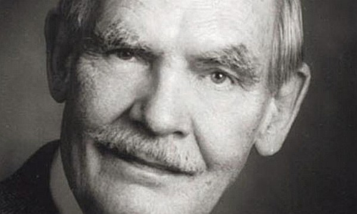

<!-- translated by Yandex Translate -->

# Путь к блогам будущего

Фредерик Пол

## Празднование памяти Фредерика Пола, 2 августа

  
  
  
  

Пожалуйста, присоединяйтесь к его семье, друзьям и фэнам, чтобы отпраздновать жизнь и карьеру великого мастера научной фантастики Фредерика Пола (1919-2013), отмеченного наградами автора, редактора и писателя-фэн-писателя; влиятельного литературного агента; футуролога; лектора и члена Первого фэнд-сообщества, чья карьера началась в эпоху Палп и продолжалась до его смерти. смерть в прошлом году.

Бесплатное мероприятие будет включать в себя программу выступлений с последующим фуршетом.

Номера в отеле Country Inn &amp; Suites, 1401 N. Roselle Road, Палатин, доступны с 1 по 3 августа по цене 94 доллара за ночь (включая завтрак).  ** Забронируйте номер до 18 июля** по телефону (847) 839-1010 или (800) 456-4000 с кодом *“Мемориал Пола”*, чтобы получить этот тариф.

Для получения более подробной информации напишите команде блога по адресу blog@thewaythefutureblogs.com .

### 2 Комментария

- Джон Армстронг говорит:
Я буду там в духе. Фред оказал огромное влияние на меня за последние 45 лет. Его очень не хватает
[**14 июля 2014, 14:46 вечера**](/posts/2014-06-27-frederik-pohl-memorial-celebration-aug-2/)
- Карлос Федеричи говорит:
Уважаемая миссис Пол: Спасибо за рассылку бюллетеня о мемориале Мастера. Он заслуживает такого уважения и нашей памяти. Я поделился уведомлением через свой аккаунт в “Facebook". Мне не очень нравятся социальные сети, но в подобных случаях я с удовольствием ими пользуюсь. Мои приветствия вам.
[** 19 июля 2014 года, 1:25 утра**](/posts/2014-06-27-frederik-pohl-memorial-celebration-aug-2/)

[WordPress](https://web.archive.org/web/20160416225831/http://wordpress.org/)
[TWTFB2](https://web.archive.org/web/20160416225831/http://dicksmithsoftware.com/)