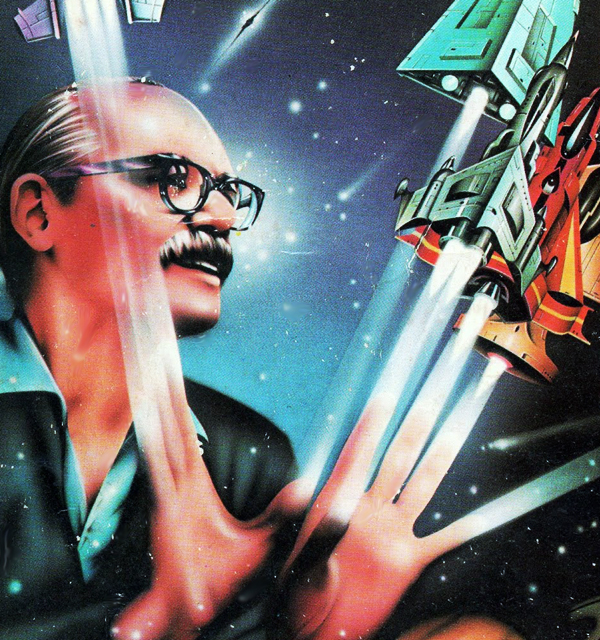

<!-- translated by Yandex Translate -->

# Путь к блогам будущего

Фредерик Пол

## Windycon отдает дань уважения вкладу Фредерика Пола в НФ

** Автор: Элизабет Энн Халл**



[Windycon](https://web.archive.org/web/20160403011647/http://www.windycon.org/) 41 в этом году доставил мне массу удовольствия, особенно сессия, посвященная Фредерику Полу и его влиянию на научную фантастику.

Некоторые основные моменты:  Мы открылись торжественным вручением мне полированной медной таблички, которая появилась на памятной скамье в [Loncon](https://web.archive.org/web/20160403011647/http://www.loncon3.org/) в этом году [Хелен Монтгомери](https://web.archive.org/web/20160403011647/http://www.fanac.org/Denvention3/programming/bios22.html) и [**Дэйв Маккарти**](/fred-pohl/2014-12-01-windycon-honors-frederik-pohl-s-contributions-to-sf/) из исполнительного комитета [Chicon 7](https://web.archive.org/web/20160403011647/http://www.chicon.org/) и [ISFiC](https://web.archive.org/web/20160403011647/http://isfic.org/).    Я был по-настоящему тронут.

[Джин Вулф](https://web.archive.org/web/20160403011647/http://www.amazon.com/Gene-Wolfe/e/B000APBL0I/?_encoding=UTF8&camp=1789&creative=390957&linkCode=ur2&tag=twtfb-20&linkId=UWNDRRPOLJ7UMCTF), наш друг, который до недавнего времени жил в соседнем Баррингтоне, присоединился к дискуссии в последнюю минуту, задал тон дискуссии и рассмешил аудиторию, когда рассказал о том, как он был расстроен, когда мы с Фредом поженились, и вскоре после этого я перестала быть одной из ведущих программы. наша местная группа фэнов, SFFNCS (она же фэны научной фантастики из северо-западных пригородов Чикаго, произносится “Сфинкс”).  В свою защиту скажу, что быть женой Фреда занимало гораздо больше времени, чем быть его девушкой!  Не говоря уже о том, что я работал полный рабочий день в [колледже Харпер](https://web.archive.org/web/20160403011647/http://goforward.harpercollege.edu/) и разрабатывал их программу с отличием, а также о том факте, что мы с Фредом много путешествовали вместе по довольно интересным и экзотическим местам по всему миру.

[Джим Френкель](https://web.archive.org/web/20160403011647/http://jimfrenkel.wix.com/james-frenkel-assoc), давний редактор Фреда, сосредоточил наше внимание на описании панели: многогранном вкладе Фреда в эту область.  Он рассказал кое-что о том, каково было работать редактором с Фредом, который всегда мог распознать хорошее редакторское предложение, когда получал его.  Мы все согласились с тем, что весь опыт Фреда в качестве редактора как журналов, так и книг отточил его художественные навыки и способность к самостоятельному редактированию, а период работы агентом также дал ему понять, насколько важна востребованность на рынке для карьеры писателя.

Я признал, что Фред уже был известным профессионалом и имел большой опыт, о котором я знал только из вторых рук, когда познакомился с ним на [Ворлдконе в Канзас-Сити в 1976](https://web.archive.org/web/20160403011647/http://fancyclopedia.org/midamericon) году.  На самом деле я преподавал Торговцев Космосом([The Space Merchants](https://web.archive.org/web/20160403011647/http://www.amazon.com/gp/product/1250000157/ref=as_li_tl?ie=UTF8&camp=1789&creative=390957&creativeASIN=1250000157&linkCode=as2&tag=twtfb-20&linkId=XNFDL3A42L2GDSA3)) в своем классе НФ, но в конце 70-х перешел на [Врата](https://web.archive.org/web/20160403011647/http://www.amazon.com/gp/product/0345475836/ref=as_li_tl?ie=UTF8&camp=1789&creative=390957&creativeASIN=0345475836&linkCode=as2&tag=twtfb-20&linkId=3VTQEDADNYZS75C3)(Gateway).

Давний чикагский фэн [Нил Рест](https://web.archive.org/web/20160403011647/https://twitter.com/NeilRest) рассказал о сенсации, которую Фред произвел на местных фэнов, когда пришел со мной на одну из вечеринок, проводимых каждый месяц в квартире [Джорджа Прайса](https://web.archive.org/web/20160403011647/http://fancyclopedia.org/george-w-price) (из [Advent:Publishers](https://web.archive.org/web/20160403011647/http://fancyclopedia.org/advent-publishing)) - или, возможно, это было на одной из еженедельных встреч в Норт—Сайде под названием “[Четверг](https://web.archive.org/web/20160403011647/http://fancyclopedia.org/thursday), ”вполне возможно, в доме [Элис Бентли](https://web.archive.org/web/20160403011647/http://www.sfbooks.com/html_files/alice_stars_bio.html), которая, возможно, была еще подростком или, по крайней мере, еще не была владелицей книжного магазина.  Нам гораздо лучше удавалось запоминать наши чувства, чем реальные детали, как это будет происходить в течение более чем 30 лет.

С самого начала своей карьеры в районе Нью-Йорка в 30-х годах Фред никогда не отказывался от fanac и своего чувства фэна, когда стал профессионалом.  Я рассказал, как Фред был взволнован на [Foolscap](https://web.archive.org/web/20160403011647/http://www.foolscap.org/) в Сиэтле в 2000 году, где Фред и Джинджер [Бьюкенен (](https://web.archive.org/web/20160403011647/http://www.tor.com/blogs/2014/02/editor-in-chief-of-aceroc-books-announces-retirement)в то время редактор [Ace](https://web.archive.org/web/20160403011647/http://www.penguin.com/meet/publishers/ace/)) были почетными гостями от фэнов.  Они назвали конвент “Шоу Фреда и Джинджер”. В 30-х и 40-х годах Фред много раз рассказывал мне, что ему очень нравилась красивая и талантливая [Джинджер Роджерс](https://web.archive.org/web/20160403011647/http://www.gingerrogers.com/about/biography.html), которая, по его словам, должна была делать все шаги, которые делал [Фред Астер](https://web.archive.org/web/20160403011647/http://www.anb.org/articles/18/18-00039.html), только задом наперед и на высоких каблуках.

Гораздо позже, в 2010 году, Фред также был в полном восторге, когда получил премию [Хьюго](https://web.archive.org/web/20160403011647/http://www.thehugoawards.org/) как лучший автор статей для фэнов на [Aussiecon](https://web.archive.org/web/20160403011647/http://fancyclopedia.org/aussiecon-4) за свою работу в этом блоге.  Он был рад отдать должное везде, где это было необходимо, и поблагодарил своего блогмейстера [Лию А. Зелдес](https://web.archive.org/web/20160403011647/http://www.zeldes.com/), которая позволила ему сосредоточиться на написании, не беспокоясь о технических тонкостях публикации в Интернете, а также [Дика Смита](https://web.archive.org/web/20160403011647/http://www.dicksmithsoftware.com/), который позволил Фреду использовать свой устаревший текстовый процессор для написания как художественной, так и научно-популярной литературы.

Я должен также добавить, что веб-мастер Фреда, [Рич Эрлих](https://web.archive.org/web/20160403011647/http://miamioh.edu/cas/academics/departments/english/about/people/faculty/emeriti-faculty/erlich-richard/index.html), помог мне следить за перепиской Фреда в течение периода, пока он, наконец, не начал отвечать по крайней мере на некоторые свои электронные письма напрямую.

Фред также был в восторге в 2009 году, когда наконец получил свой [диплом Brooklyn Tech при](/fred-pohl/2009-08-28-when-i-graduated-from-high-school-after-73-years/) активной поддержке коллеги по Brooklyn Technite [Джеффри Хайткина](https://web.archive.org/web/20160403011647/http://www.bthsalumni.org/page.aspx?pid=1129), фэна Фреда. Он был впечатлен тем, что сам Джеффри пришел вручить эту честь вместе с [Ахиллом Перри](https://web.archive.org/web/20160403011647/http://www.pli.edu/Content/Faculty/Achilles_M_Perry/_/N-4oZ1z12p4u), президентом Ассоциации выпускников, и Недом Стилом, пресс-секретарем Tech.   Презентация проводилась перед камерами Tech и фотографом из [New York Times](https://web.archive.org/web/20160403011647/http://www.nytimes.com/2009/08/22/nyregion/22bigcity.html) прямо в нашей библиотеке (где я всегда работал и которая последние пять лет стала кабинетом Фреда).  О привлекательном чувстве юмора Фреда читайте в [** архивах блога **](/fred-pohl/2009-08-28-when-i-graduated-from-high-school-after-73-years/) за тот год.

[Стивен Сильвер](https://web.archive.org/web/20160403011647/https://www.sfsite.com/~silverag/) и Хелен Монтгомери также приехали к нам домой, чтобы вручить премию "Хьюго", которая была присуждена лучшему писателю-фэн-автору за его блог в нашей библиотеке.  Очень сытно!

Фред всегда поддерживал чтение, изучение и просвещение, как в библиотеках, так и в школах, начиная с дошкольного возраста и заканчивая аспирантурой, и часто выступал перед фэнами всех возрастов в их учреждениях.    Совсем недавно, примерно за год до его смерти, мы оба участвовали в писательском фестивале в нашей собственной Палатинской публичной библиотеке.

Его опыт в качестве судьи [Старджонов](https://web.archive.org/web/20160403011647/http://www.sfcenter.ku.edu/sturgeon.htm) и [**Писателей будущего**](/fred-pohl/2009-09-04-the-worlds-of-l-ron-hubbard/), а также в оказании помощи в проведении семинаров по всей территории США — в частности, ежегодных семинаров [Джима Ганна](https://web.archive.org/web/20160403011647/http://www.sfcenter.ku.edu/bio.htm) по преподаванию и написанию текстов, и других семинаров по всему миру (например, в Китае, Южной Америке, на Ближнем Востоке и т.д.) также был полезен. это важно для постоянного развития способности Фреда помогать себе продолжать писать читабельную художественную литературу, которая была бы значима для широкой мультикультурной аудитории, поэтому он был переведен более чем на 40 языков по всему миру.

Однажды во время ужина в Лондоне с [Малкольмом Эдвардсом](https://web.archive.org/web/20160403011647/http://www.ansible.co.uk/writing/medwards.html), тогдашним редактором [Gollancz](https://web.archive.org/web/20160403011647/http://www.gollancz.co.uk/about-us/), который сам начинал как фэн, прежде чем стать профессионалом, Малкольм сказал, что ему всегда не терпится прочитать новый роман, рассказ или статью Фреда, потому что “Фред всегда был восхитительным сюрпризом.  В то время как другие создали бренд, на который могли рассчитывать фэны, все, что вы знали, это то, что последняя работа Фреда будет свежей и непредсказуемой".

Оглядываясь назад, я думаю, что Фред узнал всю свою жизнь из всего, что он прочитал и увидел, и от людей, которых мы встретили в [*World НФ**](/fred-pohl/2012-08-23-harry-harrison-part-2-of-farewell/) (основанной совместно с [*Гарри Харрисоном**](/fred-pohl/2012-08-22-another-good-one-gone-harry-harrison-1925-2012/) и [Брайаном Олдиссом](https://web.archive.org/web/20160403011647/http://brianaldiss.co.uk/)), а также от тех людей, с которыми сталкивались во время круизов, осмотра научных объектов или исследования пещеры или горячие источники и т.д., что-либо геологическое, метеорологическое или астрономическое. - все это всегда побуждало его придумывать планы написания о переменчивом будущем, которое он предвидел.  Я полагаю, что во многом именно это заставляло его писать до конца своей жизни.

Это, конечно, далеко не все, что мы сказали.  Я упоминал, что вариант создания [телесериала Врата(Gateway](https://web.archive.org/web/20160403011647/http://deadline.com/2014/03/gateway-sci-fi-tv-seris-frederick-pohl-classic-696219/)) от Entertainment One все еще “находится в стадии разработки”, и, насколько я знаю, они все еще ищут подходящего ведущего шоу.

Я также упомянул, что в следующем году [издательство Университета Иллинойса](https://web.archive.org/web/20160403011647/http://www.press.uillinois.edu/) выпустит критическую биографию Фредерика Пола Майка Пейджа.  Ищите его весной или в начале лета 2015 года.  Возможно, она будет номинирована на премию "Хьюго" за лучшую смежную работу. Разве не приятно так думать?  Если так, то Фред наверняка был бы доволен!

[WordPress](https://web.archive.org/web/20160403011647/http://wordpress.org/)
[TWTFB2](https://web.archive.org/web/20160403011647/http://dicksmithsoftware.com/)