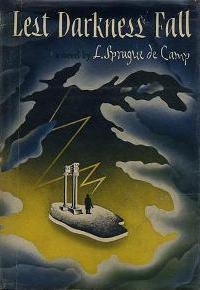

# The Way the Future Blogs

Frederik Pohl

## Fred on de Camp

If you’re on Facebook, you’ve doubtless seen the meme that asks you to list books that have resonated with you.

A few years ago, [Suvudo](https://web.archive.org/web/20160402231728/http://suvudu.com/2011/04/booked-frederik-pohl-on-l-sprague-de-camps-lest-darkness-fall.html) asked Fred about his favorite books.

Fred mentioned several works that had stayed with him throughout his life, including [Mark Twain’s](https://web.archive.org/web/20160402231728/http://www.amazon.com/Mark-Twain/e/B000APWHJ2/?_encoding=UTF8&camp=1789&creative=390957&linkCode=ur2&qid=1391320970&sr=8-2-ent&tag=twtfb-20) [**Huckleberry Finn**](/posts/2010-09-04-mark-twain-and-the-law-of-the-raft/) and [Marcel Proust’s](https://web.archive.org/web/20160402231728/http://www.library.illinois.edu/kolbp/proust/) [Swann’s Way](https://web.archive.org/web/20160402231728/http://manybooks.net/titles/proustmaetext048swnn10.html), but then went on to write at length about  [L. Sprague de Camp’s](https://web.archive.org/web/20160402231728/http://www.lspraguedecamp.com/bio.html) alternate history [Lest Darkness Fall](https://web.archive.org/web/20160402231728/http://www.amazon.com/gp/product/0345310160/ref=as_li_ss_tl?ie=UTF8&camp=1789&creative=390957&creativeASIN=0345310160&linkCode=as2&tag=twtfb-20) and how it influenced him.

We recommend both [Fred’s review](https://web.archive.org/web/20160402231728/http://suvudu.com/2011/04/booked-frederik-pohl-on-l-sprague-de-camps-lest-darkness-fall.html) and de Camp’s [novel](https://web.archive.org/web/20160402231728/http://www.amazon.com/gp/product/0345310160/ref=as_li_ss_tl?ie=UTF8&camp=1789&creative=390957&creativeASIN=0345310160&linkCode=as2&tag=twtfb-20).

*The blog team*

[WordPress](https://web.archive.org/web/20160402231728/http://wordpress.org/)
[TWTFB2](https://web.archive.org/web/20160402231728/http://dicksmithsoftware.com/)