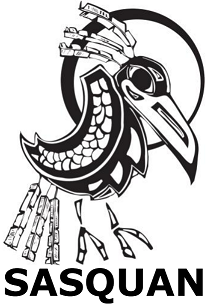

<!-- translated by Yandex Translate -->

# Путь к блогам будущего

Фредерик Пол

## Бетти отправляется на Ворлдкон: Спокан или провал!

*От команды блога:*



Счастливого пути всем вам, кто направляется на [Всемирную Конвенцию Научной Фантастики,](https://web.archive.org/web/20160402165446/http://worldcon.org/)[ Саскуэн](https://web.archive.org/web/20160402165446/http://www.sasquan.org/), в Спокан на этой неделе! Бетти тоже направляется туда. (К сожалению, остальной команде блога придется следить за новостями конвента из Чикаго через [Facebook](https://web.archive.org/web/20160402165446/https://www.facebook.com/pohlemics).)

Тем из вас, кому посчастливилось посетить Саскуан, обязательно зайдите и посмотрите на Бетти на ее *раздаче автографов** в воскресенье с 11 до 11:45 утра в выставочном зале B и взгляните на эту панель:

&gt; “**Не всегда далеко друг от друга: пересечение мейнстрима с НФ**” в четверг в 11 часов утра в отсеках 111С с участием [Элизабет Энн Халл](https://web.archive.org/web/20160402165446/http://www.thewaythefutureblogs.com/elizabeth-anne-hull/), [Роберта Силверберга](https://web.archive.org/web/20160402165446/http://www.robert-silverberg.com/), [Рича Хортона,](https://web.archive.org/web/20160402165446/http://www.sff.net/people/Richard.Horton/)[ Рика Уилбера](https://web.archive.org/web/20160402165446/http://rickwilber.net/) и [Гэри К. Вульф](https://web.archive.org/web/20160402165446/http://blogs.roosevelt.edu/gwolfe/):

&gt; * “Раньше научная фантастика считалась чем-то из ряда вон выходящим. Сейчас это, похоже, стало частью мейнстрима. Хорошо ли это для научной фантастики? Неужели научная фантастика все еще далека от основных тем?”*

Звучит завораживающе! (Возможно, не такая увлекательная, какой, вероятно, будет деловая встреча в этом году, но и там никто не склонен бросаться кулаками. Оставайтесь в безопасности!)

Профессор. Бетти проведет вторую половину дня четверга в отпуске водителя автобуса в качестве одного из тренеров в мастерской сценаристов. Если вы абитуриент, вам, вероятно, сказали, когда и где это будет.

Всем веселиться! Не позволяйте [клопам](https://web.archive.org/web/20160402165446/http://fancyclopedia.org/kolektinbug) Колектин кусаться... сильно.

### Один комментарий

- Джеффри С. Джонс говорит:
Мне жаль, что я пропустил панно и раздачу автографов — слишком много еще нужно было сделать!
[** 27 августа 2015 года, 10:42 утра**](/fred-pohl/2015-08-18-betty-goes-to-worldcon-spokane-or-bust/)

[WordPress](https://web.archive.org/web/20160402165446/http://wordpress.org/)
[TWTFB2](https://web.archive.org/web/20160402165446/http://dicksmithsoftware.com/)