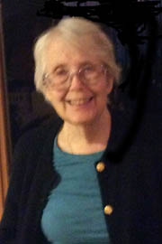

<!-- translated by Yandex Translate -->

# Путь к блогам будущего

Фредерик Пол

## Расписание Бетти на WindyCon 2015

*От команды блога:*
  

В эти выходные Бетти посещает [Windycon 42](https://web.archive.org/web/20160402212610/http://www.windycon.org/%22) в Ломбарде, штат Иллинойс. Съезд продлится с пятницы 13 ноября по воскресенье 15-го.

Она появляется на этих мероприятиях:

Пятница, 18:00 вечера  

** Юбилеи (Сиреневый B):** В 2015 году исполняется 150 лет "Алисе в стране чудес", 50-летие "Дюны(Dune)", 45-летие "Аполлона-13" и 30-летие "Назад в будущее".   Почему одни книги и фильмы заслуживают признания в день их юбилея, а другие - нет?  Каково культурное значение литературы и событий давних времен для нашего современного сообщества?

Суббота, 10:00 утра  

** Взгляд назад на Фреда Пола (Лайлак А): ** Фредерик Пол был опорой научной фантастики с самого ее зарождения, и особенно в Чикаго, где он прожил так долго.  Его присутствия по-прежнему не хватает.  Майкл Пейдж только что опубликовал обзор на  

Жизнь и работа Фреда.  Приходите и послушайте о Фреде Поле, которого вы знали или не знали раньше.

Суббота, 11:00 утра  

** Краткий обзор по сравнению с Обзор по сравнению с Критика (Сиреневый А):** Дискуссия о различиях между различными типами рецензий, о том, что они пытаются сделать и кто является аудиторией для каждого из них.  Когда уместен каждый тип проверки?

Суббота, 16:00-16:25  

**Чтение (зал заседаний)**

Воскресенье, 11:00  

**Раздача автографов (прихожая)**

[WordPress](https://web.archive.org/web/20160402212610/http://wordpress.org/)
[TWTFB2](https://web.archive.org/web/20160402212610/http://dicksmithsoftware.com/)