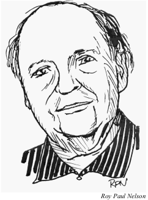

*Опубликовано в* The National Fantasy Fan *в первой рубрике "В центре внимания". Беседу вели Jon D. Swartz и Heath Row.*

*Портрет работы Роя Пола Нельсона*

---

Джек Робинс (урождённый Джек Рубинсон) — давний член Национальной федерации фэнтези-фанатов (N3F) и по-прежнему активный фанат научной фантастики. Он начал свой путь как член Международной научной ассоциации (ISA) в начале 1930-х годов. После того как в конце 30-х годов было сформировано знаменитое Футурианское общество Нью-Йорка, Робинс стал одним из членов (наряду с Дональдом Воллхаймом, Джоном Мишелем и Фредериком Полем), которые организовали Комитет по политическому развитию научной фантастики (CPASF), и он посетил первый WorldCon — NYcon — в 1939 году.

В начале 40-х годов Робинс редактировал и издал 10 выпусков своего фанзина *Looking Ahead*, а также написал статью «Секс в научной фантастике» для книги *Geep! The Book of the National Fantasy Fan Federation*, отредактированной и изданной Роуз Секрест в 1987 году. Кроме того, на протяжении многих лет он писал статьи и заметки для *The National Fantasy Fan* и *Tightbeam*, включая несколько книжных обзоров и статью в этом самом выпуске. Робинс также является членом First Fandom.

Родившись 17 февраля 1919 года (Робинсу исполнилось 90 лет в начале этого года), он говорит, что научная фантастика была важной частью его жизни с раннего подросткового возраста. Когда он учился в старшей школе для мальчиков в Бруклине, он дружил с Айзеком Азимовым, которого пригласил присоединиться к футурианам.

Редакторы *The Fan* гордятся тем, что в первой рубрике «В центре внимания» представляют Робинса — выдающегося человека. Наша беседа с Робинсом основана на его воспоминаниях о футурианах, его участии в N3F и науке в научной фантастике.

---

**The National Fantasy Fan:** Как вы начали участвовать в жизни футурианов?

**Джек Робинс:** Футуриане возникли не за одну ночь. Все началось с организации под названием Международная научная ассоциация — ISA. Большинство людей, которые были членами ISA, позже стали ядром футурианов.

**The Fan:** С кем из людей вы общались благодаря участию в этом движении?

**Робинс:** Я общался почти со всеми, но особенно с Фредериком Полем, Дональдом Воллхаймом, Джонни Мишелем, Уолтером Кубилиусом, Айзеком Азимовым, Сирилом Корнблатом, Робертом Лоундсом, Дэвидом Кайлом и Дэниелом Берфордом, который был художником и иллюстратором.

Я потерял связь с Айзеком и футурианами после того, как женился и начал карьеру химика, в итоге получив докторскую степень по физической химии. Мы с женой Лотти любили посещать летние писательские конференции, и однажды, когда мы отправились на конференцию писателей на Кейп-Код, мы встретили там Айзека. Он был писателем-резидентом и приехал туда со своей первой женой и детьми. Айзек узнал меня сразу, хотя прошло много лет с нашей последней встречи. Он написал о нашей встрече с Лотти во втором томе своей автобиографии.

**The Fan:** Как N3F сравнится с футурианами?

**Робинс:** Их действительно нельзя сравнивать. Футуриане были группой для личного общения, а также для индивидуального взаимодействия. Обсуждения охватывали все темы, которые можно вообразить: научную фантастику, науку, писательство, литературу и практически всё интеллектуальное, кроме спорта. И они в основном находились в пределах транспортной доступности от Нью-Йорка.

N3F — это в основном группа для общения по электронной почте с ограниченным кругом обсуждаемых тем. Поскольку члены разбросаны по всей стране, личное взаимодействие членов N3F возможно только на конвенциях.

**The Fan:** Расскажите мне о Комитете по политическому развитию научной фантастики.

**Робинс:** Это было детище Мишеля. Он верил, что, поскольку читатели научной фантастики спасаются от мира депрессий и возможных войн, читая о других мирах, которые могут быть лучше, они должны объединиться и попытаться создать лучший мир. Однако его комитет никуда не пришёл и просто умер.

**The Fan:** Как вы думаете, научная фантастика политизирована?

**Робинс:** Научная фантастика как литература не обязательно политизирована. Эдвард Э. Смит, один из моих любимых авторов, написал несколько рассказов, которые были антипрофсоюзными; он, казалось, не понимал причин, по которым создавались профсоюзы.

Раньше были рассказы о мире, которым управляют технократы. Затем появилось множество историй об альтернативной истории, включая одну, в которой Адольф Гитлер выиграл Вторую мировую войну.

Рассказы были настоящими исследованиями — «А что, если?». Они не пытались повлиять на кого-либо, чтобы он стал членом какой-либо политической партии.

**The Fan:** Как изменился фэндом научной фантастики с годами?

**Робинс:** Основное действие в научной фантастике сейчас происходит в основном на конвенциях. Там проходят панельные дискуссии, которые могут познакомить вас с последними новостями. Сегодня акцент делается на написании научной фантастики и попытках опубликоваться. Я являюсь членом First Fandom, и письма в их публикации сосредоточены на том, какие конвенции по научной фантастике посетил участник за последний год. Мне не хватает волнения и товарищества футурианов, но того мира уже давно нет.

**The Fan:** В течение многих лет вы работали химиком. Есть ли связь между химией и научной фантастикой?

**Робинс:** Я любил научную фантастику — и я любил науку. Возможно, на мой выбор научной области повлияла научная фантастика; я не знаю. Изначально я хотел стать инженером-химиком, но когда я узнал, что это предполагает работу с большими механизмами, я потерял интерес. В старшей школе я с увлечением узнал, что элементы могут иметь разные и красивые цвета. Наш учитель химии позволил нам сжигать порошкообразные металлы в пламени горелки Бунзена, и меня заинтриговал зелёный цвет, который давал барий, жёлтый цвет натрия, красный цвет стронция. Я был покорён. Химия должна была стать моей областью.

Я получил степень бакалавра наук по химии в Городском колледже Нью-Йорка, степень магистра в Университете Буффало и докторскую степень в Политехническом институте Бруклина, который теперь объединён с Нью-Йоркским университетом. Я работал химиком в нескольких компаниях, последней из которых была Atlas Powder Co. в Тамакве, штат Пенсильвания. Там я проработал 25 лет научным сотрудником-химиком, занимаясь коммерческими взрывчатыми веществами. Я вышел на пенсию в 1984 году.

**The Fan:** Как вам живётся на пенсии?

**Робинс:** С 1984 года я был занят как никогда раньше! Я много писал научно-популярных статей и публиковался в различных журналах. Я пишу ежемесячную колонку в нашей местной газете кондоминиума. Также я пишу мемуары.

У меня постоянные проблемы с компьютером, иногда я отчаянно ищу помощи в интернете. Пока что я не изобрёл новых ругательств; я просто использую обычные. Я всё ещё вожу машину, и мои права действительны до 17 февраля 2014 года. Я сопредседатель компьютерного клуба в моём кондоминиуме и отвечаю за его рекламу.

**The Fan:** Из всех прочитанных вами книг в жанре научной фантастики, какие из них вы хотели бы порекомендовать другим членам N3F?

**Робинс:** У каждого человека свой вкус в чтении. Я не могу сказать, какого автора или рассказ не стоит пропускать.

Позвольте мне просто сказать, какие авторы и произведения мне понравились больше всего. К ним относятся серия *Galactic Patrol* и серия *Skylark* Эдварда Э. Смита, научная фантастика и фэнтези Джека Вэнса, многочисленные совместные работы Фреда Пола, некоторые рассказы Дональда Воллхайма, истории Энн Маккефри, различные романы по «Звёздным войнам», семь книг о Гарри Поттере, рассказы Пирса Энтони, истории о Мифе Роберта Асприна, Азимов, Роберт Силверберг и слишком многие другие, чтобы перечислять.
