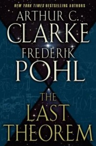

# The Way the Future Blogs

Фредерик Пол

## Сэр Артур и я



Впервые я встретил [Артура Кларка](https://web.archive.org/web/20090123111018/http://www.arthurcclarke.net/) в 1950-х годах, во время его первого кросс-атлантического визита в Нью-Йорк К тому времени Артур уже зарекомендовал себя как первоклассный писатель научной фантастики, и он делал то, что делают писатели-фантасты в незнакомом городе: Он искал других НФ-писателей, с которыми можно было бы поговорить.

Он нашел их в довольно аморфной по форме группе, которая называла себя [Клуб Гидра](https://web.archive.org/web/20090123111018/http://jophan.org/mimosa/m25/kyle.htm), где я был одним из девяти руководителей, которые были его основателями. Мы стали друзьями. И оставались ими на протяжении всего полувека, оставшегося от жизни Артура. Мы встречались по воле случая - на кинофестивале в Рио-де-Жанейро, на случайных научных встречах, на разнообразных "конвентах" - так в sf говорят о сборищах научной фантастики - во многих местах и в разное время.

В первые годы Артур Кларк много времени проводил в Нью-Йорке, обычно останавливаясь в отеле "Челси" на Западной 23-й улице, и при возможности я присоединялся к нему, чтобы поужинать или выпить - это были деньги со счета и с радостью оплачивались моим издателем, потому что в те дни я был редактором и стремился опубликовать как можно больше Кларка, который попадался мне под руку. Но к началу тысячелетия наша дружба свелась к скудной переписке и случайным телефонным разговорам. Я забросил редактирование, чтобы сконцентрироваться на собственном творчестве. От чего Артур отказался, так это от того, чтобы когда-нибудь покинуть свой дом на острове [Шри-Ланка](https://web.archive.org/web/20090123111018/https://www.cia.gov/library/publications/the-world-factbook/geos/ce.html), где я никогда не был. (Хотя я посетил множество других стран, Шри-Ланка не была одной из них)

Затем, в одном из писем в начале 2006 года, Артур довольно невзначай упомянул, что за пару лет до этого в порыве энтузиазма он подписал издательские контракты на несколько книг, которые, как он теперь был уверен, он никогда не сможет написать сам. Большинство из них он поручил закончить другому писателю, но была одна, под названием *The Last Theorem (Последняя теорема)*, для которой ему нужен был соавтор.

Это прозвучало как намек, и я его понял. Я написал в ответ: "Если тебе действительно нужен соавтор для того незаконченного романа, то Баркис наверняка согласится. Мне нравится сотрудничать, и, к сожалению, похоже, что у меня закончились соавторы"

Мне жаль говорить, что это было не более чем правдой. Из нескольких десятков моих опубликованных книг почти треть была написана с соавторами, обычно с давними друзьями - [Айзек Азимов](https://web.archive.org/web/20090123111018/http://www.asimovonline.com/), [Лестер дель Рей](https://web.archive.org/web/20090123111018/http://www.nndb.com/people/208/000085950), [Сирил Корнблат](https://web.archive.org/web/20090123111018/http://www.luna-city.com/sf/cmk.htm) и [Джек Уильямсон](https://web.archive.org/web/20090123111018/http://www.sfwa.org/news/2006/jwilliamson.htm) среди них, и все четверо с тех пор ушли из жизни. Мне пришло в голову, что призывать его присоединиться к группе с таким высоким уровнем смертности, возможно, не самое лучшее побуждение для предлагаемого партнера, и действительно, когда прошло несколько недель, а я не услышал от Артура никакого ответа, я начал думать, не спугнул ли я его от этой идеи. Но тут пришло письмо, причем не от самого Артура, а от его нью-йоркского агента, в котором говорилось, что Артур передал ему мое предложение, и добавлялось:

> После получения этого письма от Артура я обсудил его с его редактором Крисом Шлюпом, а он обсудил его со своими коллегами и начальством в издательстве Ballantine/Del Rey. Я рад сообщить, что сегодня они позвонили мне и сказали, что с радостью примут участие в продолжении..... Мы продали материал Ballantine на основе некоторых кусочков, предоставленных Артуром, и краткого наброска. Полагаю, ты захочешь увидеть их, прежде чем возьмешь на себя обязательства по этому проекту.

У меня не было сомнений в том, что я хочу написать книгу, но я с нетерпением ждал заметок Артура. Когда они пришли, то составили около сотни страниц заметок и черновиков, некоторые из них были набросками, некоторые - вполне законченными.

Роман должен был называться "Последняя теорема" - это отсылка к знаменитой каракуле французского математика XVIII века Пьера Ферма (https://web.archive.org/web/20090123111018/http://www.simonsingh.net/Pierre_de_Fermat.html). Ферма размышлял над хорошо известной математической проблемой. Если возвести в квадрат стороны правильного треугольника и сложить их вместе, то их сумма будет равна квадрату гипотенузы треугольника. Самый маленький треугольник, для которого это работает в целых числах, имеет стороны в три и четыре единицы и гипотенузу в пять. Три в квадрате, или девять, плюс четыре в квадрате, или 16, равняется 25, что является квадратом пяти единиц, которые отмерила гипотенуза.

Это, конечно, пока что не представляет особой проблемы. Все, кого это хоть сколько-нибудь волнует, знают об этом.

Все и всегда знали, по крайней мере, со времен древних греков. Вопрос, который беспокоил Ферма, был связан с уравнениями с большими экспонентами. Может ли когда-нибудь существовать треугольник, в котором a-cubed плюс b-cubed равнялись бы c-cubed?

Не может, заявил Фермат и добавил, что сам недавно обнаружил элегантное доказательство этого утверждения, "которое, - написал он, - слишком мало, чтобы вместить в себя" И все прошедшие с тех пор годы другие математики пытались найти то элегантное доказательство, которое, как утверждал Фермат, у него было. Ни один из них не преуспел в этом, и умные деньги теперь делают ставку на предположение, что Фермат просто ошибся и никогда не имел такого доказательства.

Когда я читал все это в отрывочных заметках Артура, в мой разум начало стучаться небольшое чувство предчувствия. Я пережил свой собственный период увлечения заумным искусством теории чисел, поэтому все это было мне знакомо и интересно. Но как быть с обычным покупателем книг? В издательском бизнесе считается аксиомой, что американские покупатели книг ненавидят, боятся и презирают математику в любой форме. Станут ли они покупать книгу, само название которой представляет собой непонятное математическое высказывание?

Ну, сказал я себе, конечно, да. На самом деле книга не о теореме. Она о мальчике, который полон решимости заново найти это потерянное доказательство, и о том, что произойдет с ним, с его миром и даже с его галактикой после того, как он это сделает. Кроме того, там было много всего интересного, включая замечательное боевое оружие, которое побеждало в сражениях, никого не убивая; трогательную сцену между Ранджитом Субраманианом, центральной фигурой истории, и его отцом, главным священником буддийского храма на Шри-Ланке; пару захватывающих гонок в космосе; смерть главного героя; эскизы - нет, не такие большие, а именно эскизы мизинца - главных персонажей. И многое другое, включая, я был уверен, еще один великий ресурс, который восполнит все недостающие кусочки, - самого Артура.

Поэтому я быстро написал Артуру записку, в которой сообщил, что принимаю довольно щедрые условия его предложения, и начал проводить исследования, возвышенно уверенный в том, что написать эту книгу будет относительно легко. Так получилось, что в то время у меня был наполовину написан собственный роман, но отложить его, чтобы заняться книгой Артура, не составило труда; я уже давно сообщил Джиму Френкелю, моему редактору [Tor](https://web.archive.org/web/20090123111018/http://us.macmillan.com/Tor.aspx), что он обязательно возьмется за книгу, но я не собираюсь подписывать с ним контракт, пока не закончу ее, так как не хочу, чтобы меня поджимали какие-то контрактные сроки. И я начал писать *The Last Theorem (Последняя теорема)*

У каждого писателя есть свой собственный идиосинкразический способ переноса слов из головы на бумагу. Мой немного необычен в двух отношениях.

Во-первых, я пишу понемногу каждый день - под выражением "каждый день" я подразумеваю все дни, которые есть, включая Рождество, мой день рождения и дни, когда мне делают корневой канал.

Во-вторых. Я делаю это независимо от того, где нахожусь. Некоторые из своих лучших произведений я писал в гостиничных номерах, в аэровокзалах, в самолетах на высоте 30 000 футов по пути, скажем, в Найроби или Пекин, а также в довольно большом количестве мест, которые еще более странные. В том числе, в старые добрые времена Второй мировой войны, в про-станции на поле Чануте, где я учился на метеоролога ВВС, потому что это было единственное место на базе, где не выключали свет после такта.

Но из всех мест, где я мог бы зарабатывать на хлеб насущный, моим личным фаворитом является хороший круизный лайнер, везущий меня в какую-нибудь часть света, которую я никогда не видел.

На этот раз наш запланированный круиз был не по одному из великих соленых морей. Мы совершали речной круиз по Дунаю, стартуя из Бухареста, Румыния, затем по суше до реки, вниз по течению до Черного моря и обратно вверх по течению через Болгарию, Сербию и Хорватию до Будапешта, Венгрия. Так получилось, что в большинстве этих мест я уже бывал в 1960-х годах, когда читал лекции за границей для Госдепартамента США, но это не имело значения. Моя жена сошла с корабля, чтобы посетить местные достопримечательности. А я - нет. Я оставался на борту со своими линованными желтыми блокнотами и шариковыми ручками, записывая слова с огромной скоростью.

За все время между отплытием из Чикаго и нашей посадкой на речной теплоход я не пытался поддерживать связь с Артуром. Но наше судно было хорошо снабжено электронной почтой, и одним из первых я написал ему, чтобы спросить о некоторых интересных инопланетных персонажах в его записках. Их называли Великими Галактиками. Они практически управляли всем, и я понял, насколько полезными они могут быть в готовой истории, поэтому предложил ему рассказать обо всех мыслях, которые у него когда-либо возникали по поводу этих чудесных сверхсуществ. Однако его ответ оказался гораздо менее полезным, чем я надеялся. Все, что он знал о Великих Галактиках, сказал он мне, было на тех страницах заметок, которые передал мне его агент. Когда-то, сказал он, у него, несомненно, было множество дополнительных идей о них. Больше у него их не было. Они бесследно исчезли.

Изумленный и обеспокоенный, я попросил Артура рассказать о подробностях. Он смог дать мне очень мало. Очевидно, в один из дней 2003 года с Артуром произошла забавная вещь. После подписания всех этих контрактов он проснулся однажды утром и обнаружил, что не помнит, как писать ни один из них.

Не проси меня объяснить, как такое возможно. Артур и сам не очень хорошо объяснял мне, но вот оно. Каждое слово о том, как написать любую из этих книг, исчезло из его головы. Он сказал, что с тех пор ему вполне удавалось писать приветствия из 300 слов различным группам по всему миру, которые хотели почтить его память. Но ничего более амбициозного. На этом его писательские навыки не заканчивались.

Поэтому я поднялся на верхнюю палубу и некоторое время смотрел на проплывающие мимо берега реки, размышляя над этим новым событием. Это означало, что у меня будет больше работы - или, точнее, не работы, а ответственности.

Тем не менее, это было не так уж и плохо. Артур пообещал просматривать каждую страницу по мере того, как я буду ее писать, и делать настолько полезные комментарии, насколько он сможет их сгенерировать. Это была новая игра, правда. Но не обязательно такая, которой я не мог бы наслаждаться. Итак, я спустился на обед, и, когда я допивал вторую чашку кофе, второй помощник корабля передал мне новое письмо. Оно было от моего собственного нью-йоркского агента, и в нем говорилось: "Если ты действительно пишешь *The Last Theorem (Последняя теорема), то тебе следует остановиться. Агент Кларка отменил сделку"

Когда, наконец, книга была закончена, переработана в угоду Артуру, переработана в угоду мне, переработана в угоду Крису Шлюпу, нашему редактору [Дель Рей](https://web.archive.org/web/20090123111018/http://www.randomhouse.com/delrey), я отправил Артуру письмо, в котором сообщал хорошие новости и говорил: "За все мои книги я никогда не встречал ни одной с таким количеством проблем, как эта. Я рад, что все получилось, но я бы не стал делать это снова для чего-либо меньшего, чем *Война и мир*" Ибо этот отказ нью-йоркского агента Артура был лишь первым в череде беспрецедентных трудностей.

Я не очень серьезно отнесся к этому первому испытанию. Инцидент был не более чем ссорой между нью-йоркскими агентами Артура и моими собственными агентами из-за распределения комиссионных, и я знал, что в конечном итоге ничего не получится. Тем не менее, потребовалось немало недель переговоров взад-вперед, чтобы все уладить, а ситуация становилась все хуже.

Например, чуть позже электронный провайдер Шри-Ланки вышел из бизнеса, видимо, никому не сказав, и поэтому электронная почта перестала работать, а связь с Артуром прервалась больше чем на неделю. (Довольно неприятно, когда ты пытаешься отправить письмо на адрес, которым постоянно пользовался, а полубог Yahoo сообщает тебе, что такого адреса нет и никогда не было) Позже такое же отключение произошло еще на неделю, но на этот раз не по вине человека, а из-за сильного тропического шторма. А между всеми остальными проблемами была повторяющаяся и непреодолимая - здоровье Артура.

На ранних этапах Артур читал то, что я писал, как только отправлял ему, и, как и обещал, подробно комментировал и предлагал. Это не всегда было приятно. В начале книги, по сюжетным соображениям, я хотел, чтобы наш Ранджит Субраманиан провел некоторое время в одиночной камере. Проще всего было сделать так, чтобы он оказался втянут в постоянный кровавый и жестокий конфликт, который правительство Шри-Ланки вело с частью своего тамильского населения, но это, как быстро сообщил мне Артур, была очень неудачная идея. Хотя все сменявшие друг друга правительства Шри-Ланки были радушны к своему уважаемому гостю (и Артур тоже был весьма щедр к Шри-Ланке), он никогда не забывал, что на самом деле он гость, и его пребывание здесь может быть прекращено, если он хоть раз серьезно обидит правителей страны. Что, как он опасался, легко могло сделать мое описание продолжающейся войны.

Вина здесь была моя. Я знал, что беспокоило Артура по этому поводу, и знал также, насколько тревожными были для него вторжения этих так называемых "Тамильских тигров". Еще в начале 70-х, когда мы с Артуром были в напряженном лекционном туре по Японии, он был как всегда великолепен и полезен, пока находился перед аудиторией, но стоило ему сойти со сцены, как он отправлялся на поиски англоязычных выпусков новостей, чтобы проверить, насколько близко "Тигры" подобрались к его школе дайвинга на побережье (как оказалось, не настолько близко, чтобы нанести большой ущерб.) Школа пережила все сражения войны, но окончательно была разрушена спустя десятилетия цунами 2006 года в Боксинг-Дей, которое унесло жизни сотен тысяч людей в этом районе)

Так что я выжал из себя пулю, выбросил целую пачку неплохих страниц и написал совершенно другой отрывок о заключении бедного Ранджита. (Который, как я теперь думаю, на самом деле немного лучше, чем материал, который он заменил, доказывая, что самый простой путь не обязательно является лучшим для писателя)

Это был, по сути, единственный элемент сюжета, на который Артур наложил прямое вето. В основном его комментарии были полезными и поддерживающими. Но с течением недель они приходили все медленнее и становились все менее подробными. Виной тому было его тело, которое изнашивалось.

Еще полвека назад я заметил, что однажды вечером Артуру было немного трудно встать с мягкого дивана, на котором он растянулся на каком-то собрании, проходившем в тот вечер. Когда я спросил его об этом, он пожал плечами. "Я немного неудачно нырнул", - сказал он. "Это пройдет" Но это было не от несчастного случая при нырянии, и это не прошло. Лучшее медицинское мнение, а это было практически лучшее мнение, которое мог предложить медицинский мир, потому что Артур посетил все крупные исследовательские центры, доступные в его поисках помощи, заключалось в том, что это было то, что они называли "постполиомиелитный синдром" Однако этот диагноз не привел к излечению, потому что лекарства не было. В итоге Артур оказался в инвалидном кресле и в последние десятилетия своей жизни никуда без него не выезжал.

Но в те 60-е и 70-е годы до "в конечном итоге" было еще очень далеко. Артур был занят, как никогда, и мы проводили время вместе на тех или иных мероприятиях.

По случаю его 90-летия, когда стало ясно, что он быстро угасает, собралась куча его друзей, чтобы отправить ему поздравления. Я решил попытаться подбодрить его, напомнив о тех замечательных временах, которые мы провели вместе, в частности, на одном симпозиуме NASA, проходившем примерно в 1970 году и посвященном тому, что они называли "Спекулятивной технологией" Он проводился только по приглашениям, но даже в НАСА понимали, что для эффективной спекуляции нужно иметь в списке приглашенных пару писателей научной фантастики, чтобы показать остальным, как это делается. Поэтому они решили пригласить двух представителей нашей породы - Артура Кларка и меня.

Я не знаю, получило ли НАСА от конференции то, что искало. Знаю только, что для меня, и я уверен, что для Артура тоже, это были грандиозные выходные. По замыслу, конференция проходила на острове у побережья Джорджии, откуда на материк можно было добраться только на одном маленьком винтовом самолете. Это означало, что звёзды мероприятия, те, кто обычно прилетает на остров только для того, чтобы выступить с речью, а затем сразу же улетает на следующее свидание, были вынуждены оставаться здесь и общаться с остальными на протяжении всего уик-энда - далеко не лучший способ организации подобных мероприятий.

Приглашенных гостей было пятьдесят или шестьдесят человек, каждый из которых был лидером в какой-либо технологической или научной области, включая старых друзей, таких как Марвин Мински, глава MIT по робототехнике и искусственному интеллекту, и новых, таких как астронавт "Аполлона" Эд Митчелл, который пытался отправить телепатические сообщения с поверхности Луны своим коллегам на Земле. Всем им было что рассказать. Но не только официальная программа была замечательной. В самом начале мы с Артуром обнаружили несколько велосипедов, которыми никто не пользовался, и мы уговорили остальных присоединиться к нам в велосипедных поединках: я крутил педали, а Артур стоял на руле и отбивался от противников. (В своем послании на день рождения я спросил его: "Помнишь, как мы были бодрыми?")

А потом для меня встал вопрос о [Вернере фон Брауне](https://web.archive.org/web/20090123111018/http://history.msfc.nasa.gov/vonbraun/bio.html).

В течение многих лет общие друзья, в основном [Вилли Лей](https://web.archive.org/web/20090123111018/http://www.nndb.com/people/375/000083126) и несколько других пересаженных немецких ученых, пытались убедить меня подружиться с фон Брауном. Я отказывался. Я не мог с легкостью простить ему то, что он был офицером нацистских СС и использовал рабский труд для создания своих ракет. Правда, как гласило название его книги, он всегда целился в звезды, но то, во что он попадал, было Лондоном.

Поэтому мы с фон Брауном поддерживали отношения дальнего знакомства. Он приглашал меня на несколько крупных запусков на мысе, но я никогда не общался с ним один на один до той конференции НАСА. Там, в один прекрасный день, по окончании рабочего дня, нас пригласили на пикник на дальнем конце острова. Правда, возникла транспортная проблема. На острове было ограниченное количество машин. В нашем распоряжении было только три, номинально вмещающих около 15 человек, но уже двадцать с лишним из нас выстроились в очередь и были голодны. Было только одно возможное решение. Мы удвоились. Так что следующие полчаса или около того, пока мы пересекали остров, у меня на коленях сидел фон Браун, и разговор был неизбежен.

Это не привело к близкой дружбе. В течение следующих нескольких лет я сталкивался с фон Брауном всего один или два раза, а потом он умер. Но я рад, что это произошло. Нацисты были большим злом... но если бы некоторые из моих бабушек и дедушек сделали несколько иной выбор относительно того, где они хотят провести свою жизнь, еще в конце XIX века, то я вполне мог бы родиться в Германии, а не в Бруклине. Как бы я справился с чудовищностью, которой был гитлеровский Третий рейх, я не могу сказать. Надеюсь, я бы не поддался искушению, но ведь и фон Браун тоже, до определенного момента.

*Последняя теорема* (The Last Theorem)

После этого наступило долгое молчание, растягивающееся на недели, а то и на месяц-другой. То тут, то там. Мне сказали, что это происходило потому, что Артура забирали в больницу и иногда не разрешали общаться с внешним миром. Когда он действительно болел, его шриланкийский домашний и офисный персонал делал все возможное, чтобы не дать ему возможности беспокоиться о чем-либо, кроме задачи выздороветь. После месяца молчания я отправил ему упомянутое выше письмо, в котором сообщил, что моя работа завершена, и пожелал, чтобы он собрался с силами и рассказал мне, что он думает о финальном варианте, который уже давно находится в его руках. Наверное, я чувствовал себя немного мелочным, потому что закончил письмо словами: "Пожалуйста, дай мне весточку от тебя. Я знаю, что ты стар и нездоров, но я тоже"

А через день или около того я получил от него длинное письмо, в котором было написано все то, что я хотел услышать. Он одобрил все, что я сделал; он считает, что книга получилась прекрасной; он простил меня за то, что я не сделал одну или две совсем незначительные правки, потому что (как я ему сказал) я влюбился в эти части и надеялся, что он не будет разочарован тем, что я их не изменил. И дело было не только в том, что он сказал все то, на что я надеялся, - он сказал это безошибочной прозой старого доброго сэра Артура Кларка, стиль которого был таким же живым и лаконичным, как всегда.

Мне трудно передать, насколько приятным было для меня это письмо. Я набросился на ответ, чтобы сказать ему, что, хотя его кости, возможно, крошатся, а внутренние органы рассыпаются, очевидно, что его ум по-прежнему остер. А потом, спустя день или около того, я включил новости по телевизору, чтобы составить себе компанию, пока я разбирался с письмами, и диктор сообщил, что сэр Артур Кларк умер во сне накануне вечером.

Так что мы его потеряли.

Артур был ценным гражданином нашей планеты, и его будет - уже есть - очень не хватать. Тем не менее, есть еще один и почти комичный аспект этого события, которым я хотел бы, чтобы он поделился.

Поскольку я имел честь читать подробные и добродушные инструкции, которые Артур продиктовал и оставил для организации собственных похорон, я знаю, что его бы позабавила маленькая шутка, которая кроется в этой печали. Возможно, смертельность сотрудничества над книгой с Фредом Полом не имеет под собой никаких оснований, но запись есть. И я не думаю, что мне захочется снова сотрудничать с каким-либо другим писателем.

### 17 комментариев

- [Дэвид Дайер-Беннет](https://web.archive.org/web/20090123111018/http://dd-b.net/) говорит:
Я сейчас как раз читаю _Astounding Days_ сэра Артура и как раз наткнулся на твою историю о сотрудничестве с ним над _The Last Theorem_, и она как-то сразу вписалась.  А еще у меня очень приятные воспоминания о твоих мемуарах, в честь которых ты назвал этот блог.
Это, наверное, не очень важная часть истории, и ты, наверное, уже знаешь, но последняя теорема Ферма была окончательно доказана в 1995 году.  Многие, правда, считают, что на самом деле у него не было доказательства; по крайней мере, те доказательства, которые мы имеем на данный момент, очень маловероятны, чтобы быть таковыми (хотя первое, конечно, НЕ вписывается в эту границу!)
Я прочитал твою запись о проблемах с правой рукой и связанных с этим проблемах с набором текста и не жду, что ты будешь тратить свое скудное писательское время на меня!
[**January 19, 2009, 11:23 pm**](/posts/2009-01-05-sir-arthur-and-i/)
- [File 770 " Blog Archive " Фред Пол прибывает в будущее](https://web.archive.org/web/20090123111018/http://file770.com/?p=789) сказал:
[...] в одном из первых постов Пола рассказывается, как он начал сотрудничать с Артуром Кларком над "Последним [...]
[**January 20, 2009, 12:04 am**](/posts/2009-01-05-sir-arthur-and-i/)
- Дэниел Бун говорит:
Огромное спасибо за этот кусочек мемуаров!  Книга Артура Кларка была, по-моему, вторым томом научной фантастики, попавшим мне в руки лет тридцать назад, и тогда это был далеко не молодой том.  Приятно слышать, что он был самим собой до конца.
[**Январь 20, 2009, 12:28 am**](/posts/2009-01-05-sir-arthur-and-i/)
- стив Бейкер говорит:
Я наслаждался многими твоими книгами на протяжении многих лет. В те годы, когда научная фантастика была еще фэнтези. Сегодня может появиться дышащий водородом говорящий паук из развитой цивилизации, которая прекратила свое существование миллиард лет назад, и благодаря тебе и твоим товарищам никто не будет пялиться.
[**Январь 20, 2009, 11:13 am**](/posts/2009-01-05-sir-arthur-and-i/)
- Говорит Энн Кампер:
Ответ не ожидается, читать необязательно.  
  Вы станете последним соратником и тем самым завершите

 рекорд "летальности сотрудничества над книгой с Фредом Полом".  

 Однако я прошу тебя не торопиться с этим выводом. Пусть твое тело выдержит тебя, пока ты не будешь готов. Спасибо тебе за чудесные миры, которые ты создаешь.
[**Январь 20, 2009, 2:17 pm**](/posts/2009-01-05-sir-arthur-and-i/)
- [You Have the Power " Blog Archive " No Recession Here, Alang Shipyard Flourishes | Market News ...](https://web.archive.org/web/20090123111018/http://power.trippinpipe.com/no-recession-here-alang-shipyard-flourishes-market-news/) says:
[...] The Way the Future Blogs " Blog Archive " Сэр Артур и я [...]
[**January 20, 2009, 3:40 pm**](/posts/2009-01-05-sir-arthur-and-i/)
- Крис Норрис рассказывает:
Я не могу поверить в свою удачу, что нашел этот блог. Читать размышления из первых рук человека, который был героем для меня и многих других людей моего поколения, - это чувство, для которого у меня мало слов. Ты и твои товарищи научили нас мечтать и заставили жаждать создавать завтрашний день уже сегодня.
[**Январь 20, 2009, 5:04 pm**](/posts/2009-01-05-sir-arthur-and-i/)
- [Стивен Питерс](https://web.archive.org/web/20090123111018/http://poptrope.blogspot.com/) сказал:
Если это показательно для того, чем ты будешь делиться, то я с нетерпением жду каждого слова. Мне определенно не терпится узнать о твоем опыте общения с другими людьми и даже о процессе написания. А теперь я отправляюсь покупать "Последнюю теорему" (The Last Theorem)
[**Январь 20, 2009, 6:15 pm**](/posts/2009-01-05-sir-arthur-and-i/)
- [Билл Хиггинс - Beam Jockey](https://web.archive.org/web/20090123111018/http://beamjockey.livejournal.com/) пишет:
Стив Бейкер пишет:
*Сегодня может появиться дышащий водородом говорящий паук из развитой цивилизации, которая прекратила свое существование миллиард лет назад, и благодаря тебе и твоим товарищам никто не будет пялиться*
При всем уважении, Стив, боюсь, что я бы уставился.
[**Январь 20, 2009, 6:59 pm**](/posts/2009-01-05-sir-arthur-and-i/)
- [Джерри Райт](https://web.archive.org/web/20090123111018/http://www.bewilderingstories.com/) сказал:
Я только что дочитал "Последнюю теорему" (The Last Theorem) и нашел ее восхитительной.  А потом Boing Boing отправил меня в этот блог!  Потрясающее совпадение.
[**Январь 20, 2009, 9:34 pm**](/posts/2009-01-05-sir-arthur-and-i/)
- Саймон сказал:
Какое знаменательное событие произошло сегодня. Во-первых, мистер Обама находится в Белом доме, а во-вторых, дорогой старый мистер Пол пишет блог! От твоего рассказа о последнем общении с Артуром Кларком у меня потекли глаза, сдерживаемые радостью от того, что один из моих любимых авторов детства (думаю, мне было около 11 или 12 лет, когда я впервые прочитал Gateway, и только недавно я имел удовольствие пересмотреть его) в режиме онлайн делится с нами. Я обвиняю тебя, сэр, в том, что ты развратил меня в впечатлительном юном возрасте такими причудливыми мыслями, и надеюсь, что ты примешь это обвинение в том духе, в котором оно было высказано, - с любовью и глубокой признательностью. Теперь ты в моих мыслях (и в списке моих любимчиков). Я тоже отправляюсь на поиски экземпляра "Последнего Теорума".
[**January 21, 2009, 2:48 am**](/posts/2009-01-05-sir-arthur-and-i/)
- Бад Вебстер сказал:
Фред, это потрясающая новость!  Теперь я смогу выуживать у тебя информацию в интернете, и мне не придется страдать от капризов USPS.
Подозреваю, что это будет очень популярный блог.
[**January 21, 2009, 6:09 pm**](/posts/2009-01-05-sir-arthur-and-i/)
- Гарднер Дозуа говорит:
Рад "видеть" тебя здесь, Фред, или что бы мы там ни делали, "где бы" мы ни находились.  Странный мир, в котором мы живем, не так ли?
Недавно мне напомнили, что ты был одним из немногих писателей НФ, предсказавших что-то даже отдаленно похожее на сегодняшний мир интернета, в "AGE OF THE PUSSYFOOT".
[**21 января 2009, 20:26 pm**](/posts/2009-01-05-sir-arthur-and-i/)
- [Linkblogging for 22/01/09 " Sci-Ence! Justice Leak!"](https://web.archive.org/web/20090123111018/http://andrewhickey.info/2009/01/22/linkblogging-for-220109/) says:
[...] Поль начал вести блог. Вот история его недавней книги, совместной работы с покойным Артуром Си [...]
[**January 22, 2009, 1:19 pm**](/posts/2009-01-05-sir-arthur-and-i/)
- [Джон Райт](https://web.archive.org/web/20090123111018/http://www.sff.net/people/John-c-wright/) рассказывает:
Это действительно странный мир, в котором мы живем. Красивый, головоломный, запутанный и логически выстроенный мир, но странный. Артур Кларк был одним из тех, кто в моей непутевой юности впервые убедил меня в этом. Его будет не хватать.
Хех. У тебя и моей прекрасной и талантливой жены один и тот же редактор, старый добрый Джим Френкель.
[**Январь 22, 2009, 2:55 pm**](/posts/2009-01-05-sir-arthur-and-i/)
- Аллан Маурер сказал:
Мне понравилась "Ретроспектива Будущего" (THE WAY THE FUTURE WAS), и когда я услышал о твоем блоге в "Локусе", с нетерпением ждал возможности прочитать его. И романы Пола и Корнблата 1950-х годов, и твое редактирование Galaxy и IF, не говоря уже о твоей периодической нехудожественной литературе, остаются в моем списке хорошего чтения. Книга получилась такой же хорошей, как я и ожидал, и я надеюсь, что ты проживешь еще 89 лет (ну же, биотехнологи, догоняй НФ).  

Ты можешь попробовать использовать одну из систем распознавания речи для написания текстов. Они стали лучше, чем были раньше.
[**January 22, 2009, 3:30 pm**](/posts/2009-01-05-sir-arthur-and-i/)
- [Сун Ли](https://web.archive.org/web/20090123111018/http://soon-lee.livejournal.com/) говорит:
Спасибо, сэр, что поделились своим опытом.
[**January 22, 2009, 4:47 pm**](/posts/2009-01-05-sir-arthur-and-i/)

[Записи (RSS)](https://web.archive.org/web/20090123111018/http://www.thewaythefutureblogs.com/feed/)
[Комментарии (RSS)](https://web.archive.org/web/20090123111018/http://www.thewaythefutureblogs.com/comments/feed/)
[(Atom)](https://web.archive.org/web/20090123111018/http://www.thewaythefutureblogs.com/feed/atom/)
  
[WordPress](https://web.archive.org/web/20090123111018/http://wordpress.org/)
[TWTFB](https://web.archive.org/web/20090123111018/http://dicksmithsoftware.com/)