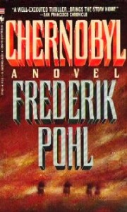

# The Way the Future Blogs

Frederik Pohl

## Me and the Biz

For years I have held to the theory that the trouble with sf films is that the people in charge of making them in the studios are, at the highest level, demented little animals.  That would explain it all.  However I am no longer quite as sure of this as I was, since my dearly beloved daughter-in-law, as a senior vice president of one of the biggest organizations, says it certainly isn’t true of her own bunch. She even says that, in many years of dealing with executives at other outfits, she has encountered several who are hardly demented at all, and, as I know that Meg would never lie to me, my theory must be wrong.

Still. . . .  Well, let’s look at the record.

In the task of turning my written words into performable scripts there has been one recurring problem. (With English-language producers, I mean.  With Europeans —  German, Spanish and Italian — there have been other problems, but at least they got something made.)

There are three books of mine — rather two of mine, Gateway and Man Plus,  and one that was half mine and half Cyril Kornbluth’s, The Space Merchants — that have struck any number of Hollywood people as good bets for dramatization.  So they have repeatedly ponied up money for option or purchase — over the years a not negligible sum  — and then tried to find someone to write a script.

This is where every one of these ventures has come to grief.  They’ve never been able to find a writer who could figure out a way of translating the novel into a shootable script.  In the process they have given employment to quite a few scriptwriters all over the world, at a cost of quite a few dollars apiece — apparently totaling, in a single case, close to a million — but the one person they have never once asked if he had any ideas to solve the problem was the guy who wrote the things in the first place, namely me.

Honestly, now.  Is this not pretty close to madness?

I am, of course, not alone in this; approximately 99 out of every 100 people who have sold the rights to a published story to a moviemaker have similar stories to tell.  Still, it rankles.  Oh, I do not deceive myself that I know more about scriptwriting than a Hollywood pro does.  I do know more about those stories than they do, though.

I don’t mean to say that every producer is an imbecile.  I can testify that there is, or was, at least one Hollywood producer who knew a good story when he saw it and immediately set about getting it made as a film. His name was Larry Schiller, and the novel was my book Chernobyl, the story of the nuclear power plant that took out a whole industry when it blew.  Larry acquired the rights, lined up financing, developed a script, began casting and arranged with the suddenly independent country of Belarus, which owned a power plant identical with Chernobyl but more prudently managed, to do location shooting there … being careful to stop in Chicago now and then as he passed through to let me know how things were going.

Oh, vision of delight!  Everything was going just as one ignorantly dreams. . . .

And then at the last minute, thirty-six hours before principal shooting was to start, one of the pledged backers pulled his money out of the deal, and the whole house of cards irretrievably collapsed.

I regard that as one more symptom of an industry-wide dementia, and it broke my heart. It didn’t help Larry’s any, either, because after that happened he abandoned his career as a big-time motion-picture producer and turned himself into a vastly successful writer of bestselling books. I’m glad for Larry. But I do wish the damn film had got itself made.

### 8 Comments

- Kaysays:Mr. Pohl,I’m enjoying your blog and wish that all science fiction novelists would follow your lead. Regarding film adaptations, you’re right when you say that not all executives are demented little animals. But not all screenwriters are, either. It isn’t solely the fault of the screenwriter if your book isn’t well adapted. Why don’t the writers contact you? A lot of writers simply don’t want to do this. They consider the script a separate entity. Some writers just wouldn’t think of doing it. And some may have tried to contact other authors, but were rebuffed. But one big, bright reason is that if a studio has optioned rights to a book, they are going to the writer. The writer isn’t bringing the property to the studio. Studios have lists of pre-approved writers they will go to with properties, and it’s almost assured that the writer who takes the assignment wasn’t at all familiar with your work before getting the call. It’s a job, not a calling. Sometimes, a writer will option and adapt a book on spec and usually, this type of writer has a passion for the material and the author. But if you’re a screenwriter who isn’t getting those open writing assignments, you’re probably a screenwriter who doesn’t make a lot of money and an option is expensive. There are many science fiction books I’d love to adapt but can’t afford to option, and I’m a professional TV writer. It would be wonderful, I think, if authors who are eager to see their work translated to film would be willing to work with screenwriters who are passionate about the work. But we’ve all got to make money, one way or the other. So I understand why that usually doesn’t happen.This is an incredibly roundabout way of saying that the disappointments you’ve felt can’t be so simply quantified. Just a suggestion that the next time one of your books is optioned, tell the producer or executive that you are open and available for collaboration. Chances are, it just didn’t occur to them!February 15, 2009, 2:00 am
- Mike Weasnersays:Mr Pohl,I hope your experiences with radio were better.  I enjoy listening to your stories that were aired on X Minus One, Dimension X, and the CBS Radio Workshop.  Perhaps in a future blog entry you could talk about those radio experiences.Thanks!  –MikeFebruary 15, 2009, 8:41 am
- Jeffsays:Having sat through so many horrible sci-fi movies, what you say doesn’t surprise me in the least.February 15, 2009, 11:33 pm
- Toothsoup: Back to reality.says:[...] Pohl has a go at the sci-fi film industry, with a few amusing [...]February 16, 2009, 2:42 am
- SebiMeyersays:I would like to second the request for some radio-related anecdotes.One of the reasons scifi fares so badly in Hollywood (with the exception of a few “boldly” ones) is that it costs so much to realize what good scifi writers like yourself dream up. Sets, special effects and make up cost millions, so it’s somewhat understandable, albeit annoying, that producers are apprehensive about scifi.In radio it costs about the same to create scifi as it does to create a murder mystery.February 16, 2009, 7:31 am
- Nicholas Wallersays:It occasionally happens that directors/screenwriters and authors collaborate - Michael Powell (director of The Red Shoes, Black Narcissus, The Life and Death of Colonel Blimp and A Matter of Life and Death) liked Ursula le Guin’s Earthsea trilogy and started collaborating with her on it.Mind you, this didn’t result in a production (the various things that have been produced have nothing to do with that script) and so you’re right, in that the studios who did produce the films didn’t really talk to le Guin.“Many years ago Michael Powell and I wrote a script, combining the first two books, which was brief, lively, and perfectly true to the spirit of the books” said le Guin -http://www.ursulakleguin.com/Interview-Castagno.htmlhttp://www.powell-pressburger.org/Reviews/MichaelPowell.htmlfrom Powell’s angle:“I began to rough out a script on the Ursula Le Guin trilogy. Having done a few sequences, I summoned up courage and sent them to her. She was delighted with them. I said, “In that case, let’s do the script together.” “We have done it so by correspondence. We have only met twice, once in San Francisco and Portland, Oregon where she lives. It’s been a most happy collaboration and it’s still going on.”Powell died nearly 20 years ago, so obviously it’s not still going on now…Eventually something came out - the title of this Locus article from Ursula le Guin is “Frankenstein’s Earthsea”!http://www.locusmag.com/2005/Issues/01LeGuin.htmlFebruary 16, 2009, 11:43 am
- Jeffsays:The Legend of Earthsea is a perfect example. I’m glad Nicholas mentioned it. I watched about the first five minutes, saw that it wasn’t Earthsea, and changed the channel.Another fine example is the first Dungeons and Dragons movie - written and produced by people who had never played the game. At least they didn’t have modern players magically transported to a fantasy world, but they might as well have.February 17, 2009, 8:33 am
- Larry Lennhoffsays:I think one part of the problem is that Hollywood keeps trying to make a movie out of a novel, which is really much too big.  If they worked with short stories, novelettes, or even novellas they wouldn’t have to cut so much.Of course, some people just want to have the use of the fans of the book while caring nothing for its content.  I refer toI, Robotas ‘based on a title by Isaac Asimov’, and similarly forStarship Troopers.February 17, 2009, 11:03 am