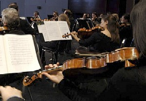

# The Way the Future Blogs

Frederik Pohl

## Music Hath Charms

At least for me it does, and by music I mostly, though not exclusively, mean the sounds produced by a symphony orchestra with or without a soloist (preferably violin) in some great concerto.  If you don’t happen to bend that way, you can skip this posting and let’s be friends anyway.

What brings this on is that the other night I went to a performance by the **Elgin Symphony Orchestra** that I found particularly interesting.  What, you ask, is there really an *Elgin* Symphony?  Well, yes there is, and (I speak as someone who has attended performances by most of the world’s greatest orchestras) don’t sniff.  The fact is  the orchestra itself is really quite good, and the soloists they import to ornament the regulars are world class.

Last night’s performance included three pieces.  The one that made sure I would come to the hall instead of giving that one of our season tickets to somebody else was Beethoven’s jolly 6th, or “Pastoral,” Symphony, which I have always loved (even when it was full of dancing Disney hippos and satyrs). The other two were by Argentinian composers — Astor Piazzolla’s “Tangazo” and Alberto Ginastera’s Harp Concerto — and I had never heard, or indeed heard of, either piece.

The surprise was that it was the two Argentinians that I found myself talking about on the way home.  They weren’t what I thought they would be.  In the orchestration of the string section of just about every classical composition I know, it is the first violins that carry the ball, with all the other strings basically supporting the stars.  Not in “Tangazo.”

It opens with the big strings, cellos and basses, playing in unison; then the violas and second violins join in and it is only quite a few bars later that the prima donna fiddlers, who have been sitting on their hands all along, finally get to add their own voices.  I don’t think I had ever heard anything quite like that before.

And when I saw in the program notes that Yolanda Kondonassis, the soloist in the harp concerto, would be up against four, count ’em, four percussionists I did wonder if we would ever get to hear her harp.  Well, we did.  She dominated the performance, and I don’t know how.

So I need to hear these pieces again. Fortunately I can, and if you want to hear them for yourself, you can, too, because FM radio station WFMT is broadcasting (and streaming) the whole concert on 24 April at 8 p.m. CST. I’d be interested to know what you-all think.

### 4 Comments

- Ronan O'Driscoll says:
Thanks for the info on the concert. I have put it on my google calendar! Really enjoy your blog Fred. 
Thanks,
Ronan O’Driscoll
March 5, 2009, 9:22 am
- Eric Horner says:
While I don’t lean toward strings, especially violins (I am a brass/wind man myself), I looked up both of the Argentinian pieces you mentioned on my favorite MP3 purchase site (emusic.com). From the 30 second clips they had, I was very impressed with the Tangazo.  Not so much the harp concerto.  But, then again, not so much of a harp guy.  I may have to put the streaming webcast on my calendar.
Keep writing, we appreciate it.
March 5, 2009, 2:24 pm
- Fathercrow says:
This sounds interesting. Have you been to Ravinia? They are doing Camelot this June, which should prove to be interesting as well. I just hope I can make it this year.
March 6, 2009, 3:07 am
- Phil Paine says:
Try the brilliant performances (and compositions!) of master double-bassist Edgar Meyer.  His “Double Concerto for Cello and Double Bass” [performed with Yo-Yo Ma], and his Concerto in D for Double Bass and Orchestra are fine. The two pair up again with Mark O’Connor to interpret Appalachian tunes on “Appalachian Waltz” (1996).  Meyer also brilliantly performs the works of Giovanni Bottesini, the Baroque composer most associated with the double bass.
March 12, 2009, 5:03 pm

**WordPress**
**TWTFB**