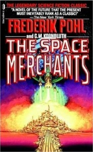

# The Way the Future Blogs

Фредерик Пол

## Я и Биз, часть II

**То, что прошло правильно, почти*

[Торговцы Космосом](https://web.archive.org/web/20090324084347/http://www.amazon.com/gp/product/0312749511?ie=UTF8&tag=7159-20&linkCode=as2&camp=1789&creative=390957&creativeASIN=0312749511)

И вот в самый разгар событий мне позвонил человек по имени Арнольд Перл.  Он сказал, что только что прочитал книгу.  Он подумал, что в ней есть некоторые возможности, которые, возможно, не приходили мне в голову, и хотел бы обсудить их.  И почему бы мне не заглянуть к нему домой в Алфавит-Сити - в то время это был приятный жилой район нижнего Ист-Сайда, еще не порабощенный наркотическими царствами, - и не поболтать?

Если ты более искушенный человек, чем я в 1950-е годы, то знаешь, кто такой [Арнольд Перл](https://web.archive.org/web/20090324084347/http://www.ibdb.com/person.php?id=4250).  А я не знал.  Ему пришлось рассказать мне.  Он был тем человеком, который взял книгу рассказов [Шолема Алейхема](https://web.archive.org/web/20090324084347/http://www.myjewishlearning.com/culture/2/Literature/Yiddish_and_Ladino/European_Writing/Sholem_Aleichem.shtml), *Дочери Тевье*, превратил ее в пьесу еврейского театра... а затем стимулировал этот процесс вместе с Джозефом Стайном, Джерри Боком и Шелдоном Харником, который переделал историю молочника и добавил несколько отличных песен - и все остальное, что было нужно, чтобы стать *Скрипачом на крыше*, практически самым большим и лучшим музыкальным событием, которое произошло на старом Бродвее.

И вот что ему интересно, - сказал Арнольд, наливая мне еще одну чашку чая, - можно ли сделать нечто подобное с *Торговцами Космосом*

Не могу сказать, что я знал, что именно мне предлагают, но то, что я знал, меня немного настораживало.  Мне не хотелось разочаровывать этого милого человека, и я прекрасно понимал, что ничего не знаю о написании пьес.  Не волнуйся, - сказал Арнольд.  Ему не нужен был готовый сценарий.  На что он надеялся, так это на проблески - короткий рассказ, даже одна страница из повести, противостояние, открытие.  Идея.

Или песня.

Или танцевальный номер - в конце концов, я ведь был большим фэном балета, не так ли?

Но ничего такого, что должно было бы соответствовать профессиональным стандартам театра.

Так что я сделал это.  Я сказал, что попробую, и пока я спускался от его дома в Ист-Виллидж, идеи начали сгущаться из того, что было тем аморфным облаком, из которого появляются такие вещи.  Так что я ждал, когда идеи придут.

Никакого "Если бы я был богатым человеком" не пришло ко мне из моей гимнастики, даже длинный и пустой отрезок железнодорожного пути.  Но я, как мне казалось, начал улавливать ритм процесса.  Одно представление - песня и танец о серьезной хирургической операции - надолго застряло в моем сознании.  Какое отношение это имело к будущему рекламного бизнеса?  Никакого.

Что сказал Арнольд, когда я показал ему это?  Он сказал: "Я рад видеть, что ты раскрепостился"

Было ли что-то из этого материала настоящим материалом для сюжета?  Не знаю, но иногда у меня возникало чувство, что с минуты на минуту появятся полезные кадры.  Мое большое горе заключалось в том, что мне пришлось делать все это в одиночку, потому что Сирил умер несколькими месяцами ранее.  Если бы он был рядом, весь процесс был бы как минимум вдвое легче и как минимум вдвое лучше.  Но его не было.

И вот однажды утром в шокирующе ранний час зазвонил телефон, и на линии был офис моего киноагента, [Х.Н. Свонсона](https://web.archive.org/web/20090324084347/http://www.people.com/people/archive/article/0,,20116500,00.html).  Я не хочу сказать, что это был сам Суони.  Это был один из его многочисленных ассистентов, помощников и прочих человеческих существ, населявших двухэтажную высотку, в которой располагался его офис.

"Фред?" - сказал голос в трубке.  "Свани говорит, что какие-то англичане под названием Redifusion Television предлагают 750 долларов за права на фильм *Торговцы Космосом*, и что ты хочешь, чтобы он с этим сделал?"

[**Продолжение следует. . . .**](/posts/2009-03-20-me-and-the-biz-part-ii-continued/)

**Связанные посты:*

[**Me and the Biz**](/posts/2009-02-15-me-and-the-biz/)

[**Me and the Biz, часть II (продолжение)**](/posts/2009-03-20-me-and-the-biz-part-ii-continued/)

[WordPress](https://web.archive.org/web/20090324084347/http://wordpress.org/)
[TWTFB](https://web.archive.org/web/20090324084347/http://dicksmithsoftware.com/)