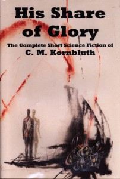

# The Way the Future Blogs

Frederik Pohl

**Is the Bell Curve a Crystal Ball?**
**Maxwell George Frederik Warren Pohl-Weary**

## Cyril



I think Cyril Kornbluth knew he wanted to be a writer at the age when most of us did, that is in his early teens.  His first efforts, or at least the first I knew anything about, weren’t stories.  They were poems.

He owned a book, written by one of his high-school teachers, I think, which gave the rules for composing every kind of verse I ever heard of.  Cyril and I studied the book and resolved to write one of each.  We made a good start, actually writing a **haiku** (we spelled it “hokku”), a **villanelle**, a **sestina**, two **sonnets** (one Petrarchan and one Shakespearean) and I think a couple of others.  We bogged down when we came to the **chant royal** (the chant royal is *HARD*) and, like most of the other  **Futurians**, we decided to try our luck with science fiction.  At that time, I think Cyril was maybe 14, and I three or four years older.

If Cyril had favorites among his stories, he didn’t tell me about them.  He did take his work seriously and got really testy when editors messed them up.  (Particularly Horace Gold.)

Cyril had excellent work habits.  When he sat down to write he wrote.  I am not aware that he ever sat unproductive, staring into space, for more than a few minutes at a time before putting words on paper, and he rarely rewrote.

  
**F&SF**
**Bob Mills**
**Fritz Leiber’s**
**The Silver Eggheads**

Unfortunately Cyril’s health was deteriorating.  Partly this was due to the quantities of coffee, cigarettes, hot pastrami sandwiches and alcohol he had been ingesting since his teens, but mostly it was due to the war.  Cyril’s draft number had come up early, but he caught a break.  He had worked for a time in a machine shop and thus had experience of operating metal-working machinery.   This was just what the artillery people wanted, so they recruited him to work in cannon-repair shops, always located far enough from the front lines that the enemy couldn’t sweep  down in a lightning raid and steal the precious machines.  It was the kind of a safe and cushy job that several million GIs would have traded their right testicle to get, but in 1944 what looked like a better deal came along.

Higher-ups in the Army’s command circles were calculating that the war was likely to last for years yet, and if so there might be a serious shortage of college-educated candidates to serve as commissioned officers.  They didn’t want to get caught short of these valuable resources, so they quickly set up what they called the Army Specialized Training Program, under which the GIs lucky enough to be accepted would be relieved of all duties except going to college.  This sounded like a dream of heaven to most GIs, not least because the service’s unrelenting drafts of manpower had left most college student bodies heavily weighted with an excess of young single women.

Cyril applied, was accepted and went happily back to school, though in uniform … until some person higher still than the higher-ups noticed that both the Germans and the Japanese were losing most of the recent battles, and the war might end sooner than they had feared.  So ASTP was peremptorily abolished and all its personnel transferred willy-nilly to the infantry.  For which branch of service the Army had a great and unanticipated immediate need, since Hitler had managed to launch an immense surprise Christmas attack on the unsuspecting Allied troops in the Ardennes Forest.

  
**Battle of the Bulge**

The hypertension won. Cyril’s editorial career was cut short — a pity, because he would have been an outstanding one.  Early in spring of 1958 he had a meeting scheduled with Bob Mills in New York.  It had snowed heavily in Levittown, where Cyril lived.  He had to shovel out his driveway, which made him just barely able to catch his train, so he ran to the train station and died of a heart attack on the platform.

**C.M. Kornbluth works online**

- “The Only Thing We Learn” (From Startling Stories, July 1949)
- “The Mindworm” (From Worlds Beyond, December, 1950)
- “The Cosmic Expense Account” (From F&SF, January 1956)

C.M. Kornbluth on Amazon

### 5 Comments

- steve davidsonsays:Fred, thank you very much for sharing this with us.  I’ve loved both Cyril and your writings and am very fond of the novels your wrote together.  It brought me closer to Cyril to learn some things about him that I didn’t know.April 20, 2009, 8:49 am
- Luke McGuffsays:Thank you for writing these memories. I, too, count your collaborations among my favorite sf novels from my golden age.April 20, 2009, 12:47 pm
- Stefan Jones says:
The collection shown (His Share of Glory) is full of wonderful stuff, and highly recommended. Kornbluth was writing satirical fantasy decades before guys like Aspirin and Pratchett made it popular.
Note to time travelers who might read this: Consider hopping back to 1958, renting a jeep, and offering the guy a lift.
April 20, 2009, 1:39 pm
- Elio M. García, Jr.says:I was just starting junior high school (this would place it about 19 years ago now) when I fell in love with science fiction. I devoured the books my school and local libraries had, and of course it slanted towards novels and collections containing the great, classic authors. Asimov, Heinlein, Clarke… and Kornbluth (and, if I may say so, Pohl). Early on I read a biographical clip about Cyril, and it struck me (even at that young age) as a real tragedy that he died so young when he wrote such wonderful stories.Thank you for sharing your recollections of him.April 21, 2009, 2:53 am
- Scott Haugersays:Just a note to let you know that I really appreciate and enjoy reading your blog, especially the biographical memoirs of sf authors.  I am old enough to have read a couple of your collaborations with Cyril Kornbluth when they first came out, (as well as most all the Heinlein \"juveniles\"}.My favorites, though are the Gateway novels.  How did you come by the underlying concept for them?April 21, 2009, 9:23 pm

**WordPress**
**TWTFB**