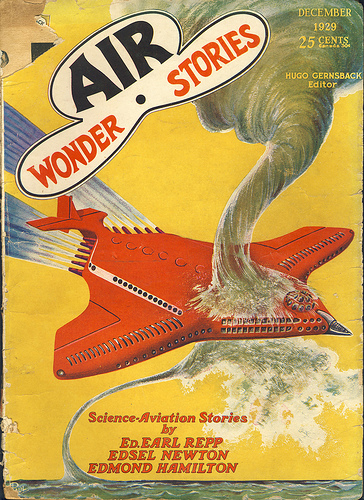

# The Way the Future Blogs

Frederik Pohl

**Let There Be Fandom, Part 3: A Brooklyn Boyhood**
**Let There Be Fandom, Part 5: The Big League**

## Let There Be Fandom, Part 4: New Deal, New Worlds

  

The Depression had settled in, but Franklin Delano Roosevelt was inaugurated a week or two after Dirk Wylie and I met, and there was talk of a New Deal. Society seemed to be evolving into something new before our eyes.

So was science. We heard about things like relativity and the expanding universe — not just in the sf magazines, but even on the radio. The world seemed to be into science fiction almost as much as Dirk and I were, at least in a nuts-and-bolts way. Airplanes were almost common in the sky, whereas a few years earlier it had been reason enough for housewives to leave the dishes in the sink and run outside to gawk at a plane. There were dirigibles, and the new Empire State Building, almost a quarter mile of masonry stretching up to scrape the sky, was topped with a mooring mast for blimps (or for King Kong to cling to).

There was a kid in our classes at **Brooklyn Tech** who actually *flew* — yes, had a real pilot’s license, spun the prop, took off, landed, was full of stories about how you could walk into an unseen spinning propeller and be chopped into ground round before you knew it, about hairy landings in the fog and storms aloft. I had fantasies about getting a plane of my own, preferably one of the swallow-tailed or heart-shaped or magnetically driven jobs out of Wonder Stories, challenging my friend to a race and beating his ass off. I knew that that was fantasy. But what but fantasy was it that he was doing, every Saturday at Floyd Bennett Field?

In a way that had never happened before in the history of the human race, the world was looking into the future. Most especially Dirk and I. Most particularly through science fiction. When the Science Fiction League came along, we both sent our applications off at once, and almost by return mail I got a postcard from a man who identified himself as one George Gordon Clark. He was, he announced, Member 1 of the Science Fiction League. Not only that, he had been authorized to form Chapter 1; and I was invited to attend Meeting 1.

It was at night, and most of an hour away by subway, but I would not have missed it for rubies.

**Related posts:**

- The Quadrumvirate
- When I Graduated from High School (After 73 Years)
- Let There Be Fandom: The Science Fiction League
- Let There Be Fandom, Part 2: School Days
- Let There Be Fandom, Part 3: A Brooklyn Boyhood
- Let There Be Fandom, Part 5: The Big League
- Let There Be Fandom, Part 6: The Pros!
- Let There Be Fandom, Part 7: The Crusade

### 5 Comments

- Mike Weasnersays:“In a way that had never happened before in the history of the human race, the world was looking into the future.”Except during the 1969 Manned Lunar Landing, the world has stopped looking into the future.October 8, 2009, 8:07 am
- smsays:Love this stuff.But looking into the future: what about the Crystal Palace?October 8, 2009, 8:31 am
- Jeffsays:I disagree. We’ve always looked into the future, and we still look into the future, but with dread.October 9, 2009, 8:25 am
- Dsays:“Except during the 1969 Manned Lunar Landing, the world has stopped looking into the future.”Enough to make one weep.October 9, 2009, 3:20 pm
- Marc Jacobs says:
I love the reference to Floyd Bennett Field. My maternal grandfather took me there as a child, in the ’60s. I still have fond memories of the place.
Your column reminds us all that New York != Manhattan. Or, more exactly, not only Manhattan.
October 10, 2009, 7:57 am

**WordPress**
**TWTFB**