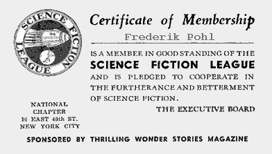

# The Way the Future Blogs

Frederik Pohl

## Let There Be Fandom, Part 5: The Big League

  

**Wanderings**

When G.G. Clark started the Brooklyn Science Fiction League, I do not think he knew what he was getting into.

Clark was a grown-up adult human being, in his late twenties or thereabouts. He had a job, and he had a Collection that made even Dirk Wylie’s look sick. (Mine was sick to begin with. I had a fair number of books and magazines, but no place to put them, except for what space I could make by pushing the dishes and cans of soup off some kitchen shelves. That strikes me as odd. There were not many books in my house when I was a kid, except my own. My father read nothing but Westerns, which he kept on the top shelf of his bedroom closet. My mother did not seem to read much at all, which is strange: she was a pretty literate person, could recite poetry at great length, had been valedictorian of her graduating class, even once held a minor editorial job with St. Nicholas Magazine for a brief time. A happy one for me; she used to bring home the review copies of children’s books. But I was fifteen before I lived in a house with a real bookcase.)

Clark not only had every issue of every science-fiction magazine ever published, but they had that fresh- from-the-mint look of having been bought new from the corner candy store, rather than being picked up second-hand. He even had a few variorum editions, such as a copy of Amazing Stories on which the red plate of the three-color cover had failed to print, so that it was all ghostly blues and greens. He also had more sf books than I had ever seen in one place before, and he even had science-fiction fan magazines, of which I had never previously even heard.

I think Clark must have been less than delighted with us scruffy adolescents who turned up in response to his postcard. Not one of us was within ten years of his age. At least one — Arthur Selikowitz, a tall, skinny polymath who entered Rensselaer Polytechnic Institute not long after at the age of thirteen — could not then have been quite eleven.

At our first meeting, the first thing we did was to elect Clark chairman. There was no alternative. Not only did he rank us all (Member *1*), but it was his hall. We met some of the time in his cellar library (allowed to touch The Collection only one at a time, and with Clark hovering vigilantly by), sometimes in a rented classroom of a nearby public school. The term “nearby,” of course, refers to its proximity to Clark. All the rest of us had to travel miles.

It is hard for me to remember what we did at these meetings, and I think the probable reason for that is that we did very little. There was a certain amount of reading the minutes and passing amendments to the bylaws, and not much else. After a while we decided to publish a mimeographed fan magazine of our own. I became its editor (largely, I think, because I owned my own typewriter), and it may have been the first place in which words of mine were actually published.

I haven’t seen a copy of *The Brooklyn Reporter in many years and doubt that there was much in it worth reading, but it was marvelously exciting to me then. My words were going out to readers all over the country! (Not very many* readers, no. But quite geographically dispersed.) People I never saw were writing letters to comment on what I had done.

It was through *The Brooklyn Reporter* that I first met [**Robert Lowndes**](/posts/2009-05-08-the-quadrumvirate/) — only as a pen pal at first, because he lived in faraway Connecticut, and neither of us could see any way of bridging that near-hundred-mile distance. But we became good friends by correspondence, quickly found interests in common (we both were addicted to popular songs), and shared others: he initiated me into **Baudelaire**, **Mallarmé** and **J.K. Huvsmans**, and I introduced him to **James Branch Cabell**.

You see, what we science-fiction fans mostly wanted to do with each other’s company was to talk — about science fiction, and about the world. Robert’s Rules of Order didn’t seem to provide for much of that, so we formed the habit of The Meeting After the Meeting. After enduring an hour or so of parliamentary rules, we troops would bid farewell to our leader and walk in a body to the nearest station of the El.

On the way, we would stop off at a soda fountain. This had three very good features: it gave us an informal atmosphere for talk, it supplied us with ice-cream sodas, and it got rid of G.G. Clark, so that we kids could be ourselves. The only bad part of it was that we had to adjourn the regular meetings pretty early, since none of us were old enough to stay out very late. But, considering what was happening at the regular meetings, that was no sacrifice.

I really don’t know why the meetings had to be so dull. I wonder why it never occurred to any of us to invite some real-live science-fiction *writer* to come and bask in our worship. That would have been a thrill past orgasm for every one of us, maybe even for Clark. It wouldn’t have mattered who the author was, and I’m sure some would have come. For one thing, if anyone had ever suggested it to  **Hugo Gernsback**, he would surely have flogged any number of them into our arms to boost sales.

I know why it didn’t occur to me. I was simply too naive. I wasn’t aware that writers lived in places where they could be met. I don’t know where I thought they did live. I may have thought they were mostly dead — that seemed to be the case with Mark Twain and Voltaire and a lot of my other favorites. If they were alive, I suppose I assumed they occupied some tree-lined, gardened, pillared suburb of something like heaven.

But still, why didn’t the idea occur to someone more sophisticated than I?

**Related posts:**

- [**The Quadrumvirate**](/posts/2009-05-08-the-quadrumvirate/)
- [**Let There Be Fandom: The Science Fiction League**](/posts/2009-09-17-let-there-be-fandom-the-science-fiction-league/)
- [**Let There Be Fandom, Part 2: School Days**](/posts/2009-09-28-let-there-be-fandom-part-2-school-days/)
- [**Let There Be Fandom, Part 3: A Brooklyn Boyhood**](/posts/2009-10-02-let-there-be-fandom-part-3-a-brooklyn-boyhood/)
- [**Let There Be Fandom, Part 4: New Deal, New Worlds**](/posts/2009-10-08-let-there-be-fandom-part-4-new-deal-new-worlds/)
- [**Let There Be Fandom, Part 6: The Pros!**](/posts/2009-10-15-let-there-be-fandom-part-6-the-pros/)
- [**Let There Be Fandom, Part 7: The Crusade**](/posts/2009-10-12-let-there-be-fandom-part-5-the-big-league/)

### 2 Comments

- Stefan Jones says:
“. . . the furtherance and betterment of science fiction.”
I can think of few if any people who fulfilled that pledge better than you, Mr. Pohl.
October 12, 2009, 9:32 pm
- Nate says:
These are really wonderful stories - both for the history of New York City and the history of SF Fandom.  
“largely, I think, because I owned my own typewriter”
As a collector (or rather, accumulator) of old pulps and typewriters, this makes me weep for the way the future was, indeed.
October 13, 2009, 7:17 pm

**WordPress**
**TWTFB**