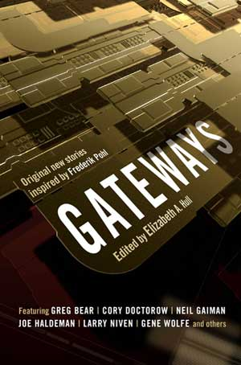

# The Way the Future Blogs

Frederik Pohl

## All Right, You Got Me!

#### I’ve been nominated for the Best Fan Writer Hugo(and I couldn’t be more pleased!)

Of course being nominated for a Hugo isn’t quite the same as winning one.  This is a lesson I have been taught several times.  All the same, it’s a nice feeling, and I appreciate it.

The blog team was absolutely right, too, in urging you to join the Worldcon, give them the $50 and get the sampler of Hugo nominees.  It comes in electronic form instead of good old ink on paper, which I personally much prefer, but the price is right.  All those great novels, novellas, novelettes and short stories would be many times more expensive if you paid retail, and you get samplings of all the other awardable categories, too.

*   *   *

As long as we’re talking I’ve got a couple of other things I meant to talk to you about.  One is a really neat book that’s coming out next month from Tor.  Its title is **Gateways** — note the plural s — it’s edited by my favorite anthology editor ever (that is, the one I’ve been married to for the last quarter-century, **Elizabeth Anne Hull**) and it came about when Betty Anne told our **Tor** editor, **Jim Frenkel**, that she would like to put together a *festschrift* anthology for my then upcoming 90th birthday, composed of new stories written by writers on whose careers I had had some significant effect, as editor, agent, collaborator or whatever.

When she made a list, Jim whistled and said,  “That’s a list of most of the top writers in the field.”  Not all of the writers were able to produce stories for her but most did, and it is my opinion that some of these are going to be showing up on awards voting this time next year.

She didn’t make the deadline for my birthday, though.  I kept getting sick, and her efforts would be devoted to keeping me alive for a while.  And then Betty herself fell in a bank parking lot and cracked a lumbar vertebra, resulting in pain, surgery and a lot of lost time.  But now it will be in the stores before you know it, and I think you’ll like it.

*   *   *

Speaking of the ills the flesh is heir to—

A couple weeks ago, I had to get an adjustment in one of the contrivances that keep me more or less normal.  We had just parked at the hospital where they do most of my repair work when another car pulled up beside us, and out of it came our production staff, comprising Leah A. Zeldes, our blogmeister, and her husband, Dick Smith, who makes sure we have enough bandwidth and keeps our computers functioning much of the time.  (They are, by the way, pretty good fanzine Hugo candidates themselves, having been nominated for the award in three separate years for their handsome zine STET.)

I was out of there and back home in a couple of hours.  Leah, not so much.  She had a couple of days of being observed while the doctors figured out what she needed, then a spot of surgery, then bed rest for recuperation, and then, just to keep the doctors on their toes, a bit of pneumonia to round things off.

Now she’s back home recovering.  But she still managed to get up a couple of posts from her hospital bed.

### 7 Comments

- Pat says:
You\’ve just made my day. Though it might be a day next year as I am in the UK, is Gateways planned for release here?
Keep well.
June 4, 2010, 12:45 am
- RAB says:
Two comments:
First, I’m really looking forward to Gateways.  This sounds fantastic.
Second, thank you so much to Elizabeth and Leah and Dick for everything you do.
June 4, 2010, 2:40 am
- Stefan Jones says:
That’s quite a variety of authors in that anthology. And that’s only judging by the ones that made the cover.
June 4, 2010, 12:08 pm
- James Davis Nicoll says:
I don’t suppose the table of contents is online somewhere?
June 5, 2010, 8:58 am
- Marc says:
Fabulous! I’ve just pre ordered a copy, roll on the 6th July!
Thank you Elizabeth Anne, Frederik and the rest of the team, you’ve brightened up a rather dull and rainy day on this side of the pond.
June 8, 2010, 3:58 am
- simon says:
Mr Pohl, my imagination owes you so much. Growing up in a cold, wet, grimy English town I spent every afternoon after school in the library when waiting to change buses to get home, and it was there that by chance I gave Gateway a go, followed immediately by Beyond the Blue Event Horizon, and from there the universe. Because of your work I have read Vonnegut, Asimov, Ballard, Campbell, Zelazny, Bradbury, Adams, the list is too big to continue. Thank you.
June 8, 2010, 6:13 am
- Bald Guy says:
May your contrivances keep you comfortably amongst us for a long, long time, Mr. Pohl.
June 9, 2010, 12:18 pm

**WordPress**
**TWTFB**