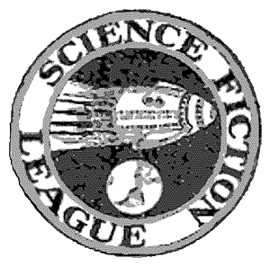

# The Way the Future Blogs

Frederik Pohl

## Basement and Empire, Part 2: Science Fiction Meetings

The Brooklyn Science Fiction League met in the basement of its chairman, George Gordon Clark. He was an energetic fellow. When Wonder Stories announced the formation of the SFL Clark did not waste time, he sent in his coupon at once and consequently became Member No. 1. When the SFL announced it was willing to charter local chapters, he acted instantly again, and so the BSFL was Chapter No. 1, too.

We outgrew Clark’s basement pretty quickly; there was only room for about four of us, in with his collection of sf magazines. We moved to a classroom in a nearby public school. What I mostly remember about those meetings is surprise that I couldn’t fit into the grammar-school desks anymore — after all, it was only a couple of years since I had been occupying desks just like them every school day. I remember we talked a lot about how to interpret Robert’s Rules of Order and spent quite a lot of time reading minutes of the previous meeting. If anything else substantive took place, I have forgotten it entirely.

But, ah, the Meeting After the Meeting! That was the fun part. That was when we would adjourn to the nearest open soda fountain, order our sodas and sundaes and sit around until they threw us out, talking about science fiction.

It was always a soda fountain. Not always the same one; over the years we fans must have staked out and claimed dozens of them, all over the city. But we were addicted to ice cream concoctions, so much so that a few years later, in a different borough of the city, after the meetings of a different club, we finally designed our own sundae, which we called the Science Fiction Special, and persuaded the proprietor of the store to put it on his menu.

We were a young bunch, as you can see. Except for Clark, who must have been in his early twenties, the old man of the group was Donald Wollheim, pushing nineteen. John B. Michel came with Donald; and a little later, down from Connecticut, Robert W. Lowndes; the four of us made a quadrumvirate that held together for — oh, forever, it seems like — it must have been all of three or four years, during which time we started clubs and dispersed them, published fan magazines, fought all comers for supremacy in fandom and wound up battling among ourselves.

The fan feud is not quite coeval with fandom itself, but it comes close. None of the clubs seemed to live very long. The BSFL held out for a year, then we moved on to the East New York Science Fiction League, a rival chapter of the parent organization, which seceded and renamed itself the Independent League for Science Fiction. That kept us engaged for another year, then it was the turn of the International Scientific Association (also known as the International Cosmos-Science Club). The ISA was not particularly scientific, and it certainly wasn’t all that international; we met in the basement of Will Sykora’s house in Astoria, Queens. (The ENYSFL-ILSF had met in a basement, too, the one belonging to its chairman, Harold W. Kirshenblith. I do not know what science-fiction fandom would have done in, say, Florida, where the houses didn’t have basements.)

It didn’t much matter what the name of the club was, or where we met. We did about the same things. We held meetings once a month, mostly devoted to arguments over whether a motion to adjourn took precedence over a point of personal privilege. We got together between times to publish mimeographed magazines, where we practiced our fledgling talents — for writing, and also for invective.

The fan mags (now they are called “**fanzines**,” but the term hadn’t been coined then) were sometimes club efforts, sometimes individual. I managed to wind up as editor of the club mags a lot of the time, but that wasn’t enough; I published some of my own. The one I liked best was a minimal eight-page mimeographed job measuring 4 ¼ by 5 ½ inches — a standard 8 ½-by-11-inch **mimeo** sheet folded twice — called *Mind of Man.* Since it was my own, I could publish anything I liked in it. What I liked best to publish was my own [**poetry**](/posts/2009-01-30-the-poetry-corner/), which at that time was highly sense-free, influenced in equal parts by Lewis Carroll’s “Jabberwocky” and some of the crazier exhibits in **transition**.

*To be continued. . . .*

**Related posts:**

- [**Basement and Empire**](/posts/2010-07-05-basement-and-empire/)
- [**Basement and Empire, Part 3: Lessons in SF**](/posts/2010-07-09-basement-and-empire-part-3-lessons-in-sf/)
- [**Basement and Empire, Afterwords**](/posts/2010-07-12-basement-and-empire-afterwords/)
- [**The Quadrumvirate**](/posts/2009-05-08-the-quadrumvirate/)
- [**Let There Be Fandom: The Science Fiction League**](/posts/2009-09-17-let-there-be-fandom-the-science-fiction-league/)
- [**Let There Be Fandom, Part 2: School Days**](/posts/2009-09-28-let-there-be-fandom-part-2-school-days/)
- [**Let There Be Fandom, Part 3: A Brooklyn Boyhood**](/posts/2009-10-02-let-there-be-fandom-part-3-a-brooklyn-boyhood/)
- [**Let There Be Fandom, Part 4: New Deal, New Worlds**](/posts/2009-10-08-let-there-be-fandom-part-4-new-deal-new-worlds/)
- [**Let There Be Fandom, Part 5: The Big League**](/posts/2009-10-12-let-there-be-fandom-part-5-the-big-league/)
- [**Let There Be Fandom, Part 6: The Pros!**](/posts/2009-10-15-let-there-be-fandom-part-6-the-pros/)
- [**Let There Be Fandom, Part 7: The Crusade**](/posts/2009-10-19-let-there-be-fandom-part-7-the-crusade/)

### 4 Comments

- Robert Nowall says:
Yeah, I remember reading The Early Pohl.  I got a book club copy.  I regretted it wasn’t the big volume (two-part paperback) edition that the ones by Asimov and Del Rey were…from what I gleaned at the time I got the idea it was an issue of sales and marketing…
Gee, times have changed.  Those days, you had to have printing presses or mimeo machines—not even photocopying.  Now, with the ‘Net, or whatever it’s hip to call it these days, the younger crowd—or anybody who wants to, age neutral—can blog or put up just about anything at any time.  (I started dumping my rejected stuff onto my own site, basically to show the world and mostly fellow would-be writers that I could write something other than Internet Fan Fiction…)
July 7, 2010, 6:15 am
- Bald Guy says:
Pretty cool, Robert. I copied Plant Girl and pasted it into a text file, hope you don’t mind. I need to read stuff on paper, a Luddite to be sure. I’m going to print it off at work.
July 7, 2010, 11:55 am
- Robert Nowall says:
Paper does remain my favorite way of reading stuff, but ya gotta be flexible.  Also saves some on cartridges…
I’d forgotten I’d put a link to my site up here, actually…
July 8, 2010, 11:47 am
- Andrew Porter says:
Err, Fred’s intro to these is wrong. ALGOL and SCIENCE FICTION CHRONICLE were two separate magazines. ALGOL, later titled STARSHIP, was an irregular critical magazine which ceased publication in 1984. SCIENCE FICTION CHRONICLE was a monthly news magazine which started being published in 1979, and which I sold in 2000; it ceased publication in 2006.
The photo of Sykora and Ley was one of many that Forrest J. Ackerman sent to me and which I scanned and put up on the internet. I never published it anywhere. I snt it to Fred at thr same time I sent him the text of his intro, which I published in ALGOL as a separate article.
The only connection to the two mags is that Fred’s columns, which started in ALGOL after the strong positive reaction to his original piece, later jumped to SCIENCE FICTION CHRONICLE. Bu they were two different magazines, even had two different ISSNs…
July 14, 2011, 4:41 pm

**WordPress**
**TWTFB**