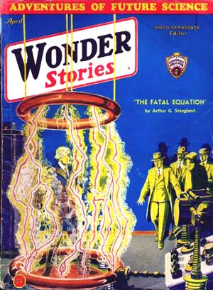

# The Way the Future Blogs

Frederik Pohl

**Basement and Empire, Part 2: Science Fiction Meetings**
**Basement and Empire, Afterwords**

## Basement and Empire, Part 3: Lessons in SF

I don’t know what kind of a writer I would have been if I hadn’t met Dirk Wylie and, through him and with him, the whole world of science-fiction fandom. Much the same, I imagine. I almost certainly would have been some kind of a writer — I’m hardly fit for anything else. And I had been trying to write sf at least a year before I met Dirk, in idle moments in classes in the eighth grade. But it would have taken a lot longer.

I owe a lot to fandom. From Don Wollheim, John Michel, Doc Lowndes — and later from Cyril Kornbluth, Dick Wilson, Isaac Asimov and others — I learned something about what they were learning about writing; we all showed each other our stories, when we weren’t actually collaborating on them. In the fan mags, I acquired the skills necessary to prepare something for public viewing — and the courage to permit it.

What I am not as sure of is whether all the things we learned then were worth learning.

Science fiction was purely a pulp category in those days. Sometimes the emphasis was on gadgetry, sometimes on blood-and-thunder adventure; when it was best, the high spots were vistas of new worlds and new kinds of life. In no case was it on belles-lettres, nor was it a place to look for fresh insights into the human condition. What we learned from each other and from the world around us was the hardware of writing. Narrative hooks. Time-pressure to make a story move. Character tags — not characterization, but oddities, quirks, bits of business to make a person in a story not alive but identifiable. So I learned how to invent ray-guns and how to make a story march, but it was not for a long, long time that I began to try to learn how to use a story to say something that needed saying.

In fact, when I look back at the science-fiction magazines of the twenties and the early thirties, the ones that hooked me on sf, I sometimes wonder just what it was we all found in them to shape our lives around.

I think there were two things. One is that science fiction was a way out of a bad place; the other, that it was a window on a better one.

The world really was in bad trouble. Money trouble. The Great Depression was not just a few million people out of work or a thousand banks gone shaky. It was *fear.* And it was worldwide. Somehow or other the economic life of the human race had got itself off the tracks. No one was quite sure it would get straight again. No one could be sure that his own life was not going to be disastrously changed, and science fiction offered an escape from all that.

The other thing about the world was that technology had just begun to make itself a part of everyone’s life. Every day there were new miracles. Immense new buildings. Giant airships. Huge ocean liners. Man flew across the Atlantic and circled the South Pole. Cars went faster, tunnels went deeper, the Empire State Building stretched a fifth of a mile into the sky, radio brought you the voice of a singer a continent away.

It was clear that behind all this growth and acceleration something was happening, and that it would not stop happening with huge Zeppelins and giant buildings but would go on and on. What science fiction was about was the going on. The next step, and the step after that. Not just radio, but television. Not just the conquest of the air, but the conquest of space.

Of course, not even science fiction was telling us much about the price tag on progress. It told us about the future of the automobile; it didn’t tell us that sulphur-dioxide pollution would crumble the stone in the buildings that lined the streets. It told us about high-speed aircraft, but not about sonic boom; about atomic energy, but not about fallout; about organ transplants and life prolongation, but not about the dreary agony of overpopulation.

Nobody else was telling us about these things, either. A decade or two later science fiction picked up on the gloom behind the glamour very quickly, and maybe too completely. But in those early days we were as innocent as physicists, popes and presidents. We saw only the promise, not the threat.

And truthfully we weren’t looking for threats. We were looking for beauty and challenge. When we couldn’t find them on Earth, we looked outside for prettier, more satisfying places. Mars. Venus. The made-up planets of invented stars somewhere off in the middle of the galaxy, or in galaxies farther away still.

I think we all believed as an article of faith that there were other intelligent races in the universe than our own, plenty of them. (I still believe it! What puzzles me is why we haven’t seen any of them as visitors. I wish I could swallow the flying-saucer stories — I can’t; the evidence just isn’t good. But the absence of hard facts hasn’t shaken my faith that **Osnomians and Fenachrone** are out there *somewhere*.) If polled, I am sure we would have agreed that wherever there’s a planet, there’s life — or used to be, or will be.

Now, alas, we know that the odds are not as good as we had hoped, especially for our own solar system. The local real estate is pretty low quality. Mercury is too hot and has too little air; Venus is too hot and has too much, and poisonous at that. Mars is still a possibility, but not by any means a good one — and what else is there? But in the mid-thirties we didn’t know as much as we do now. The big telescopes hadn’t yet been completed, and of course no spaceship had yet brought a TV camera to Mars or the Moon.

But we believed.

*Stay tuned. . . .*

**Related posts:**

- Basement and Empire
- Basement and Empire, Part 2: Science Fiction Meetings
- Basement and Empire, Afterwords
- The Quadrumvirate
- Let There Be Fandom: The Science Fiction League
- Let There Be Fandom, Part 2: School Days
- Let There Be Fandom, Part 3: A Brooklyn Boyhood
- Let There Be Fandom, Part 4: New Deal, New Worlds
- Let There Be Fandom, Part 5: The Big League
- Let There Be Fandom, Part 6: The Pros!
- Let There Be Fandom, Part 7: The Crusade

### 2 Comments

- Stefan Jonessays:It’s kind of sad that now-a-days that the young folk have no somewhat-realistic “out there” to look forward to.Tropes of the pulps, like flying cars and robot servants, are  for the most part ironic jokes today.Some folks look forward to The Singularity, but that seems more and more like a messianic impulse.July 9, 2010, 1:55 pm
- Beka C. says:
Mercury is too hot and has too little air; Venus is too hot and has too much, and poisonous at that.
Ooo, but think of the possibilities of life that THRIVES in those environments!  I refuse to believe that the kind of life we recognise on Earth is the only kind of life possible in the universe.
Other life is out there, somewhere.  Maybe they’re debating whether or not we exist, too.
July 11, 2010, 2:09 pm

**WordPress**
**TWTFB**