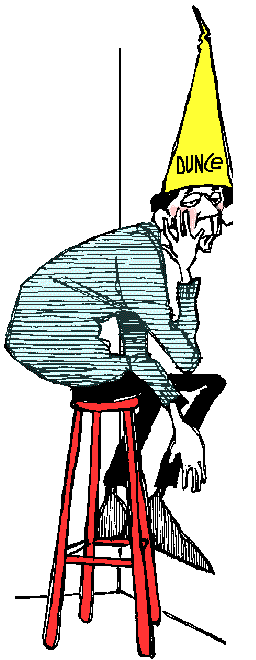

# The Way the Future Blogs

Frederik Pohl

## Fred’s Dumb Thing

A few weeks ago, I responded to a comment by a viewer who signs himself TJIC to say, among other things, that there was a species of penguin in Antarctica which is steadily moving its breeding grounds farther and farther south.  The reason it does this is to migrate to colder latitudes in order to try to avoid the warming which messes up their oceanic ice.

That much of what I said appears to be true, but then I went on to say that if the penguins went on migrating in that direction they would sooner or later reach a point so far south that the Sun would never rise at all and it would be eternally dark.

That’s ridiculous.  There’s no such place.  Simple geometry proves that.

I had misunderstood something my source said — I now suspect that it was something about no longer having any ice to worry about because they were now in the middle of the Antarctic continent — and written it down wrong.  So now to all of you I bare my throat and say I’m sorry.

There’s one other thing in that dashed-off answer that needs a little elucidation. What I said was, “… at one point in history (the scientific) community believed that the Sun went around the Earth and then, not all that much later, reversed their opinion…”

That’s not exactly wrong.  It’s incomplete, though.  It’s not just that the world’s scientists habitually look at any two theories presented to them, the old and the new, and say, oh, yeah, that new one is more complete, more accurate and more useful than the old one, so from now on I’m with the new.

That does happen, but it’s only part of the process.  The other part is that a number of scientists cling to the old theory until they die, evidence be damned.  But then they do die, and the generation of new scientists that follow them grow up with that new theory already embedded in their minds.

So it’s true that at one time almost all scientists believed that the Sun orbited around the Earth, and at a later time almost all scientists believed that the Earth orbited around the Sun.  But they weren’t the same scientists.

### 9 Comments

- Orin says:
Thomas Kuhn and other philosophers and historians of science, when studying scientific revolutions, suggested that a revolution is not complete until the old guard die out - that new “paradigms” or “research traditions” tend to be picked up by younger scientists while older scientists tend to be more inculcated in the previous model.
July 14, 2010, 4:19 am
- Bill Goodwin says:
Then there’s the third group, who believe that Earth and Sun together orbit the center of mass of the Earth-Sun system (sorry…I couldn’t help myself!).
July 14, 2010, 4:20 am
- Grego says:
In science it often happens that scientists say, ‘You know, that’s a really good argument; my position is mistaken,’ and then they actually change their minds and you never hear that old view from them again. They really do it. It doesn’t happen as often as it should, because scientists are human and change is sometimes painful. But it happens every day. I cannot recall the last time something like that happened in politics or religion.
	–Carl Sagan, Keynote address at CSICOP conference, 1987
July 14, 2010, 6:01 pm
- JG says:
On the day I read this (today), I’m currently above the Arctic Circle where the sun will set for the first time since May on Monday…. your penguin story is interestingly erroneous…
as well, I am not aware of any companies that ship thru the NorthWest Passage (across the Canadian Arctic Archipelago) however I believe there are some that ship the NorthEast Passage across Russia.
July 15, 2010, 4:26 pm
- jsallison says:
And about 40ish years ago some of the selfsame folk currently screeching about global warm…err, climate change were hyperventilating about the coming ice age, feh.  I\’ll believe it\’s a crisis when the folk screaming in my ear that it\’s a crisis start acting like it\’s a crisis.  And some actual, independently reviewed numbers demonstrating that our caloric output isn\’t just so much random noise compared to that ongoing fusion reaction going on overhead.
July 15, 2010, 8:19 pm
- Stefan Jones says:
I was a nerdy teenager in the 1970s, and followed science stories quite closely.
The “new ice age” flap came after concerns about the greenhouse effect. It was a brief, marginal concern based on historical statistics (simplified: “We’re overdue for an ice age.”). There were no calls to action or “hyperventilating.”
It was good for a cover article on Newsweek and maybe a Nova episode and that was it. The ice age flap in no way compares to concerns about global warming. The equivalence is a cheap rhetorical stunt.
Here’s a nickel, kid. Go buy yourself some fresh talking points.
July 16, 2010, 5:50 pm
- Bill Goodwin says:
The point has never been our caloric output.  It’s our output of greenhouse gases that trap the caloric INPUT of the aforementioned ongoing fusion reaction, that is of concern.
July 16, 2010, 9:34 pm
- John H says:
The sad thing is, jsallison, we have evidence today that people like you wish to ignore because doing so is easier than letting go of destructive yet relatively cheap sources of energy.
July 18, 2010, 7:32 am
- armband thomas sabo says:
The sad thing is, jsallison, we have evidence today that people like you wish to ignore because doing so is easier than letting go of destructive yet relatively cheap sources of energy.
August 4, 2010, 2:45 am

**WordPress**
**TWTFB**