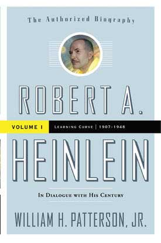

# The Way the Future Blogs

Frederik Pohl

**Science Quiz Answers**
**Fred’s Non-Partisan Way to DecideWHO TO VOTE FOR(Or, More Accurately, Who to Vote Against)**

## Robert Heinlein, We Never Knew Ye

**Robert A. Heinlein:
In Dialogue with His Century: Volume 1,
Learning Curve, 1907–1948**  

**By William H. Patterson**  

(Tor, Hardcover, $29.99).

When I read a biography of someone I’ve known well, there are two things I look for on first inspection.  The first is errors of fact, and I’m glad to say that Patterson’s detailed and well researched study seems innocent of any serious quantity of these.  The other is more personal.  It’s learning new things about the subject’s behavior that you had never guessed, particularly when they impact on yourself.  I did find a couple of those in *Learning Curve*.

I was pretty sure Robert Heinlein regarded me as a good editor — if not, he would never have rewritten some of his stories to my specifications, especially at the pitiful rates I was able to pay.  But I hadn’t known until I read it in the book that Robert had been so upset when I  left the company that he asked  New York friends to find out if I had been unjustly canned, writing,  “If he” — that’s me — “got a dirty deal from them and wishes his friends to boycott them, I don’t care to do business with them.”    I hadn’t had any idea of such a thing, and I have to say I was touched when I read it in Patterson’s book.

There was one other thing I learned there that I hadn’t suspected, and that was that in letters to his friends Heinlein referred to me as “Freddie.”   That was an even bigger surprise.  It’s about a year since I first discovered that.  I haven’t yet decided whether or not I like it.

*   *   *

Patterson’s book starts at the very beginning, or maybe a little before the actual beginning, of Robert’s life, by introducing his parent and grandparents.  This is of interest, of course, only insofar as it helped to shape Heinlein himself.  Actually, by Patterson’s account he was not seriously unlike any other Midwestern kid, growing up in a family with limited amounts of money, and one of the things I most appreciate about Patterson is the briskness with which he moves us through the pages of genealogy.  It is when Robert himself successfully seeks to be appointed to the United States Naval Academy that his life begins to diverge from the rest.

Even someone who has never read a word of Heinlein would value Paterson’s book for the way he describes the life of a midshipman.  It was a demanding period in Robert’s life, since any upperclassman could demand their attention at any time — and if they were unsatisfactory in any way — or if the upperclassman just happened to feel like it — the punishment was a good beating on the rump with a wooden bar.

Robert did well at the Academy but he didn’t complete the expected trajectory of becoming an actual Navy officer.  His eyes were the first to betray him, then other parts of his body (most famously, the ones he joked about as his “asteroids”) . He never got to fight in World War II, but spent the war years in working on an oddball research team based at the Philadelphia Navy Yard with Isaac Asimov, L. Sprague de Camp and a female naval officer named Virginia Gerstenfeld, who, as everyone well knows, before long became Mrs. Robert A. Heinlein.

One of the questions Patterson’s admirable book did not answer for me was precisely how it happened that Robert so thoroughly switched his affections from Leslyn, who was Wife No. 2, to Ginny, who wound up the series as Wife No. 3 and Last.  (I am not deliberately mocking Heinlein’s plurality of marriages; as everyone knows who knows me at all, I am not in a position to do that.)

I confess that I was never particularly fond of Ginny, nor she of me, but as we both were fond of Robert, we maintained courteous relations.  But I would like to know more than I do about how Leslyn got replaced with Ginny.  True, there’s no doubt that Leslyn was an alcoholic and given to fits of bad behavior.  Maybe that’s really all there is to know.  But just about all we know of those events is what Ginny tells us.  I’d love to hear Leslyn’s side of the story, and I am feeling guilty about that because Leslyn did appeal to me for sympathy, and I, unwilling to get mixed up in a private affair, discouraged her letters until she gave up.

Ah, well.  Read the book anyway.  I’m sure you’ll enjoy it.  I did.

### 10 Comments

- Robert Nowallsays:The Heinlein biography proved to be everything it was cracked up to be—I’ve been eagerly awaiting it since I learned about its existence, right here at this website.  Many myths and legends were untangled.  The tendency of taking phrases from a later era as chapter titles was annoying, but tolerable.I was very happy with the untangling of Heinlein’s early political career.  When someone goes from appearing ultra-liberal, to appearing ultra-conservative, without some sort of explanation—and, of course, Heinlein, with his guarding of his privacy, wasn’t one to provide an explanation—well, questions arise.This book ironed it out—the difference between the two positions wasn’t as great as had been supposed.  When one allows Heinlein the right to rethink his earlier positions, it all makes sense.  I recall Virginia Heinlein saying somewhere that it wasn’t so much a change in Heinlein but the world changing around him.(Probably that statement will be in Volume 2.  I look forward to reading *that,* whenever it comes on.)*****By the way, all but one of the bookstores I’ve been in since the book came out racked it with the SF titles, not in the biography section.  Probably its audience will look there…but I don’t find other literary biographies racked with their writers.  (A recent book about Charlie Chan and Earl Der Biggers turned up in biography, for example.)  Subtle genre prejudice?  Or maybe Tor Books just wanted it that way?October 21, 2010, 7:39 am
- Jeff Beelersays:Robert:“By the way, all but one of the bookstores I’ve been in since the book came out racked it with the SF titles, not in the biography section.”This follows a library practice which is to put biographies in the subject area of the career of the person they are about.October 21, 2010, 10:24 am
- R. Brucesays:Tor doesn’t really understand anything but sf, so it’s no surprise that their line reps and stores shelve the bio in sf.October 21, 2010, 12:07 pm
- Terisays:Wikipedia says: In 1929, he married Eleanor Curry of Kansas City in Los Angeles, Calif.[8] but this marriage lasted only about a year.[4] He soon married his second wife, Leslyn Macdonald, in 1932.I haven’t read Patterson’s biography of Heinlein yet, but now with your recommendation, I’ll be purchasing it soon.Thanks for all you do.October 22, 2010, 8:43 am
- Bill Pattersonsays:As it happens I’m in DC for the book this week, to talk with the Cato Institute and the Department of Homeland Security Science & Technology Directorate (and attend Capclave), and I got a chance to check out the Borders in downtown DC — 18th and L I think, or close to that.  It was entirely with the biography section, and none in the SF section.  At the B&N closest to my home in Los Angeles, the biography section is right next to the SF section, so table hopping was possible.  In DC, though, they are on entirely different levels of the bookstore.October 22, 2010, 8:06 pm
- Robert Nowallsays:“This follows a library practice which is to put biographies in the subject area of the career of the person they are about.”Regrets, but I cannot recall seeing this in practice in any library I’ve been in.Besides, while looking for Heinlein in biography, I couldn’t help but notice one or two Hemingway bios…they’re not racked with *his* fiction…Some had two copies…why not put one in each?October 25, 2010, 5:15 am
- Jonquil says:
I, also, was troubled by the ways in which the book was captive to RAH’s and Ginny’s points of view.  Another instance is that Heinlein is credited with having predicted Pearl Harbor in 1941 — this is cited to a conversation with Heinlein  in 1973. It would have been useful if the biography had touched on the possibility of the well-known human tendency to improve on one’s memories over time.
October 26, 2010, 12:47 pm
- Roberta Xsays:I think it makes sense to put the RAH bio where SF readers will see it.  My copy popped up in one of those “based on books you’ve bought in the past…” listings at an online bookseller’s, which is much the same sort of thing.  (And then my beau sent me an autographed copy, ooooo).I’m finding our host’s take on the topic fascinating.  Even the most meticulous research is no match for having been there at the time.October 27, 2010, 6:37 am
- Dale Dietzmansays:Don’t make too much of Robert predicting Pearl Harbor. He was far from the only one. Professional Naval Officers in both the US and Japanese Navies considered war inevitable; Robert was a trained, professional Naval Officer (if forced into retirement); and when they studied the map of the Pacific as it stood in 1941, Pearl Harbor was the OBVIOUS striking point. For a truly fascinating look at the war from the Japanese Imperial Navy’s POV read _Japanese_Destroyer_Captain_, biography of one of the best CO’s the IJN had. Probably out of print but you should be able to get a used copy.July 8, 2011, 1:45 pm
- Dale Dietzmansays:Jonquil, As mentioned aboved it was not considered as astounding among people “in the know” to predict the US would enter WW II or that it would begin with a Japanese attack on Pearly Harbor. Read the book _Spy_Counter-Spy_ where the man who was a partial model for James Bond delivered the list of questions the Germans wanted intel on to the U.S. Go’v't (actually J. edgar Hoover, in person). Half of them dealt with security at Pearl Harbor, and the Germans had no assets there. This was 6 months before the attack.January 30, 2012, 7:11 am

**WordPress**
**TWTFB2**