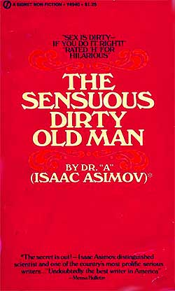

# The Way the Future Blogs

Frederik Pohl

**Bright Sayings of Bright People, No. 3*: Ciardi**
**Fred’s Distilled Writing Wisdom, Part 4**

## Isaac,  Part 6

Our continued reminiscences of Isaac Asimov, and we must be getting somewhere near the end by now, mustn’t we?

**Isaac**
**Gertrude**
**David**
**Robyn**

Still, Gertrude wasn’t entirely happy.  She knew that her husband was getting quite well known, you could almost even use the word “famous,” with all those books and all those people who kept wanting him to come and speak to their groups.  But she was a normal Brooklyn girl who read the gossip columns, and the kind of fame that she really wanted for her husband came with a special flavor that could come only from Broadway.

Isaac spent some effort on trying to make her happy.  He wasn’t a particularly addicted theater fan, but that’s where you found the air Gertrude liked to breathe, so he took her to each season’s most important plays — and often to dinner before the curtain and to a snack when the show was over, always in the places where the famous people flocked together.  But eating in the same room as the stars of the gossip columns wasn’t the same as eating with them, and on one occasion Gertrude decided to act.

She and Isaac were sharing a table for two at Sardi’s, the very definition of the famous people’s Broadway hangout.  And a few yards away, as Isaac told it to me:

> “‘You’re famous, aren’t you?’  she said.  ‘So let’s just drop by, and you can say,  “I’m Isaac Asimov, and my wife and I noticed you were having such a good time we thought we’d stop by and say hello.”‘

> “And I didn’t want to do that, but she kept on.  So finally I gave in.  We walked over there, with me rehearsing what I was going to say in my mind, and I asked for some autographs, and then one man on the far side of the table looked up.  Then he jumped up and came running over in our direction — but not exactly to both of us, and definitely not to me.  It was Gertrude he was aiming for, and he was yelling,  ‘Gittel!  Is it really you?  My God, I haven’t seen you since you moved out of the old neighborhood!’”

By the way, I’m pretty sure that Gertrude’s dream of Heaven was that her husband, and perhaps even herself as well, might possibly become subjects of  a couple of the 1,300 cartoons of celebrities that festooned the walls of Sardi’s and were the restaurant’s trademark.  I don’t think that ever happened, but I don’t know for sure.  Does anyone?

(The reason I never looked for myself is that about the only times I ate at Sardi’s was when I was grabbing a quick lunch  before an Author’s Guild Council meeting, the Guild offices being on an upper floor of the same building.  When the Guild moved out, I stopped going.  There was nothing wrong with the food or even with the prices, which are what you’d expect from a fashionable restaurant in the theater district, but it was always too crowded for my enjoyment.)

The Asimovs stayed married through the decade of the 1960s, but that was the end.  Isaac was by quite a large margin more interested in sex than Gertrude was.  He was in fact a healthy human male, not much over forty and unwilling to endure a life of deprivation.  Accordingly, he began supplying his lacks through a series of affairs.

I don’t know the identities of most of his partners in the affairs, but as it happens I do know where he had them.  That’s because on one later occasion he and I agreed to meet for some purpose in the lobby of a big old Boston hotel just off the Common.  When Isaac got there he looked around, grinning, and volunteered that this was the place where he used to take his girlfriends.  But he didn’t say who those girlfriends were, and I didn’t ask.

When I last saw Isaac in the days before World War II moved Isaac in one direction and me in another, I would not have said he was particularly successful with women.  He had not yet met Gertrude and neither Isaac nor his family had ever made me believe that there was any other girl in his life.

But by the latter ’60s, he had become a good deal more adventurous.  On meeting an attractive woman — one who was not obviously the Most Significant Other of some male friend — he was inclined to touch her … not immediately on any Off Limits part of her anatomy but in a fairly fondling way.  (When I called him on it once, he said,  “It’s like the old saying.  You get slapped a lot, but you get laid a lot, too.”)

Remember, we were former Futurians, and thus not above now and then playing little jokes on each other.  My chance for a good one along these lines came once when Isaac and I were booked on some TV show together.  We weren’t the only guests.

Along with us, the show had booked a group of three transsexuals, former males who had elected to be reconstructed as females.  What made them particularly interesting is that all three were former football players, all over six feet tall and weighing no less than two hundred pounds.  They also had perfected all the appropriate female mannerisms — the tentative touch of the hairdo to make sure it hadn’t come apart, the acceptance of a man’s help to get up the steps to the interview platform — and they were all beautifully made up.

And Isaac, a little late, was just arriving.

“Let me introduce him,”  I said to those present, and led him over. “Isaac,”  I said,  “these are Mary Grace, Betty Lou and Delicia.”  And then, as the horny smile spread over his face and the right hand began to move out in groping posture: “They’re transsexuals who used to be men.”

And the smile froze and the right hand began to pull back, and extend again, and pull back again in the precise model of a thwarted Pavlovian reflex.

**Related posts**:

- **Isaac,** **Part 1**, **Part 2**, **Part 3**, **Part 4**, **Part 5**,  **Part 7**
- Russians, Jews and Isaac

### 11 Comments

- Bill Goodwinsays:A Boston professor (by day)Was a skillful undresser (they say)Ever keen for new cloverWhen classes were overThe sort where a man goesTo layNovember 10, 2010, 3:14 am
- Qsays:You\’re a wicked man, Mr. PohlNovember 10, 2010, 6:11 am
- Joshsays:Ha!November 10, 2010, 8:59 am
- Robert Nowallsays:I’m afraid my opinion of Asimov lowered some when I learned of his “affairs,” after his death.  (It isn’t the only thing.)  I suppose I made the journey from idolatry to hero-worship to role-modeling, and eventually down to just awe and respect.The “Gittel?  Is it really you?” story *was* in Asimov’s memoirs, in slightly different form…as I recall, he cited it as a warning notice on the fickleness of his own fame…November 10, 2010, 4:52 pm
- Chookiesays:I’m going to be laughing all day about that one!November 10, 2010, 8:46 pm
- Tina Blacksays:You are a wicked man, Fred!  But it really was too good a chance to miss.November 11, 2010, 3:39 pm
- Rich Rostromsays:He hadn’t noticed they were all >6′/200 lbs?Or if he did, what did he think they were?November 11, 2010, 7:44 pm
- Dwight Deckersays:In perusing a few pulp magazines, I’ve gotten the impression that circa 1941, Asimov had some reputation in letter-column controversies for being a woman-hater. I haven’t as yet seen the letters where he got that reputation, however, and I’m basing this on considerably removed replies to replies. I would guess that young Isaac was actually objecting to the old pulp convention of stories including crowbarred-in romances, in which the young sprout hero not only saved the Earth but met the love of his life along the way. Maybe Asimov was arguing it’s enough in a story for the hero to discover that just a slight amount of excess beryllium will make a planet unsuitable for colonization, and he doesn’t need to meet and woo the chief scientist’s beautiful daughter while he’s at it to make the reader happy, and that was interpreted as being anti-female… but I’m just guessing.November 11, 2010, 10:55 pm
- Paula Helm Murraysays:That, sir, was delectable. Especially about the trans-gendered.I love all this, thanks for your reporting!  Keep it up!November 18, 2010, 9:27 pm
- Catherine Barber aka 'CatBar'says:Really enjoyed this.  Though I always reckoned old Ise would be a bit of a nerd with women: kind of liked the idea of them but wouldn’t know how to handle them sort of thing.  And also would be quite prudish about sex and things sexy.  From reading his books he NEVER ever struck me as a sensual, visceral or visual person – truly a man of intellect and ideas.May 15, 2011, 2:33 am
- Manuel Royalsays:Hate to say it, but maybe it’s just as well Isaac and Rebecca Watson weren’t contemporaries ….August 1, 2012, 2:37 pm

**WordPress**
**TWTFB2**