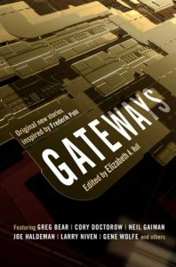

# The Way the Future Blogs

Frederik Pohl

**Fred’s Distilled Writing Wisdom, Part 4**
**Isaac, Part 7**

## E-mail Us by Nov. 15 forGatewaysGiveaway

Just a reminder that our giveaway program for that great new anthology, **Gateways**, edited by Elizabeth Anne Hull, ends on Monday. So, if you haven’t entered so far, get your entry in fast!

To enter the drawing, e-mail blog @ thewaythefutureblogs.com with your name and snail-mail address.

The winning names will be pulled out of a hat by Gene Wolfe, one of the fine authors represented in the book.  Two copies will go to folks in the USA; all the others will go to people in other countries.

### 2 Comments

- Mike Goldbergsays:The UPS man just dropped off an autographed copy of Gateways. Thanks you! It\’s great to be lucky.May 25, 2011, 4:34 pm
- Sophiesays:The mailman delivered a copy of Gateways in France today! Thanks so much, extra thanks for taking time to autograph it!!June 1, 2011, 4:15 am

**WordPress**
**TWTFB2**