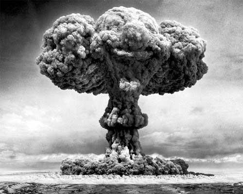

# The Way the Future Blogs

Frederik Pohl

## What Fogbanks Cost

Want to hear a funny, and true, story about atomic bombs?

Well, there’s a component that goes into them that’s so secret that I have no idea what it looks like or what it does.  I do know its name, but that’s not really very informative.  The name was made up with no relation to any tangible object — it’s called a fogbank — and the only unclassified fact the War Department is willing to disclose about fogbanks is that if a nuclear weapon doesn’t have one it won’t work.

Well, no, that’s not exactly true.  I do know one other fact about them.  I know that when the war people decided they needed to spruce up some of our aging nuclear weapons not long ago they found that they all needed new fogbanks.  Then they discovered that they didn’t have any fogbanks in stock that anyone could find, so they would have to make some new ones —

But they couldn’t do that.  They didn’t know how.

Possibly someone, back in the day when new fogbanks were being manufactured, had written down fogbank’s specifications, but if so the data were so classified that they could not be found.  Worse, everybody who had been involved in manufacturing fogbanks was either dead or retired, so there was no one they could ask.

So what did they do? Why, they just set up a new research facility and ordered it to reinvent the fogbank.   That’s what they did.  The cost was $69 million.

### 20 Comments

- Ace Lightning says:
I have to assume that the original fogbanks were still *there*, attached to the nuclear weapons, but some critical material had deteriorated to the point where they wouldn’t work any more. Therefore, it ought to have been possible to just “reverse-engineer” new fogbanks, based on the old but non-functional fogbanks. Or is that too logical for the Department of Defense?
November 21, 2010, 4:41 am
- Paul D. says:
The suspicion is that “fogbank” refers to aerogels, which are indeed somewhat similar to fogbanks.
http://en.wikipedia.org/wiki/FOGBANK
November 21, 2010, 9:17 am
- Scott Hauger says:
Hey Fred:
If that were true, how did the British, French, Russians and Chinese explode atomic weapons?
Scott
November 21, 2010, 12:51 pm
- Pyesetz the Dog says:
Wikipedia (which is always wrong) says it’s an aerogel.
November 21, 2010, 1:01 pm
- richard says:
Why does that cloud look like Bozo the Clown?
November 21, 2010, 7:04 pm
- Saketh says:
This is totally unrelated but that mushroom cloud looks like a laughing clown.
November 21, 2010, 9:02 pm
- elvy says:
yep – its defintely a happy mushroom cloud
November 21, 2010, 11:03 pm
- steve says:
Re: clown…. So much so I’m sure it’s intentional.
November 21, 2010, 11:45 pm
- Tommy says:
Its an image from Twisted Metal : Black
Video game for ps3 i believe.  You can race as a clown.
November 22, 2010, 12:47 am
- Andreas says:
Actually, Fogbank is an aerogel containing beryllium.
November 22, 2010, 2:38 am
- David S. says:
If only the other nuclear powers were as forgetful as the USA, the world would be a much safer place.
November 22, 2010, 5:08 am
- Alex Greene says:
As long as they don’t suddenly start forgetting where they put those nukes …
November 22, 2010, 6:01 am
- Margaret says:
Funny indeed.  In a twisted, wry, sort of way.  Thank you.
November 22, 2010, 10:34 am
- John H says:
The pic is titled “Murshroom Clown” [sic]: http://adsoftheworld.com/media/print/playstation_3_murshroom_clown
November 22, 2010, 12:16 pm
- Michael Antoniewicz II says:
This reminds me of a story I heard about U.S. Subs.  It seems that one of the components in the Oxygen Generation System lasted so long that the manufacturer had gone out of business years before they then they started to fail.  Supply & Logistics tried to order new one\’s as their supply in the warehouses started to get low only to then discover what had happened.  Cost a cool $50 million to get someone to dig the plans out of records, figure them out, and build a production line.  
Then the USNavy had to pay for the new parts while keeping the production line in operation….  
PS: Every design they tried to replace it with shared this two little problems.  Too big and exploded when integrated with the rest of the System (okay, some merely caught fire and spraid an O2 flame through everything in it\’s way) causing a \’higher then expected level of water consumption in the laundry\’.  
November 22, 2010, 12:35 pm
- A.R.Yngve says:
I wish I knew a scientist who could explain one detail that’s always puzzled me about atomic bombs:
At which point will the natural decay of uranium (or plutonium) in a nuclear bomb become so severe that a chain-reaction fails to occur? I know only that they decay into lighter elements (such as lead) — so over time, the buildup of lead should “pollute” the bomb material — but at which time will this make the bomb unable to detonate properly?
November 22, 2010, 2:11 pm
- John Murphy says:
Oh how wonderful. That’s a perfect little detail for this story I’m revising. Thank you.
November 23, 2010, 10:11 am
- Joshua Zucker says:
@Yngve: the half-life of U235 is in the hundreds of millions of years, and of Pu depending on the isotope (I\’m not sure which one(s) are used in bombs) is at least tens of thousands of years.  So the fraction of lead after even a hundred years will be pretty tiny.
November 27, 2010, 10:37 am
- Tamfang says:
Have you heard the one about the offog?
January 5, 2011, 1:20 am
- Tom says:
If the suspected identity of FOGBANK is correct, then pure-fission weapons do not need it at all.  Those are also “atomic” bombs.
It is also not clear that FOGBANK is necessary for *all* thermonuclear bombs, rather than just this *particular* warhead design (the W76).  $69 million is a fraction of how much it’d cost to design and manufacture a new warhead.
This is more along the lines of the submarine story, or the story about NASA buying spare parts for the space shuttle on eBay.  When you’re trying to refurbish a specific piece of aging equipment, you don’t have quite so much latitude to vary the performance characteristics of replacement components.
April 25, 2011, 11:36 pm

**WordPress**
**TWTFB2**