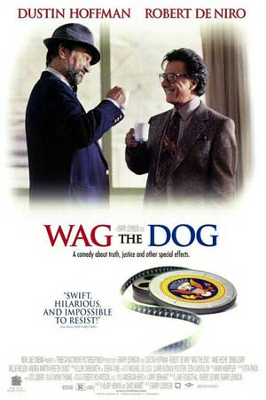

# The Way the Future Blogs

Frederik Pohl

## ‘Wag the Dog’

Want me to tell you a funny story that doesn’t make me laugh at all?

Okay, here goes.  First, you have to have seen the movie **Wag the Dog** or at least you have to know what it’s about.  (I can help you there.  It’s about an American president who’s congenitally unable to keep from getting caught in sexual messes.  So when one of them is about to go disastrously public the president and his Brains Trust cook up an idea to cover it up.  If the country began fighting a war, that would put the story of his sexual fling as a newspaper story back on about Page 32, and in small type.  So they make up a war that they pretend the U.S. was having, and then they make up an imaginary victory.)  It was actually, I’m told, a pretty funny movie.

Now comes the part that doesn’t make me laugh.  If you remember, a few days before Election Day, a new terrorist action hit the papers, somebody in Yemen trying to send bombs to synagogues, including small Jewish congregations in Chicago.

And then **Richard Roeper**, who writes a pretty good column for the Sun-Times, began getting jocular little emails coming in to him, and many of them were saying things like,  “Just like *Wag the Dog* all over again, right?”

As jokes go, that isn’t a bad one under certain circumstances.  But when they start coming in numbers, it isn’t funny any more.  There’s somebody around who is saying, don’t you believe that our president is capable of doing that if he thought he could get away with it?  Or pretending to be a Christian when he’s really a Moslem?  Or faking his birthplace so he could become president?

Or any other of those lies that apparently some people believe?

I know who’s spreading that stuff.  It’s someone who has no honor or decency himself, and so doesn’t recognize it in any else. He really should at least sign his name.

### 4 Comments

- sara says:
Its an interesting little twist on the idea isn’t it?  
We will never eliminate the cowards and the ignorant.  And the combination of the two seem to be rampant in the world today.
November 29, 2010, 12:53 pm
- Stefan Jones says:
I sometimes wonder if the right wing in this country has discovered the political-cultural equivalent of the English longbow; but instead of mowing down armored knights and put an end to feudalism, they’ve figured out how to put an end to democracy.
November 29, 2010, 1:52 pm
- Joseph Crockett says:
Mr. Pohl,
I’m not really surprised. This is typical of the disinformation campaigns run by the GOP since the ascendance of Bush II, with that weasel Karl Rove as the architect. I wouldn’t be surprised if Rove or some shadow organization that he is affiliated with is behind this.
It is amazing how far to the right they have managed to push our country, saying and doing things to which even Barry Goldwater would have raised his eyebrows. Fortunately (or rather, unfortunately), I believe that they have just about run their course. They have shifted so much wealth upward, at the cost of our middle class, our environment and our standing in world, that they have taken aim on some sacred cows in order to perpetuate their status quo. And these last election results not withstanding, proposed cuts on Social Security and Medicare and raising retirement ages in order to LOWER the top marginal tax rates for the wealthy will go over like a lead balloon. I think that they have woken the sleeping, gray giant and will pay the price in 2012.
Thanks for bringing this newest outrage to my attention.
Joseph Crockett
November 29, 2010, 3:21 pm
- Bill Goodwin says:
I’m amazed at how difficult it is to convey, to the “Terrorists Wouldn’t Worry About YOUR Rights” mentality, that the burden of civilization must be on the civilized….
November 30, 2010, 3:37 am