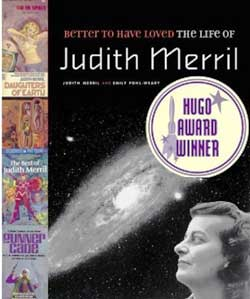

# The Way the Future Blogs

Frederik Pohl

## Judith Merril, Part 3: Life with Judy

After Judy Merril and I realized that the one thing we both most wanted from the life we had been living was to have a baby, we started looking for someone to marry us so the baby would be legitimate.  Judy quickly found someone.  I’ve forgotten his name, but he was a fairly well-known lefty New York Justice of the Peace.

So we were married in 1948. Then we began the process of knocking Judy up.  It didn’t take long.  Judy handled pregnancy quite well, so we simply went on with our lives.

Which, at the time, were actually quite nice.  We still both had our jobs and were therefore well fixed for money.  I had bought a car — secondhand, a giant Cadillac eight-seater that Jack Gillespie said was a gangster car and quite possibly once had been.  It was very easy to imagine half a dozen criminals with tommy-guns shooting up an enemy’s hangout out of its windows.

We used it to roam around the countryside, and to transport friends to cons if they wanted to go.  We’d driven it up to Toronto for the 1948 Worldcon with a party of half a dozen or so passengers — George O. Smith, I think Chan Davis and his wife, and I don’t remember who else.  (The reason I clearly remember George O. is that as we passed through Niagara Falls George got out of the car, ambled over to the railing and fulfilled a lifelong ambition by urinating into the Falls.)

And then, all of a sudden we had come to the time when Judy’s belly was as big as a washtub and we needed to watch for signs of needing to get to French Hospital for the birthing.

I have to confess I was not the most useful Father in Waiting.  What I very much feared was that she would start in labor when she was in bed with me, or something of the sort, and I would have to deliver the baby.  I’m afraid I chased her off to the hospital too early at least once, when she thought it was barely possible she was beginning to feel labor pains, and they sent her back home.  But then the labor did start.

I don’t remember where I was or what I was doing when the baby came.  I hope I was at least considerate enough to have been in the hospital while Judy was giving birth.  But I don’t remember whether I did.

Anyway, our baby daughter Ann — I insisted on naming her after my mother and Judy was willing to let is be so — was born in 1950.  Both Judy and I were then exactly as happy and contented with parenthood has we had thought we would be.

For a while.

But then it all came crashing down on us, when Judy came to me and said she was sorry but she just couldn’t help it.  She couldn’t go on without the sexual freedoms that had meant so much to her.  She didn’t want to get a divorce.  Our marriage, she said, was working quite well and she didn’t want to change a thing.  Well, one thing, that was … she wanted to change the rules a little.  How would I feel about making it an open marriage?

* * *

If you don’t know what an open marriage is you find all about in that excellent recent biography of Robert Heinlein.  It is apparently the arrangement Robert had with his first and second wives (but not his third).  In an open marriage, the two parties are just as much married to each other as any couple on *Dick  Van Dyke or The Brady Bunch.*  It’s just that whenever one of them felt the need of sexual intercourse with some other person, the left-behind one was expected to say, and apparently did say, “Oh, all right, John.  I’ll put the kids to bed.  But remind her to make sure you get a decent shave tomorrow morning, because we’re having lunch with my mother.”

You now know the exact reason my marriage to Judy suffered a mortal blow.

She wanted an open marriage, and I couldn’t live with it.  That’s what led to all the strife and hard feelings that marked our relationship for the next years.

Now over the next months — or whatever time it takes — I’m going to tell you about that strife, which mostly revolved around the question of the custody of Ann, and finally I am going to tell about the good friendship Judy and I wound up with in the end.  But you have just read the last I am going to tell you about the nastier parts of our breakup.
.
 
However, two things: The first is that Judy at the end of her life began to write her own memoir; it was completed by our joint granddaughter, Emily Pohl-Weary, and as a matter of fact won a Hugo Award.  Judy was quite willing to be candid in her memoir, so you can read that, and I so don’t have to be.

And the other thing is that, against the odds — and bad luck for the weasel if he ever has the impudence to suggest I’m lying — there is another person alive who knows exactly how Judy’s demand for an open marriage destroyed ours.  I give this person permission to go public with the story if he wants.  Or, if he likes, to run over the things I am about to tell and report whether I’m telling the truth.

*To be continued.*

**Related posts:**  

**Judith Merril,** [**Part 1**](/posts/2010-11-30-judith-merril-part-1-that-only-a-mother/), [**Part 2**](/posts/2010-12-02-judith-merril-part-2-more-motherhood/),  [**Part 4**](/posts/2010-12-06-judith-merril-part-4-last-attempts-at-having-a-family/), [**Part 5**](/posts/2010-12-08-judith-merril-part-5-a-good-successful-novel-all-of-her-own/), [**Part 6**](/posts/2010-12-10-judith-merril-part-6-our-house/), [**Part 7**](/posts/2010-12-12-judith-merril-part-7-when-it-all-hit-the-fan/), [**Part 8**](/posts/2010-12-15-judith-merril-part-8-spymaster-in-the-custody-wars/), [**Part 9**](/posts/2010-12-20-judith-merril-part-9-friends-again-before-the-end/)

### 3 Comments

- Stefan Jones says:
I can see that the new edition is going to tell a more complex story.
George O. Smith attended a Lunacon I went to in the early 80s. He passed away shortly afterwards. I remember being shocked at how rudely one smartass fan treated him while on a panel.
December 4, 2010, 11:53 pm
- Jim Worrad says:
George O should have urinated on him.
December 5, 2010, 4:44 am
- krjames says:
Stefan’s comment puts me in mind of Harlan Ellison’s well-known lecture (whose title, however, I can’t recall) on fan nutjobbery at SF conventions.  This recent “weasel” episode suggests a prime example of that particularly obnoxious brand of sociopathy.
December 5, 2010, 8:01 am

**WordPress**
**TWTFB2**