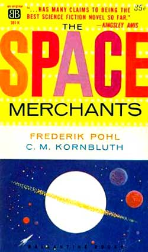

# The Way the Future Blogs

Frederik Pohl

**Me and Alfie, Part 3: Ideas and The Demolished Man**
**Me and Alfie, Part 5: Collaboration and the Futurians**

## Me and Alfie, Part 4:  Rejection

*Part 4 of “Alfred Bester and Frederik Pohl — The Conversation,” recorded 26 June 1978 at The Tyneside Cinema, Newcastle upon Tyne, UK.*

Bester: I’m curious, Fred.  Where did you get the idea for **The Space Merchants**?

Pohl: *The Space Merchants* has a long history. During World War II, I was with the American Air Force in Italy.  I got a little homesick, and I’d brought my typewriter with me. I’d carried that damn thing all over World War II hoping some time to find a use for it and I did.

I thought I’d write a novel about New York City to make me feel a little better. And the most exciting thing I could think of to write about in New York City was the advertising business — which was a glamorous sort of thing —-and I wrote this novel for some 300 pages or so, called *For Some We Loved.* It’s a quotation from **Omar Khayyam**. I was 23 years old, what did I know?

And then the war was over and I got back home, and I looked at the novel and perceived there was something wrong with it. What was wrong with it was that I didn’t know anything about the advertising business, and I had written this whole novel that dealt with it.  But I knew how to solve that problem. I looked in the Sunday New York Times, classified advertising section, and I saw three or four help-wanted ads for advertising copywriters. I’d never been an advertising copywriter, but it looked easy. So I answered a couple of the ads and one of them hired me, and I spent a couple of years there.

Bester: What agency was it, Fred?

Pohl: A little tiny thing called Thwing & Altman, mostly book accounts. We did the Dollar Book Club and the Literary Guild and William Wise.  I got to be pretty good at writing advertising.

And, at some point during those years, I had a summer place in upstate New York looking out over a lake with a big fireplace, and I had my manuscript of my novel *For Some We Loved* with me, and one night, I began to read it in front of the fireplace and as I read each page, I tossed them in the fire one by one.

Bester: Oh, Fred, no! That’s terrible.

Pohl: It was awful. The concept was painful … but the novel itself was agonizing.  I had no choice.

So here I had all this knowledge of advertising and no longer had a book to put it in.  Also Fred Wakeman had come out with **The Hucksters** by then, so it was no longer really a fresh idea for a regular mainstream novel.  Then it occurred to me to make a science-fiction novel about advertising, and I began tentatively putting words on paper — a little bit at a time, because by then I had a full-time job running a literary agency.  And when I had put about 20,000 words on paper over about a year or two, I showed it to **Horace Gold**.

Bester: What did Horace have to say?

Pohl: He said, “I am now running Alfie Bester’s **The Demolished Man**—”

Bester: Leave me out of this, will you?

Pohl: I swear to God, that was what he said. And: “I haven’t got anything to follow it up with. There’s nothing else coming in that looks as if it’ll stand up to *The Demolished Man.* So I’m going to start with the first installment now, and by next Tuesday please have the second and the third.”

And I said, “There’s no way I can do that. I have a full-time job with the agency.”

And he said, “I don’t care whether you can do it or not, the printers will be waiting.”

So I went back to my home in New Jersey where my old friend Cyril Kornbluth, with whom I’d written a lot of stories before, was staying with me. He read over the part I’d written, the first third or so and said, “Yeah, yeah, we can do something with that.” So he rewrote that and added some, and I rewrote that and added some, and we barely got it into print, but actually the first part was being set before the last was written.

Bester: My God, you were living dangerously, Fred!

Pohl: I had nothing to lose. It was Horace’s problem!

Bester: Whose title was it — Horace’s or yours?

Pohl: I called it something ridiculous like “Fall Campaign,” and Horace put “Gravy Planet” on it.

There was a big book boom in science fiction at the time, all sorts of publishers deciding to bring it out in hardcovers. So, I thought, what the hell, I’ll sell it as a book, and I was a literary agent, and I knew every publisher and editor in New York, especially the ones that dealt in science fiction — a lot of them were very good friends of mine. So I took it off to one, and I said, “Here, print this. It’s pretty good stuff,” and he read it and gave it back and said, “No, that’s not really what I meant at all!”

And I said, “So much for you,” and I took it to the next one. And it was rejected by every publisher in America who then had a science-fiction line.

Bester: So was *The Demolished Man,* sir! It was bounced by everybody.

Pohl: Well, I think it’s the same story.

So, there was no publisher left to offer it to. Then Ian Ballantine started up his own company, and he was so inexperienced as a publisher that he didn’t know this was unpublishable. So he published it! You know, it’s been translated into 45 languages now.

Bester: It shows you, the greatest books in the world can be bounced by anybody. Look at Fred’s!  The greatest science fiction novel of all time. Bounced by everybody! It’s preposterous!

*To be continued.*

**Related posts:**

- **Alfie,** **Part 1**, **Part 2**
- **Me and Alfie,** **Part 1**, **Part 2**, **Part 3**, **Part 5**, **Part 6**, **Part 7**, **Part 8**

### 5 Comments

- Richardsays:The repartee is terrific.  I’m so envious of the audience at that cinema in Newcastle!April 1, 2011, 3:24 am
- David B. Williamssays:Hilarious. Reminds me of Dune. Poor Frank Herbert couldn’t find a book publisher for several years after the magazine serialization, until he finally sold it to a company that specialized in printing catalogues or something. Then the paperback editions, the sequels, and the estate in Hawaii.April 1, 2011, 8:55 am
- Mike Goldbergsays:More, please!April 2, 2011, 8:41 am
- Michael Walshsays:@David B Williams: Dune was acquired by Chilton, publisher of primarily automotive repair manuals.  They also published “Wild and Outside” – an SF baseball novel by Allen Kim Lang.The description from the publisher: “A hilarious blend of baseball, exobiology, extra-terrestrial ethnology, slam-bang adventure, and pure fun — the story of baseball’s introduction to an alien planet.”I may be wrong, but I think he was an editor at Chilton.April 2, 2011, 12:15 pm
- Larssays:I’ve thought for a long time that “The Space Merchants” is the finest libertarian SF novel ever written.Not in the sense that libertarians would like, of course. More like “We” of “1984” are quintessential collectivist novels – showing the logical outcomes of particular ideologies. “The Space Merchants” show what the libertarian right would enable.Still, you’d think that the Prometheus people would be honest enough to reconize Mr. Pohl and Mr. Kornbluth as Grand Masters.April 4, 2011, 5:07 pm

**WordPress**
**TWTFB2**