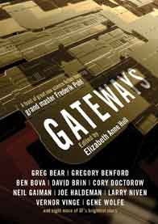

# The Way the Future Blogs

Frederik Pohl

**Popular Publications, Part 4: Continuing Down the Corridor**
**Scripting Gateway**

## And the Winners Are…

We do apologize for forgetting to announce the winners of the **drawing** for copies of **Gateways**, the best book ever written as a birthday present for me, but here are the names:

- Sophie Gousset, Brest, France
- Chris LaHatte, Wellington, New Zealand
- Simon Groom, Romford, United Kingdom
- Duane Davis, Lancaster, California, USA
- Mike Goldberg, Skokie, Illinois, USA
- Bjorn Fridgeir Bjornsson, Reykjavik, Iceland

### 5 Comments

- Mike Goldbergsays:Thanks, Fred!June 18, 2011, 8:11 am
- David Ratnasabapathysays:Oh well.  Congratulations, winners!I console myself with the Frederik Pohl bundles available atBaen Webscriptions.Thanks for putting them up!June 18, 2011, 2:03 pm
- Chrissays:Thank you very much!June 19, 2011, 12:26 am
- Mike Goldbergsays:Oops! What I really meant to say was: thanks to everyone involved, especially to Elizabeth Anne Hull, the book’s editor.June 19, 2011, 5:48 am
- Bjornsays:Thank you! So looking forward to this!June 19, 2011, 8:17 am

**WordPress**
**TWTFB2**