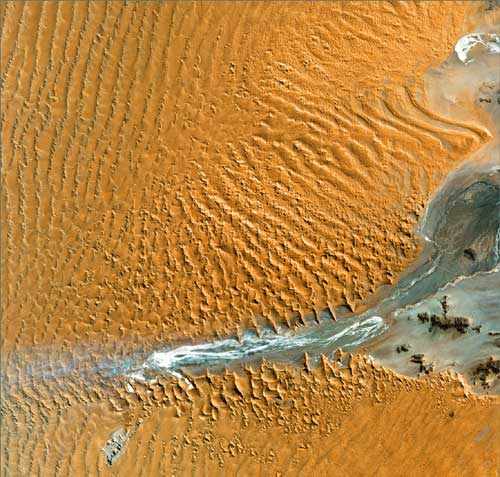

# The Way the Future Blogs

Frederik Pohl

**Donald A. Wollheim (At Seventeen)**
**My Life as Book Editor for Popular Science**

## Fred the Predictor Predicts

  

Six months or so back a local outfit asked me to make some predictions about the future.  That’s not my regular line of work, of course.  Sf writers do not *predict* the future, they just speculate about what sorts of futures might come our way, but I was feeling lucky so I took a shot.  “By 2050 A.D.,” I said, “the whole stretch of southwestern states from Texas through Southern California will be officially designated a desert.”

And what do you know?  This Sunday’s New York Times had an interview with  Richard Seagar, head analyst of Southwest weather studies at Columbus University’s Lamont-Doherty Earth Observatory.  Asked how long he thought the Southwest drought might persist, he said,  “You can’t really call it a drought. . . .  You don’t say, ‘The Sahara is in drought.’ It’s a desert.  If the models are right, then the Southwest will face a permanent drying out.”

Not the only place, either.  The same models that show Las Vegas, Los Angeles and Phoenix at risk of becoming “ghost cities,” show the same for more distant urban places like Perth, Australia, whose city planners warn that it may be the first to go.

Want another prediction while I’m hot?

All right.  By 2050 the tornado belt, which has slowly relocated closer to my own area in Northern Illinois, will inhabit Canada’s southern provinces, and you can bet on that!  (Of course, you might lose.)

### 11 Comments

- Owlsays:Fred, please excuse me if I really, REALLY hope that you are wrong!July 19, 2011, 8:14 pm
- Stefan Jonessays:I think your desertification prediction is a safe bet.It’s going to be an awful, disorienting process. Whole states turning into economic basket cases. Agriculture becoming unfeasible in a huge swath of the country.But rather than do something sane about it — like infrastructure stimulus spending on a system of catch basins and canals, and revamped sewer and water systems — we’ll probably see calls for tax breaks for golf courses so they can afford to buy more water.Conservatives will blame it on Mexicans, gay marriage, and teaching of evolution.July 19, 2011, 10:32 pm
- H. E. Parmersays:“It was an inspired guess.”Shame on you, Fred: Don’t you know all that global warming stuff is just a conspiracy by Marxist smarty pants to get grants and/or destroy Capitalism? This is just a teensy dry spell.Thank God we have brilliant intellects like Glenn Beck and Rush Limbaugh and all the Republicans who want to be President, who’ve courageously exposed this evil cabal and their junk science!Now, where’s my Hummer?July 20, 2011, 2:24 am
- Walt Gsays:Pretty good predictions. I’ll go further and say that as part of the shifts in climate the Sahara will get wetter.July 20, 2011, 12:54 pm
- Larssays:We’re already getting tornado warnings on more or less a regular basis here in southern Alberta, something that I definitely don’t remember from three decades ago.July 20, 2011, 1:36 pm
- wolfwalker says:
“By 2050 A.D.,” I said, “the whole stretch of southwestern states from Texas through Southern California will be officially designated a desert.”
Um, will be?  Most of that area already is a desert under a strict climatic definition.  Has been for at least a thousand years.  Most of the water that makes the American Southwest habitable comes from diverted rivers (pity the poor overworked Colorado, which doesn’t even reach the ocean anymore, it just sort of trickles out about fifty miles short), from winter snowfalls, and from deep-aquifer wells.
July 21, 2011, 7:11 pm
- Jay Borcherdingsays:Ghost cities of the southwest sounds like an exaggeration.  Don’t forget that agriculture still gets over half the available water through most of the region.  If things got truly dire, I think its more likely that agricultural water rights would be bought out than you’d see vast cities depopulated.  There’s also something to supply/demand curves–as water scarcity increases, the price will surely go up, which will in turn encourage conservation.  High prices depress demand, which should free up supply.  Admittedly, there are many non-market forces and inefficiencies in the water market, so those idealized curves from Economics textbooks would be somewhat distorted, but the basic principle would apply.  I think.Could be wrong of course, just tossing this out there.July 22, 2011, 2:41 am
- JJ Brannonsays:Fred’s cheating…He neglected to mention that he was a federally trained weatherman!:>)JJBPS:  Trained at Chanute Field where I trained to be a Fuels Specialist [when it was an AFB — now’s it’s a housing development].July 23, 2011, 11:54 pm
- Neil in Chicagosays:You want to _really_ go out on a limb and tell us when the boosters and Babbits and Chambers of Commerce will stop planning to keep using more of the water that’s already gone?July 24, 2011, 8:29 pm
- EdSsays:I thinking that it’s worth keeping in mind that although the US south west, including California,  may become unusable for agriculture, new opportunities will open up in Canada as the warmth moves north. As the growing season lengthens huge areas of Canada are opened up for agriculture because you will now be able to get useful crops off before the frost arrives.  The same will be true in Russia I imagine and Scandinavian countries.July 28, 2011, 2:44 pm
- Larssays:If you look at a map of Canada, you’ll note that farmed areas of the Prairie provinces are well north of farmed areas in the east. That’s because good soils in the Prairies extend to the north. It isn’t climate that’s constraining farming in northern Ontario, it’s the soils – that area is Canadian Shield, and the soils on it are thin, acidic and lacking in organic material. Soils over most of northern Canada are the same. Even if the climate becomes a lot warmer, it won’t be any good for agriculture.July 29, 2011, 3:53 pm

**WordPress**
**TWTFB2**