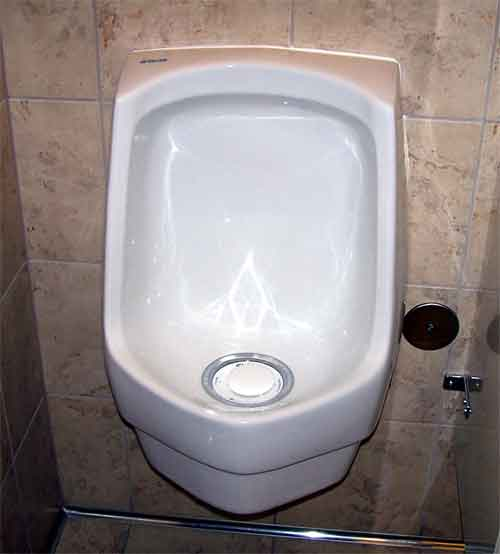

# The Way the Future Blogs

Frederik Pohl

## Guess Where You’ll Fill Your Tank Tomorrow

A simple high-school electrochemistry question for you smart ones:  how do you make that excellent, but tricky, fuel for your car, hydrogen?

Simple.  You start with plain old water; you dip two terminals from a battery at the ends of the tank and turn on the current.  Something starts bubbling at the terminals, hydrogen at one, oxygen at the other.  You can use the hydrogen to make your car go, sell the oxygen, perhaps, to the nearest hospital.  It’s a great little system, the only problem being  that it takes at least 1.23 volts to split the water molecule and electricity costs money.

Okay, forget the water.  Let’s electrolyze a different chemical liquid, say urine.

Human urine takes only 0.37 volts to electrolyze.  This cuts your power consumption down to not much more than a quarter, and the process is now economical.  What makes the difference is that urine contains urea, and a molecule of urea contains four of the hydrogen atoms that constitute your electric current — twice as many as a molecule of water — and the bonds that hold the molecule together are weaker.

So, supposing you want to start building your plant for peepee power right now, where do you get your urine?  You might think that that’s a silly question — nearly 7 billion humans alive on the Earth, and every one of them generating your new motor fuel for you every day —  but you may have to go to some trouble to get what you need.  No, you can’t just pipe your sewage into a tank and run a current through it.  Sewage is contaminated with many other materials, and the worst of them for this purpose is plain old water.  Any flush toilet dilutes the urine drastically, and thus also seriously dilutes the urea it contains, so much so that you might as well use plain water to begin .with.

There are various solutions  to the problem of the urine collection.  One was invented for us by the ancient Romans.  They liked to wear white woolen garments, but those garments got dirty and couldn’t be laundered in water because they would shrink.  Plain urine was fine to wash them in, though, so to provide their cleaning liquid, those old Roman dry cleaners put barrels out at street intersections, with ingratiating little signs urging those who had to go to use the barrels.

Of course, some neighborhoods might not care for that sort of public display.  Fortunately, there are other options.  The urine doesn’t have to come from human beings.  Any large mammal will do.  The particularly placid cow would be close to ideal.  And how do you persuade your herd of cattle to pee in a barrel?  You don’t.

There is a useful  bit of minor surgery widely in use for elderly male humans whose prostate has grown so big it interferes with their urination.  One end of a catheter is inserted directly through the skin into the gentleman’s bladder, the other end leads to a collection vessel of some sort.  From then on the man never has to dash for a public urinal, and his own urine arrives at the electrolysis plant in a nearly pristine condition.  (You save a bundle on water bills, too, since from then you never have to flush for pee.)

See how easy it is to solve some pretty big problems if you want to make the effort?

*   *   *

*All the Lives He Led*
**writing**

### 10 Comments

- marc farnum rendino says:
I’m surprised you don’t mention the picture you chose to illustrate the story – that type uses an elastomeric valve, so there is no water to pollute the stream. 
August 5, 2011, 5:26 am
- Eddie Cochrane says:
It strikes me that is would not take much of a re-design to make a urinal optimised for urine collection. Having separate outlet pipes with a valve that switches between them when the flush is operated would reduce contamination of both, i.e. the urine would be less contaminated by water, and the water less contaminated by urine, which could help with later water treatment. Of course, that only solves the male half of the problem.
August 5, 2011, 6:52 am
- Jeff Crook says:
So in the future, the old high school trick of peeing in someone’s gas tank wouldn’t work anymore.
August 5, 2011, 7:22 am
- Stefan Jones says:
I recall reading that some pee-collectors actually paid a few coins for deposits, and that some emperor or another started taxing pee money!
In David Brin’s upcoming novel Existence, pee is collected for another use . . . one that should not prevent the leftover from being electrolyzed.
August 5, 2011, 1:50 pm
- the blog team says:
Marc, I found the photo after Fred wrote this piece, so he didn’t have a chance to mention it. This particular waterless urinal, by the way, is at the Environmental Protection Agency’s “green” building in Denver. I don’t know what the EPA is doing with its collected urine.
August 5, 2011, 4:52 pm
- deadprogrammer says:
Dumping a bunch of synthetic urea into water might be a bit simpler than collecting and transporting pee.
August 5, 2011, 7:57 pm
- Jay Borcherding says:
Amusing and educational post!  And allow me to echo Marc’s comment that the urinal pictured would be a practical way to collect human urine from public places.  True, it would only be applicable for half of available public restrooms, but that’s still a pretty good source.
Another aside regarding the illustration, the sex columnist (and atheist, and founder of the It Gets Better Project, and scourge of Republican lunacy, and etc.) Dan Savage had a ‘urinal of the day’ feature on his blog awhile back, and the photo immediately brought that to mind.  Perhaps the first time you’ve almost been confused with the much younger, and much gayer, Mr. Savage.
August 5, 2011, 11:18 pm
- Bruce Arthurs says:
We have some of those waterless urinals where I work.  I guess the idea is that the porcelain is so slick that all the urine will slide down and into the drain without a watery washdown required.  This idea works better in concept than execution; there’ve been times when the previous user’s odor was a memorable part of my own experience.
For a fun and educational experience, get an ultraviolet flashlight, turn off the bathroom lights and check out the toilet.  Who knew guys could splash that much, and that far from the water’s surface? Take a break, guys; get off your feet for a moment or two, and pee sitting down.
August 6, 2011, 3:58 am
- EdS says:
No sorry, you can’t have my urine. I might need it to top up the car battery.
August 6, 2011, 12:00 pm
- Rich Rostrom says:
Stefan Jones: the urine in public urinals was collected for use in tanning leather. The Emperor Vespasian imposed a tax on the urinals. When his son Titus complained of this vulgar proceeding, Vespasian retorted ””Pecunia non olet”” (“Money’s got no smell”).
To this day, public urinals are known as ”vespasiani” in Italy and “vespasiennes” in France.
August 14, 2011, 12:27 pm

**WordPress**
**TWTFB2**