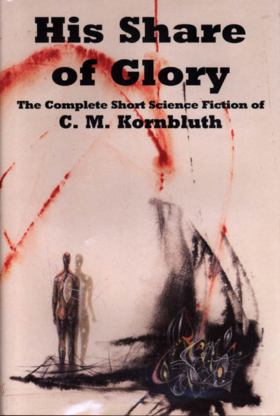

# The Way the Future Blogs

Frederik Pohl

**We’ll Tak a Cup o’ $224 Billion**
**Warren Buffett’s Plan to Fix Congress**

## Cyril Kornbluth, Part 3

Cyril Begins to Blossom

When Cyril’s bad luck dumped him into the Infantry just when Hitler caught the American Army with their pants down in the Battle of the Bulge, he became a machine-gunner.  What happened with him in that worrisome period before Patton, plus thousands of fresh reserves, kicked Hitler’s troops back into Germany I don’t know, because Cyril refused to talk about it.  The end result, though, was that he got two things from that period of service.  One was a Bronze Star.  The other was a bad case of what they called severe essential hypertension, which was Army talk for heart trouble.

For a time after the war Cyril dealt with that situation by ignoring it.  At some point he had married Mary G. Byers, the Ohio femmefan he had smuggled into New York City over the efforts of the uncle who, as her guardian, had done everything he could to prevent it.  When Cyril’s draft number came up (I believe from things Cyril said), they were married.

While Cyril was serving in Europe, Mary was (again, I understand) alone, and not doing well.  I believe that was when her drinking problem first surfaced; but when Cyril came home, he entered the University of Chicago on the G.I. Bill and, at least for a time, things went well for both of them, especially after he took on a part-time job working for the newswire service, Transradio Press.

That job he got by invitation of our mutual old Futurian friend, Dick Wilson, who got there a little earlier than Cyril and had already become head of Transradio’s Chicago Bureau.  (I must write something about Transradio some time, because it loved hiring Futurians, including, occasionally, me.  But not now.)

Cyril had stopped by New York before moving on to Chicago, and he and I had kept in contact.  I was then operating the Dirk Wylie Literary Agency, helping Dirk to make it a career (his own war injuries having made it impossible for him to hold a normal job.)  When Cyril began writing, and selling, an occasional postwar sf story  again, I coaxed him to do more.

He ultimately gave in, quit Transradio (and quit the university too) and moved back east.  I *think*, again from things Cyril said, that part of the reason for leaving Chicago was because Mary was involved in some drinking there.  I know (from Mary herself) that Cyril tried really hard to help her quit, including some pretty harsh measures.

He and Mary set up housekeeping near where I was living with my family in Red Bank, New Jersey.  For the next few years Cyril-the-writer was not only vastly productive but getting better and better at it, almost by the day.   That’s when he was producing such winners as “The Luckiest Man in Denv,” “The Silly Season,” “The Little Black Bag” and many more.  Cyril had a nearly in-born gift for graceful writing and excellent spot-on characterization.  His only real weakness was in plotting.  By then he had taught himself — maybe with a little help from those Futurian writing orgies — plot structure for short stories and, soon thereafter, novelettes and novellas.  Some of his work from that period I would match against almost anybody’s best stories ever, including “The Marching Morons,”  “Two Dooms” and a good many others.  (The intelligent folks at **NESFA** have put all those stories in a single volume, entitled **His Share of Glory: The Complete Short Science Fiction of C.M. Kornbluth**.) None of them won any Hugos or Nebulae.  The reason was just some of  Cyril’s bad luck.  The awards hadn’t been invented yet.

Apart from  the writing, Cyril’s life was unusually ordinary — that is to say, mostly quite apparently happy in those years.  He and Mary shared many interests, not least the two sons, John and David, that Mary gave him in those years. Fatherhood, I must say, revealed a side of Cyril that I had not suspected to exist.  He was an archetypal proud papa, he worried seriously when John developed some problems that none of their doctors seemed able to cope with (but which, apparently, the boy ultimately outgrew).  From outside, even a quite close outside, the ultimate cynic seemed to have transmuted himself into a perfectly normal young married.

There was one small puzzle.  One time when he and I were in my car, on the way to the Ipsy-Wipsy Institute, our conversation got much more than usually personal.  And when, leaping from earlier remarks between us, I asked Cyril what he would most like to change about himself, he clenched his teeth and,  “I wish I were less cruel.”

I didn’t ask him any questions about that remark, but I did give it a lot of thought for a long time.

*More coming along as soon as I find time to write it.*

**Related posts:**

- **Cyril Kornbluth,****Part 1**, **Part 2**
- **Mary Kornbluth,** **Part 1**, **Part 2**, **Part 3**

### 3 Comments

- J.J.S. Boycesays:Actually “The Little Black Bag” and “The Marching Morons” were included in The Science Fiction Hall of Fame, Volumes I and II, respectively. That anthology collection was intended to honour pre-Hugo/pre-Nebula stories that never had a chance to be nominated for an award.In addition, “The Little Black Bag” won a Retro Hugo in 2001 for best novelette. So you’re right Mr. Pohl, Kornbluth was an award winner who was unlucky enough to be active at the wrong time, but at least he eventually got his due.January 9, 2012, 8:20 am
- Stefan Jonessays:Keep it coming.I wonder what sort of SF war story that Kornbluth might have eventually written, given that he actually fought in a war. I bet it would be very different than an SF war story written by someone who (ahem) stayed on the home front.Also: The collection “His Share of Glory” is amazing. Kornbluth was writing snarky humorous fantasy decades before folks like Asprin and Pratchett. Searing social satire.January 9, 2012, 1:11 pm
- TADsays:Been meaning to say for awhile, thanks for posting this, too. I haven’t read as much of Cyril as an SF fan should, but “Two Dooms” and “The Last Man Left in the Bar” and “The Altar at Midnight” are all pretty amazing. He really was ahead of his time. Thanks again for sharing this.February 8, 2012, 2:40 am

**WordPress**
**TWTFB2**