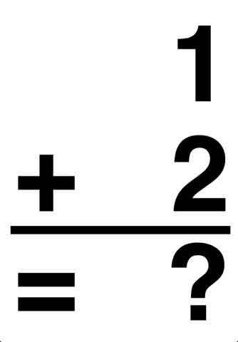

# The Way the Future Blogs

Frederik Pohl

**Bright Sayings of Bright People, No. 24**
**Rating the Candidates**

## Math skills

**Some numbers about assorted people’s grasp of arithmetic:**

- % of population who think they know enough household mathematics to handle problems:80%
- % of population who got at least one-half of test questions on a sixth-grade arithmetic test right: 42%

The less math people know, the more confident they are in their decisions.

- Scores on a test of simple arithmetic of people who have already been foreclosed:
- Willingness to seek help and/or do research:Best informed:   most likelyLeast informed:  least likely

### 4 Comments

- Jack William Bellsays:This is known as the Dunning Kruger effect. It applies to things other than math skills.http://en.wikipedia.org/wiki/Dunning%E2%80%93Kruger_effectJanuary 27, 2012, 10:49 am
- Keithsays:Just out of curiosity, where’d you get these statistics from , Fred?January 27, 2012, 11:26 am
- Theophylactsays:Ah, yes: TheDunning-Kruger Effectrears its ugly head once more.January 27, 2012, 11:57 am
- Larry Kollarsays:Who was it that said learned people agonize over a problem, while the ignorant have full faith & confidence in their wrong answer? (I’m sure I’ve garbled the quote, but someone will know what I meant.)Seems appropriate that a simple math question is required to post a comment to this blog.January 27, 2012, 10:56 pm

**WordPress**
**TWTFB2**