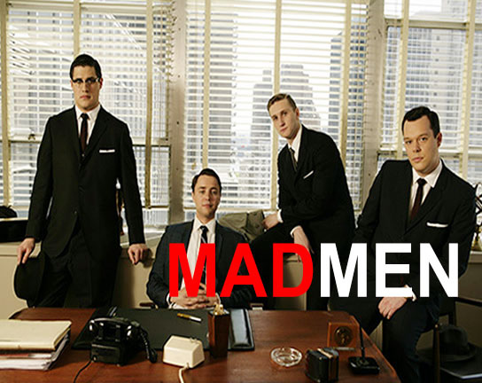

# The Way the Future Blogs

Frederik Pohl

## No, Not Me (I think)

People have been asking if I am the model for the Mad Ave. advertising man who writes for Galaxy under pen names.  I don’t think so.

True, I did once work for a Madison Avenue ad agency, but Thwing & Altman was too tiny a shop to support all that adultery.  And, yes, I did write quite a bit for the real Galaxy and some of the stories did appear under pen names, particularly when I had more than one story in an issue.  But no.  I don’t even know anybody on the program.

What a pity that the magazine hasn’t survived to get the benefit of all this Class A+ product placement.

### 3 Comments

- TAD says:
I’m sure you must have seen that episode of STAR TREK: DEEP SPACE NINE that had GALAXY featured in it? It was really pretty excellent….
April 23, 2012, 3:30 am
- Robert Nowall says:
If the show mentions Galaxy enough, maybe somebody’ll revive it.  (Who owns the rights now?)
I’d be happy to see some more print magazines around…online reading just isn’t the same…I’d even be happy with the return of Worlds of If…
April 24, 2012, 5:59 am
- lorq says:
I’ve wondered for a while now if Alfred Bester might not be one of the inspirational forces behind “Mad Men.”  He was very much a part of the Madison Avenue scene dramatized in the show; two of his non-SF novels, “The Rat Race” and the posthumously published “Tender Loving Rage,” are explicitly based in that world, and “The Demolished Man” (first published in “Galaxy”), as William Gibson and many others have commented, is also “about” that world, as refracted through a science-fictional lens.  The psychological mysteries of the protagonist of “Mad Men” could also fit neatly into a Bester story.  I’m not saying Bester is the only candidate for character-model for the show, but he’s a pretty damned good one.
April 28, 2012, 1:29 pm

**WordPress**
**TWTFB2**