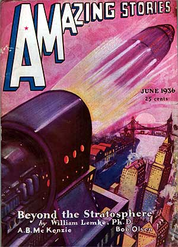

# The Way the Future Blogs

Frederik Pohl

## Early Editors

The development of a professional writer is marked by a number of stages, each identified by a particular event.  My own development was accelerated by the fact that by the time I was 14 or so I had come to know people — Johnny Michel and Don Wollheim — who had actually sold works to professional science-fiction magazines.

(Well, “sold” is putting it a bit strong, since neither of  them had really been paid for their work.  In fact, that’ s why they had come to Geegee Clark’s Brooklyn Science Fiction League in the first place; to put pressure on Hugo Gernsback to pay the writers for his Wonder Stories by denouncing him to his most loyal fans, the ones who had joined his club.)

Anyway, I listened to them reverently, and in fact learned a great deal.  One of  things I learned was that, surprisingly, the editors of science-fiction magazines were in some ways indistinguishable from ordinary human beings.  They went to offices to work —  well, I knew that because I had discovered on my own the existence of writers’  magazines that actually gave addresses for those offices.  I  had even experimentally tried mailing one or two of my early stories to one or two of those sf markets.  What I learned additionally from Donald and Johnny was that you could go in person to some of those offices, and that some of those editors, sometimes, would actually talk to you.

That particular nugget of information was worth actual cash to me.  As I had learned from my study of Writers Digest, I could mail in my stories —  and had done so.  The catch to that was that I was required to enclose postage for the return trip in the (likely) event of rejection.  That had amounted, in the last story I had submitted by mail, to 9¢ in stamps each way, total 18¢.  While the cost, if I delivered them in person, would be only a nickel each way for the subway.  (Plus, of course, whatever price could be put on my time for the 45 minutes each way it would take for me to do it —  but, then, nobody else was offering to buy any of my time at any price.)

That represented a nearly 50-percent reduction in my cost of doing business,  or even more —  much, much more! —  if I had enough stories to submit to make a continuing process out of it.  I could, say, take the subway to editor A’s office to pick up rejected story X and at the same time submit new story Y, then walk (no cost for walking) to the office of editor B to try story X on him.  And there was no reason for me to limit myself to a single story each way at each office.

The only thing that could prevent me from working at that much greater volume was that I hadn’ t written enough stories to make such economies of scale pay off, and that, boys and girls, is how I became a literary agent.

In 1936, what you needed to become a literary agent was basically only two things, a) to find some writers who would let you handle their work and, b) some editors to submit that work to.  It’s a little more complicated today.  Getting the clientele was no real problem for me since almost the entire membership of the Futurians was busily writing and totally unagented.  (No one said the stories an agent submitted had to be any good.)  Finding markets was even easier, because the science-fiction magazine field was multiplying rapidly.  For years, there had been just three magazines.  Now there were nearly thirty.

So I let my fellow Futurians know that my new agency was accepting clients.  They came through for me and I began laying out my trap lines.  The first editor to get a look at my wares would be F. Orlin Tremaine  at Astounding, simply because I had learned that he paid the most.  From there, I drew a map of Manhattan with all the magazines in place, and when I had accumulated a reasonable clutch of stories that least looked more or less professional, I put on my sturdiest shoes and set forth.

Over the next couple of years the field grew explosively and new magazines with new editors came along almost faster than I could learn their names.  It was an embarrassment of wealth.  For many years the universe of science fiction in America had comprised three publishing companies, each with a single magazine.

The oldest was Amazing Stories, founded by Hugo Gernsback way back in 1926; but he lost it in the troubles that began the Great Depression.  Now it was owned by something called Teck Publications, paying its authors not much and not very soon, and edited by an ancient long-bearded man called T. O’Conor Sloane, Ph. D.   (Who wasn’ t exactly the type you would have picked to run a science-fiction magazine because he had made it clear that he didn’t believe man would ever fly in space.)

The nice thing about Amazing was that their office was handy to the Seventh Avenue subway line, near Penn Station. Also handy to the same line was the office of Street & Smith, who had picked up Astounding Stories from the Depression-wrecked line of Clayton pulps when those went down the tube.  Street & Smith, at 7th Avenue and 17th Street, was probably the healthiest of the pulp publishing houses, and about the best-paying.  (A penny a word, sometimes more, and paid at once on acceptance.)  Their man in charge was an editor-for-all-seasons named F. Orlin Tremaine, who knew nothing about science fiction when he was first handed the portfolio, but was really good at asking questions.

As it turned out, he was willing to ask quite a few of me.  I can’ t exactly say we became friends, but after a few episodes of having an assistant  shoo me away at the door, he finally allowed me into his office and to quite long conversations.

### 9 Comments

- Jeff B. says:
Mr. Pohl,
I wanted to chime in and tell you I find these blog posts by you fascinating and invaluable. Your insight into a critical phase of science fiction, a genre I grew up loving, and still love, is not just valuable in and of itself, but also due to it being specifically your insight. The internet is truly the Wonder of our age, allowing me to have access to the thoughts and musings of, for example, one of the truly great science fiction writers and editors. I look forward to more of your blog posts, and, of course, your other writings. Heck, I just finished JEM again the other day, rereading it for the first time in over thirty years, and I have more of your books on my neverending “to be read” pile.
Take care.
October 1, 2012, 5:56 pm
- Bill Higgins-- Beam Jockey says:
I love the image of young Fred on the sidewalks of Manhattan, bundle of Futurian stories under his arm, consulting his map to plot the optimal route to the office of the next-highest-paying publisher.
October 1, 2012, 6:33 pm
- Mirko Tavosanis says:
Wow, I have just read this wonderful account. It is charming, and it made me think also to the way Will Eisner presented the work for his comics agency (1937 ca.) in “The Dreamer”. Thank you for sharing this!
October 2, 2012, 6:01 am
- Robert Nowall says:
Another alas for me…in the days when I started writing, I lived too far away to wander into an NYC SF editor’s office by walking into it…later, when I could’ve driven into the city and wandered in, I found myself living much father away, too far to drive.  It was all correspondence for me—some rejections which told me someone had actually *read* the story, but, in the few-and-far-between stuff I put out now, nothing but form rejection for ten years or more.
Is it any wonder why I turned to Internet Fan Fiction for awhile?
October 2, 2012, 7:33 am
- Chuk says:
Thanks for this look back.
October 4, 2012, 6:08 pm
- Rob Hansen says:
I can honestly say it would never have occurred to me you became an agent because you could save money on postage. Wonderful! What a fascinating look at a world that doesn’t exist anymore.
October 9, 2012, 2:45 pm
- Enrico says:
Fascinating stuff. Where else could you find a first-person account of the SF scene in 1936, but posted online in 2012!?
Fred, do you still have that map of all the magazines? Since I go to Manhattan daily I am inspired to try and visit some of the locations.
October 9, 2012, 11:14 pm
- John Boland says:
As Fred recounts those days with obvious pleasure, I look back on the days when IF and Galaxy were on the stands. Rarely I have a recurrent dream of finding a news stand I haven’t been to before, with one of those old revolving wire racks, and there in the rack by God is a new issue of IF, cover by Pederson (of course). And I wonder how long has this been going on?
October 13, 2012, 10:37 am
- Michael A.. Baanks says:
Now that we’re living in the future and have email, we don’t have to resort to mail or in-person visits (the latter impossible for those of use living in places like Milford or Oxford, Ohio).
I often think that having to mail in manuscripts was a useful barrier to discourage those who weren’t really serious (or very good) in their writing.  And it was certainly fun getting rejection slips with “Almost” or “Close” scrawled at the bottom.  Or–a fine rarity–a letter asking for a rewrite!
My first submission to Asimov’s drew a letter from Isaac Himself that opened by telling me how good the story was, and how much he liked.  It went on for a page and a half telling me how and why it needed rewriting.  It was a subtle matter, and I rewrote it and it was published.
–Mike
October 24, 2012, 7:20 pm

**WordPress**
**TWTFB2**