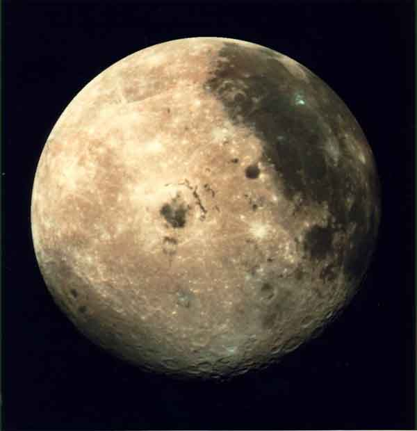

# The Way the Future Blogs

Frederik Pohl

**Early Editors**
**A vote for the GOP is a vote against the Earth**

## Astrophysics with Pick and Shovel

Why We Should Go Back to the MoonFor the Sake of the Science There

What recent scientific discovery suggests that we ought to resume space  flights to the Moon for purposes of scientific research?

Why, that would be the discovery of traces of the  isotope iron-60 in deep-sea rocks and meteorites.  The reason that discovering this isotope, which has a half-life of 2,600,000 years, is so important is that it can’t be made in detectable quantities by any process that happens on the Earth.  It can only be found in material expelled by a supernova.  So how did it get to the Earth?

There is only one possible explanation:  At some time within the past 2.6 million years the Earth must have been close enough to supernovae for them to deposit traces of their emissions in our planet.  That is to say, within about 100 light years.

But our stellar neighborhood has been studied thoroughly enough for scientists to be pretty sure that there was no supernova within that distance over that period of time.

The only explanation is that at some point our solar system must have been in a different galactic  neighborhood … as, in fact, we know that it was, because our sun has been shown to circle the core of the galaxy every 60 million years, in an orbit with a constant radius of about 30 thousand light years.  So that trace of iron-60 is nothing but an heirloom left by some long-ago brush with a neighborhood in the heavens where supernovae are or were common, as, for example, the light from the neighborhood of the Orion Nebula shows that it was at one time.

Now the astrophysicists begin to prick up their ears.  If some ancient supernova left traces of itself in the rocks of the Earth it must have left similar traces in the rocks of Earth’s constant companion, the Moon.  For Earth, those traces would have been eroded away long ago by the actions of wind and wet, but not on the Moon, which possesses neither.

So, if you want to learn the secrets of or galaxy, don’t bother with big telescopes.  With your shovel on your shoulder, just head for the Moon and dig, dig, dig!

### 9 Comments

- Joshua Zuckersays:That’s really cool!  I didn’t know that about iron-60.I think your orbital period is off by a factor of a few, though — more like 240 million years for one trip around the galactic center.October 16, 2012, 5:08 pm
- Bill Goodwinsays:There are ten thousand reasons for us be walking, crawling and roving all over the moon, and only two reasons that we’re not: ignorance and apathy.  It’s time to choose which qualities define us!October 17, 2012, 11:18 pm
- H. E. Parmersays:That first link, though, was pretty worthless. It reminded me of Roz Chast’s cartoon of a Bad-Translationese version of Peter Pan: “Peter Pan — what is? Is pan with not-want-growing-up feeling.” (Accompanied, of course, with an illustration featuring a winged frying pan.) You know I’m not going to be able to rest until I find out what “hondruly” and “hondrulah” are.Still, I didn’t see anything in the link to the article about the Iron-60 found in deep-sea rocks which states that more than one supernova was responsible for the deposit. So that’s no indication the local neighborhood was all that different, 2.8 to 3.1 million years previous. I also imagine someone, somewhere is even now “running the film back” and looking for a supernova remnant within 100 to 200 light years of where the solar system was, a little over 1/100th of a galactic revolution ago.October 18, 2012, 2:49 pm
- H. E. Parmersays:Oops. That should have been “looking for a supernova remnant *which was* within 100 to 200 light years of where the solar system was [around 3 million years ago].” Which I imagine both complicates the search and expands the amount of real estate you have to sift through.October 18, 2012, 3:00 pm
- Bill Higgins-- Beam Jockeysays:I have a shovel in the garage.  Let’s go!October 19, 2012, 11:26 am
- Nestorsays:I think the helium 3 mining might be a better sell for the man on the street and the politician on the hill, even if it probably is a bit of a crock. But who knows, perhaps Neil deGrasse Tyson can pull it off…October 19, 2012, 7:45 pm
- H. E. Parmersays:Not, mind you, that I have anything against going back to the Moon. And the science we could do is just one of the excellent reasons we should. (Plus I’d feel a bit more optimistic about our species’ chances of survival.)October 24, 2012, 3:28 pm
- Marc Marinosays:I really shouldn’t comment  too much up here, I’ll make myself look stupid.  So I’ll mostly read and learn about science.I didn’t know they think the galaxies are constantly moving and I don’t know how iron60 is different than other iron. And I don’t know how it would benefit us.  but hey, I’ve always felt we should pursue space exploration.  I’ts a more worthwhile activity than  many other things our government spends money on. And I hope the rest of you don’t think I’m a luna tic!October 25, 2012, 3:48 pm
- Nestorsays:>ignorance and apathy. It’s time to choose which qualities define us!Well for me it’s mostly apathy, with a side helping of ignorance.October 28, 2012, 6:32 am

**WordPress**
**TWTFB2**