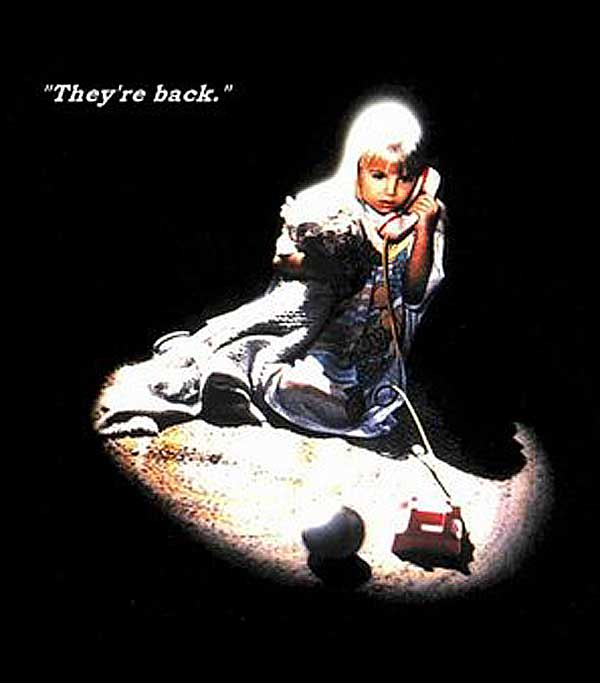

# The Way the Future Blogs

Frederik Pohl

## We’re back!

(Did you notice we were gone?)

Gone we all were, and for weeks on end.  There were the bugs that were flying around, for starters.  We didn’t get any of the more popular brands, but we got some mysterious upper-respiratory hits and several others at other locations, and that’s without mentioning the plagues that, without warning, took our computers out.

But now we’re back, healthier and happier than ever — so give us a look and let us know what you think.

### 12 Comments

- Bill Higgins-- Beam Jockey says:
Fred, you’ve become a cyborg– and as such, you appear to be vulnerable to diseases of both man and machine.
So the augmentation of humanity has a downside.  Man Minus, so to speak.
March 18, 2013, 12:14 pm
- ironchefoklahoma says:
Glad you’re back on the air. Good health, sir.
March 18, 2013, 12:39 pm
- Daniel says:
Good to have y’all back!
March 18, 2013, 1:03 pm
- Joseph Nebus says:
I noticed, and am quite relieved to see you back.  
I did notice your quiet began at almost the same time that “Asia”  and former “Buggles” keyboardist Geoffrey Downes stopped tweeting, and I had never suspected that you might be the same person.  (Although, come to think of it, the Buggles songs should have been a clue.  “Take me to Vermillion Sands”?  Or about a monorail,  “Oh, my, my, you are so sci-fi”?)
March 18, 2013, 2:26 pm
- Lars says:
Glad to see you back.
March 18, 2013, 4:07 pm
- Paul Wolf says:
Welcome back!  Yes, I did notice.  Sorry you were bothered by “bugs” (both you and your computer), but am very glad you’re doing better now.
Paul
March 18, 2013, 4:12 pm
- Soph says:
Glad you got rid of all the bugs! Welcome back.
March 18, 2013, 5:03 pm
- H. E. Parmer says:
We didn’t get any of the more popular brands …
I can assure you, from personal experience with the new norovirus, you missed not a thing. Worst. 48. Hours. Ever. 
Welcome back. (And be sure to wash your hands frequently.)
March 18, 2013, 11:03 pm
- Robert Nowall says:
I just figured you were busy again.
March 19, 2013, 3:36 am
- Bruce says:
Welcome back!  Been checking every day.  Glad to hear your “bugs” have left the building.
March 19, 2013, 6:35 am
- Cathy W says:
Glad to hear everything is okay – I did notice you were gone, and I was mildly alarmed. Here’s to hoping plague season is over for both man and machine…
March 20, 2013, 7:33 am
- TulsaTV says:
Great to have you back!
March 22, 2013, 6:10 pm

**WordPress**
**TWTFB2**