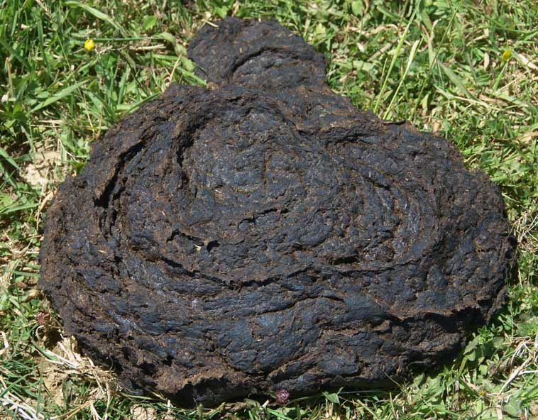

# The Way the Future Blogs

Frederik Pohl

## Dung into dollars

If you’re driving a People’s Gas truck and the fuel tank is running low, head for the North Side of Chicago.  There the first of three filling stations has been operating for a year, turning waste cow dung into truck fuel with the help of an Obama Administration grant.  An anerobic converter changes half a million gallons of cow manure into clean fuel a day, enough to drive a truck 20,000 miles, with the help of live bacteria.

### 2 Comments

- Cathy W says:
How wonderful! If they could apply the same process to huge lagoons of pig manure (and as far as I know there’s no reason they can’t), two birds would be killed with that stone…
May 17, 2013, 3:13 pm
- jasonmitchell says:
the same process could be used at municipal sewage treatment plants and landfills (which natuarally generate methane)
trash into cash – indeed!
May 29, 2013, 3:19 pm

**WordPress**
**TWTFB2**