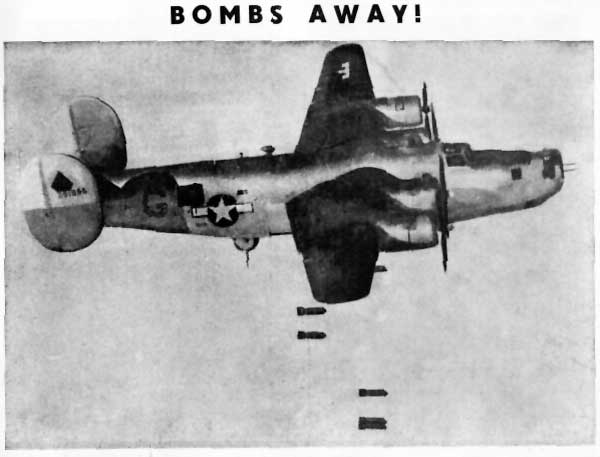

# The Way the Future Blogs

Frederik Pohl

**How to Paralyze the Senate**
**My War, Part 2:  Flying a desk**

## My War: The Night of the Invasion of Southern France

See, I wanted to get into the action  This was World War II, and it was my personal war.  I wanted to fight.  When I was inducted, they put me, as they did everybody, through a battery of tests, and when they looked at all the results they said, “Boy, you qualified for everything.  Now, you have to list what branch of service you want to serve in and, bam, then you’re off to basic training in that service and pretty soon you’re in the war, right where you want to be.”

So I took the list and checked off my three choices.

Number One was Infantry.  That was the down-and-bloody place for fighting, and they said,  “You put that down anywhere as a choice and that’s where you’ll go, because that’s where they need replacements all the time.”  Just to make sure, I put Field Artillery as my second choice and Armored Corps as my third, and next thing you know, I’m on my way to basic training.

In the Air Force.

That’s when I began to perceive that they didn’t really much care what I wanted.  Somewhere somebody was making arcane calculations of what the Army wanted.  And that’s what they chose.

All right, I was in the Air Force.  Then they kept me stooging around the Lower Forty-eight for two years before they at last dumped me into the hopper of the 456th Bomb Group (Heavy) weather station in Italy. It was just in time.

The rumbling and grumbling roar of B-24 motors was coming from every one of those takeoff strips that sprawled over what had once been Italian farm fields and olive groves.  We weathermen just arriving from the States had got there in such a hurry that I had already pulled my first shift in the weather station by the time I dumped my baggage in the four-man tent, one of whose cots would be my home for the foreseeable future.

At last!  I was in the war!  The proof of that was right overhead, where some three hundred or so lubberly B-24s were fighting every attempt of their pilots to gain altitude so they could form up for the long pull across the Mediterranean to where their war would start — No! Had started already!

Once I was outside, I could see in the last glimmer of daylight those chubby B-24s nuzzling into their formations, a few of them all formed up already and already starting to line out across the Mediterranean Sea toward southern France.  That’s what it was, the invasion of Southern France, begun at last!  And every American and British bomber and fighter in Italy or North Africa was joining in the fight.

The sky was full dark now, stars beginning to appear, along with the little running lights of all those planes — no!  It wasn’t dark!  Two great blossoms of red and yellow fire swelled overhead, followed at once by the great ker-BANG blast of two B-24s that had cut their turns too fine and exploded in the air as they turned into a collision … and then, suddenly, another immense ker-BANG from a little farther away, as two more B-24s collided … and then a single, smaller blast as a plane flying by itself caught a chunk of wreckage from one of the collisions and itself blew up.

That was five heavy bombers afire at once in the sky over the 456th Bomb Group.  Ten men in each crew.  Fifty human beings dying before my eyes.

And the next morning at daybreak, every last cook, clerk or MP in the 456th Bomb Group was rousted out of his bed at dawn and set to join one of the wobbly lines of searchers that trudged across the earth under where the explosions had been, looking for a head, a thumb, an ear, a boot with something that once had contained a living human’s foot, to turn over to the graves registration squadrons to try their luck at identification.

That’s what I saw that first night with the 456th.  There were ten men, from pilot to tailgunner, in each of those five blown-up bombers, but there were no parachutes and no survivors.

Oh, I was in the war all right.  I just wasn’t allowed to do any fighting.

*To be continued.*

**Related posts:**

- Hal Clement: Major Harry Stubbs
- How I Lost My Oldest Friend (and Gained a Literary Agency)

### 7 Comments

- David Dyer-Bennetsays:Things that seem good risks in a war zone, like packing planes that tightly, do have their problems, they certainly do.Was it actually “Air Force” officially?  I thought it was Army Air Corps or some such through the end of the war?May 20, 2013, 12:45 pm
- the blog teamsays:Yes, you’re right.May 20, 2013, 4:23 pm
- SMsays:A lot of American SF authors who wanted to seem to have had trouble getting to the front: consider Heinlein or Hubbard (http://www.cs.cmu.edu/~dst/Cowen/warhero/joining.htm)I have read that the US had a ‘scientific’ system of personnel management during the war.  The idea was that anyone could be a grunt, but only intelligent and educated people could be technicians, so people with high test scores were kept out of combat.  The problem was that it turned out that infantry needed brains too.  It is one thing to read about this in the abstract, and another to experience it as an individual, though!May 20, 2013, 7:48 pm
- Joe from Brklynsays:This set of images, and your deft description, will stay with me for a long time. I only wonder if you wrote home about this at the time, and what the letters you wrote back then described.  I imagine this scene would not have made it past the censors.May 21, 2013, 5:28 am
- Kensays:So you really wanted to fight up front, huh? Commendable and a worthy cause for sure. I wonder how you fared on the front lines in some alternate universe. Kinda glad they didn’t send you in this time line.Coward that I am, I would have checked the box next to “towel boy in the nurse’s locker room”, and prayed for a rain delay.May 21, 2013, 8:50 pm
- The Apple Cheeked Boy ( Your Commanding Officer)says:Great blog post, Fred! I was the base weather officer and you were my clerk.  Because you wrote my reports, I got high ratings from the command. You called me the “Apple Cheeked Boy” because I was only 19 and the youngest base weather officer in that theater of operations and you were a mature man in your early 20s.  I remember that you brought your own typewriter to our base in Stornara, Italy.May 22, 2013, 6:13 pm
- Narmitajsays:I read somewhere that nearly twice as many plane crashes occurred in flying accidents than through combat during the war. This site (http://www.wwiifoundation.org/our-mission/wwii-facts-figures/wwii-aircraft-facts/) largely bears that out with various eye-popping stats…For instance, for the USA alone: 57,000 aircraft lost, of which 23,000 were in combat but as many as 34,000 in accidents (14,000 of them in the USA) – so nearly 200 accidents a week on average!My father flew B-24sfor the last few months of the war – anti-submarine patrols with 547 Squadron of RAF Coastal Command (as I commented on the previous Major Harry Stubbs post) – but possibly the three and a half years before that learning to fly and being a flying instructor in Canada were more dangerous.Coastal Command meant mostly going out as lone aircraft with little danger of collision with other planes, but it was still possible to hit hills, as happened tothis Liberator from 547. And, despite being over water most of the time, it was of course still possible to get shot down, as unfortunately happened toone 547 Liberator in the very last few days of the European war(the link is about U-534, sunk on 5th May 1945; scroll down for details of the attack on it).May 30, 2013, 6:33 pm

**WordPress**
**TWTFB2**