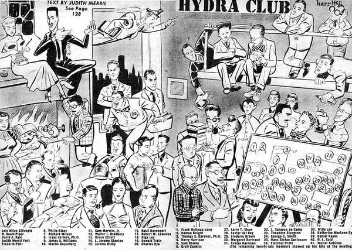

# The Way the Future Blogs

Frederik Pohl

## About the Hydra Club

In earlier posts I’ve mentioned the  Hydra Club, but  haven’t given many details.  Well, I’ve just turned up an old press release that explained Hydra.  Here’s what it said:

> The Hydra Club was founded in 1947.  A New York club, it was founded in Philadelphia, at that year’s Worldcon, when Lester del Rey said to Frederik Pohl, talking about spending time with fellow sf people, a novelty, since the recently ended war had broken up established sf groups,  “This was fun.  We ought to do it more often.”  Back in New York, they did.  They each rounded up some friends — totalling nine in all, which accounts for the name, which was borrowed from that of a legendary Greek monster with nine heads — and the club was formed.

> With the Eastern Science Fiction Association, the Hydra Club put on the Eastern Science Fiction Conference of 1959, which may have inspired the custom of having local American cons when the Worldcon was remote from American fan centers.   Its members and guests have at one time or another included the majority of the best-known writers, editors, critics and other people professionally active in science fiction.  Its public meetings were ordinarily held at the Lotos Club, private ones at the homes of members.  An exception was the Christmas Party, most recently held in the ballroom of the Gramercy Park Hotel.  Membership is by invitation, usually, though not necessarily, extended to individuals  professionally active in science fiction.  At the time of this writing there were 56 members.

### 8 Comments

- Ace Lightning says:
The very first con I ever attended was an ESFAcon. I had been invited by Sam Moscowitz; I was twelve years old, which would have made it 1960 (of course, my parents attended with me). Isaac Asimov was the GoH, and it was held in a basement meeting room of the YMCA in Newark, NJ. I remember that Lester Del Rey, Robert Silverberg, and Hans Stefan Santessen were there as well – possibly even your esteemed self.
June 8, 2013, 2:34 am
- David says:
What a great picture. I couldn’t make out the names very well, but thought I would do a “Where’s Frederik”. There he was – over the fireplace. Had to and was him. Either he was hot stuff or the artist had an earlier disagreement with him.
June 8, 2013, 10:08 am
- Gregory Benford says:
Can get this illo expanded?
June 8, 2013, 6:08 pm
- John Armstrong says:
Why were you on the spit, Fred?
June 9, 2013, 4:46 pm
- Robert Nowall says:
Harry Harrison drew that, didn’t he?
June 10, 2013, 10:06 am
- Keith Graham says:
You can see the original scan of the article from Marvel Science Fiction (November 1951). Written by Judith Merril, art by H. Harrison:
http://thatsmyskull.blogspot.com/2012/01/hydra-club.html
A blown up version of the scan is at:
https://farm8.staticflickr.com/7169/6635968041_fb9c93a8b3_o.jpg
June 10, 2013, 2:48 pm
- Robert Nowall says:
I see the name “George C. Smith” in the credits…is it supposed to be “George O. Smith” or was there another George Smith running around in those days?
Memo to John Armstrong.  Mr. Pohl was a literary agent in those days…Dr. Asimov, who’s turning the spit, was one of his clients.  (Notice Phillip Klass roasting a weenie over the fire, and Judith Merrill (the future former Mrs. Pohl) lighting a cigarette on the fire as well.)
June 11, 2013, 4:05 am
- Margo Anderson says:
Nifty!  I see my grandfather, Jerome Stanton, and Margaret Bertrand,  who introduced my parents at one of his parties.  They repaid the favor by naming me after her.
June 13, 2013, 1:02 am

**WordPress**
**TWTFB2**