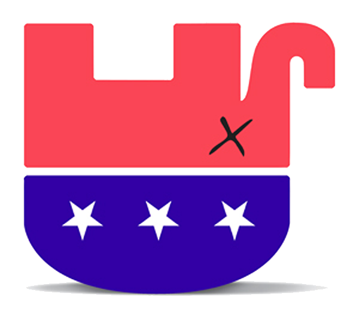

# The Way the Future Blogs

Frederik Pohl

## Why the Greedy Old Party Needs a Licking

The thing is, to return our country to a normal two-party system we need to start by recognizing that GOP no longer resembles an American political party.

In organization it is much more like a modern army at war.  Its declared enemy is just one man, President Barack Obama. One in the Supreme Court, reliably churning out new law (with that one amazing exception) to   It has powerful allies, not least the Gang of Four Plus speed the GOP’s conquests and fund its campaigns.  It requires its front-line troops in Congress to sign a pledge never under any circumstances to vote for any tax increase, thus making compromise impossible.  It destroys unions where it can — as in Wisconsin — and chips away at their power wherever they have any.  And it flexes its political muscle in arenas generally thought of as nonpartisan, such as school boards, library boards and so on.

Unfortunately for the world we live in, ceding so much power to a political party means that that party has an inescapable obligation to conduct itself in ways beneficial to the general good.  Unfortunately the Republican Party is enslaved to the interests of fossil fuels.  They cannot resist the tragical changes in our world’s weather, since it is that burning which causes them.

The only hope for the world is to terminate their control of the forces which are dooming us to worsening storms, droughts and spoilage of our natural resources. That is not arguable.  It is a fact of our lives which we have lived with for steadily worsening conditions for generations, and can’t afford to let go on.

### 6 Comments

- Barry Traylor says:
I could not agree more Mr. Pohl. What a sad state our country is in today.
July 12, 2013, 5:36 am
- Ken says:
I have been wondering lately if we would be better off if the Democrats split into two separate parties with a moderate branch and a more liberal/progressive branch. Part of the problem I see (anecdotally, mind you) is that the majority of Republican politicians are extremists and like you say, far more at war than being representatives, but the majority of ordinary Republican voters (not necessarily the loudest but it seems like the most common) are not early as extreme in their views. However,with all of the us vs them mentality in all political discussion, they are more willing to swallow Republican extremism than vote Democrat and all of the baggage they’re tied into that.
But if there were a moderate splinter of the Democrats that was perhaps fiscally conservative (but in a sane way), they could concievably suck the votes from the Republicans and become the new Conservative party. It’s not one I would still like, but it could at least come to the table in a reasonable manner.
Otherwise what we have now is a bunch of government representatives who see government as the problem, so devote their entire career to making sure they can accomplish nothing.
July 12, 2013, 9:44 am
- pjcamp says:
The GOP does in fact resemble an American political party. They resemble the Whigs.
And they’re headed for a similar crack-up, over race. They are seemingly inextricably lashed to the rump of American bigotry and as it continues to dwindle, so will their party.
That’s ironic. The death of the Whigs allowed the Republican party to exist, and now they’re following the same path. There’s probably a political science Ph. D. thesis in the question of why liberal parties survive through changed but conservative ones tend to self destruct. I think it is inherent in the conservative conviction that things should never change. When things do in fact change, as they always will, there is an ever greater mismatch between the ideals of the aging conservative party and the rest of society. 
Adapting to changing circumstances is the central point of liberalism so it is much more adaptable.
July 13, 2013, 12:58 am
- Robert Nowall says:
Whatever happened to the toleration for others that liberals are supposed to be so fond of practicing?  Guess it doesn’t apply to those who disagree with them…
July 13, 2013, 9:07 am
- John C. Boland says:
Dear Fred (who edited my favorite magazines, just yesterday),
First. Among serious people, everything is arguable. When my son was nine or ten, I read him Asimov’s “Belief,” which is as good a dramatization of the point as I’ve encountered.
Second. Sorting out the inputs and outputs of complex systems is a daunting task, and the answers are best treated as tentative. If it were otherwise, a bright guy or gal would model the stock market and own the world.
Third. You’re propounding a belief system, not a scientific theory (as near as I can tell). If it’s a theory, it has to exclude a lot of alternative possibilities, so–what would you view as a falsification of your ideas?
Other topic. Where is Hal Clement when we need him? A gas giant, 63 lt yrs from earth, 7,000 kph winds, 1,000 Celsius temp, and it rains silicate glass. Wouldn’t he have had fun?
Best wishes.
July 14, 2013, 11:06 am
- Andrew Pober says:
To: Robert Nowall – Hypocrisy is proclaiming a standard for others and then refusing to adhere to it.  Like Orson Card who demands that the public be tolerant of his intolerant statements you are asking that others compromise with a party that has publicly rejected compromise.  Reminds me of the story someone who kills his parents and petitions the court for leniency on the grounds that he’s an orphan.
August 11, 2013, 2:32 pm

**WordPress**
**TWTFB2**