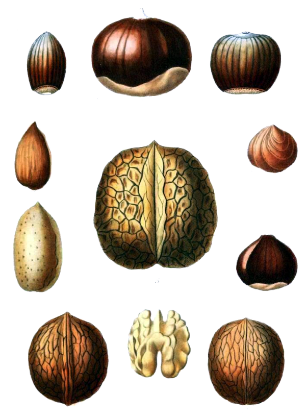

# The Way the Future Blogs

Frederik Pohl

**The Story of  The Space Merchants, Part 3**
**Bright Sayings of Bright People, No. 50: Eisenhower**

## Nuttiness in the Health News

**By Elizabeth Anne Hull**



Two headlines in recent news seem at odds:

1) Eating nuts tied to lower risk of death, and
2) Doctors see increase in those allergic to sesame seeds.

The first story touted not only “true” nuts like pistachios, almonds and walnuts, but also said the results of a 30-year study analyzed at Harvard University included peanuts, a legume.  Eating nuts seven times a week reduced by 20 percent a person’s risk of dying of any cause.

Since I love nuts, including of all those mentioned, plus filberts, brazils, pecans and others, I rejoiced.  Nuts are also reputed to help with weight loss and contain no transfats.  Good tidings of great joy!

But not so fast.  The second article reported that, since America’s rise in popularity of Middle-Eastern cuisine, especially hummus (which is usually seasoned with tahini,  sesame paste) and the general infusion of Asian dishes that also use a lot of sesame, allergists have discovered that any individual sensitive to peanuts is also somewhat likely to react to sesame.  Why remains a mystery, since sesame isn’t a nut, it’s a seed, while peanuts are not really nuts, but a legume.

Researchers have been puzzling over the rise in allergies and asthma as well, often blamed on the pollution in densely populated areas.  Another theory is that children who have been blocked from infection by cleanliness have not had a chance to build anti-bodies and develop their own immune system defenses.

Since my mind is such that it searches for unified theories, I can’t help wondering if one problem in medical research is that we are supposed to do the greatest good for the greatest number of people by statistical analysis. Applying a set of diagnostic criteria to any individual’s ailment may cure more patients, but it doesn’t help the individual who deviates from the norm.

For now, I intend to continue eating nuts; they are delicious, if high fat — fat is where the flavor is. I’ll also try to find ways to cope with my asthma while enjoying homemade hummus, unless I develop hives or go into shock.  I already have noticed that eliminating stress is a bigger factor in controlling my asthma  than whether or not I’ve forgotten to take my inhaler today.

### One Comment

- Dan Gollubsays:There’s an article at sciencedaily.com noting that if pregnant women eat peanuts that won’t result in the offspring being allergic to peanuts, and the opposite may be true.December 29, 2013, 5:51 pm

**WordPress**
**TWTFB2**