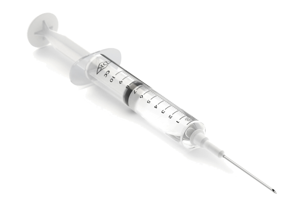

# The Way the Future Blogs

Frederik Pohl

## Vaccinations: Personal Choice vs. Public Health

**By Elizabeth Anne Hull**



Remember the recent outbreak of measles?  It brought a rush response from the CDC to immunize recent immigrants and visitors with long-term visas, who sometimes come from areas of the world where measles hasn’t been vanquished to the extent it has been in the West.  But it wasn’t just noncitizens who suffered; American children also have been catching this sometimes life-threatening disease.

We’re also seeing a resurgence of whooping cough, and not just among the poor or uninsured.  We hear early warnings that polio may soon reappear as well.  Can smallpox be far behind?

Either because of complacency or ignorance, children aren’t getting their shots. For fear that vaccinations will produce autism (debunked) or other unanticipated side effects, or for religious reasons, or whatever, it has become a deadly trend not to get all children protected. Their parents rely on the fact that most families do comply with recommended and required immunizations, when they enroll their children in public schools across our nation, if not before.

Recently, nurse in central Pennsylvania was fired from a healthcare facility, per company policy, because she refused to get a flu shot; she was pregnant and groundlessly feared miscarriage.  I personally would prefer that my health-care workers be immunized.  We’re told by the CDC that people can get the flu even though they have taken the shots, but if they do, they’ll likely get a less severe case.

Word is that the majority of cases this flu season are H1N1.  This is the strain that Fred and I probably had in 2009 that knocked us flat on our backs in the middle of the South Pacific.  About 10 percent of our cruise’s passengers were stricken. It’s terrible to be sick with a flu virus in tropical areas. My sister, traveling with Fred and me, left the ship at Tahiti to spend several days in a hospital there, and flew home to be hospitalized for four more days.

I might have had rheumatoid arthritis prior to the flu; but it was coincidentally diagnosed after I returned home.  I can’t help wondering if that could have been triggered by H1N1. (I also realize that this speculation may easily be as misguided as that of those who fear inoculations and so, unintentionally, become part of the problem of spreading contagious diseases.)

Where do individual rights end?  Who are the proper people to make this decision?  Would you support this nurse’s right to keep her job without getting a flu shot?  Have you gotten all the vaccinations you should have?

### 3 Comments

- Phillip Helbig says:
“Where do individual rights end?”
When other people are endangered
“Who are the proper people to make this decision?”
The state, enforced by armed police if necessary.
“Would you support this nurse’s right to keep her job without getting a flu shot?”
Of course not.
“Have you gotten all the vaccinations you should have?”
Of course.
Libertarianism kills babies.  Thousands per year.
January 29, 2014, 11:26 am
- pjcamp says:
This is, in fact, the reason why in the US we use a weakened polio virus vaccine instead of a killed virus vaccine (Sabin, not Salk). A weakened virus is shed into the environment and leads to secondary immunities among people too stupid or eat up by religion to get vaccines. 
The price we pay for this is that some low level of people will get polio every year from the vaccination. It is the luck of the draw. How many of those victims, I wonder, think that their lives are a worthwhile sacrifice for a few ignorant asses to exercise their pseudoscience?
If everyone could be trusted to get their vaccinations, then it it would be safe to use a killed virus polio vaccine and that would be the end of polio. We maintain polio so that we can protect the right of people to be idiots.
February 2, 2014, 1:25 am
- H. E. Parmer says:
What Philip Helbig said.
This will surely date me, but I remember as a young child going to our local high school and getting a sugar cube with the polio vaccine. Even at that tender age I could pick up on how relieved the adults were to see what they believed was the end of a dreadful scourge. It was rightly considered a triumph of medical science.
Fast forward almost sixty years, and we have a country in which a third or more of the population believes Jesus walked with dinosaurs and global warming is a conspiracy cooked up between climate scientists and eco-extremists who want to make us all surrender our SUVs and iPads and flat screen TVs and go live in mud huts, subsisting on a diet composed solely of bugs and burdocks.
Lesser forms of insanity are only to be expected.
February 4, 2014, 3:39 pm

**WordPress**
**TWTFB2**