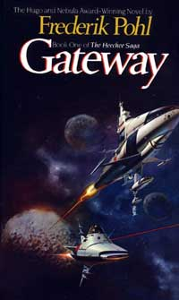

# The Way the Future Blogs

Frederik Pohl

## Syfy:GatewayMoves Closer to TV

*From the blog team:*

Heechees on TV! Fred’s 1977 Hugo-winning novel, **Gateway**, has moved a step closer to your TV screen.

Now there are script writers: David Eick (**Battlestar Galactica**) and Josh Pate (**Falling Skies**) are collaborating on adapting the book for the proposed hour-long TV series, starting with a pilot script written by Pate and revised by Eick.

“David and Josh are masters of telling authentic, multidimensional stories set in wholly unfamiliar worlds, and we are thrilled to collaborate with them and Syfy to translate Frederik’s beloved and timeless adventure saga into an equally exhilarating television series,” said Pancho Mansfield, president of global scripted arogramming for **Entertainment One Television** (**Hell on Wheels**).

**Syfy** is a new partner in the project, along with **Universal Cable Productions** (**Monk**), joining eOne and **De Laurentiis Co**. (**Dune** and **Hannibal**) to develop and produce the series adapted from *Gateway*, which was one of [**Fred’s favorites**](/posts/2010-09-28-the-gateway-story/), and a winner of the **1978 Hugo Award** for Best Novel, the 1978 **Locus Award** for Best Novel, the 1977 **Nebula Award** for Best Novel, and the 1978 **John W. Campbell Memorial Award** for best science-fiction novel.

Eick and Pate will also serve as executive  producers, along with Martha De Laurentiis and Lorenzo De Maio of De Laurentiis and former eOne TV exec Michael Rosenberg. Plans are to distribute the series worldwide.

“*Gateway* is thought-provoking and unsettling, raising profound questions about mankind’s possible relationship with alien life,” said Bill McGoldrick, executive vice president for original content at Syfy.

- UPI: **Syfy is adapting Frederik Pohl’s ‘Gateway’ novel as a series**
- Hollywood Reporter: **Syfy Prepping Alien Drama ‘Gateway’ From ‘Battlestar Galactica’ Alum**
- Broadway World: **Syfy Developing Adaptation of Frederik Pohl’s GATEWAY with BATTLESTAR GALACTICA Alum**

### 2 Comments

- Elizabeth Anne Hull says:
Very exciting news about Syfy, now let’s see if it really happens.  Remember how long it took for Hollywood to get Dune done? Betty
August 21, 2015, 10:27 am
- Guess who?: Frederik Pohl. | NOT A REVIEW says:
[…] Escribió un buen número de novelas entre las que se incluyen Pórtico (sobre la que vuelan planes para llevarla a la pequeña pantalla) y el resto de la saga de los Heechee, Mercaderes del […]
September 13, 2015, 5:10 am

**WordPress**
**TWTFB2**